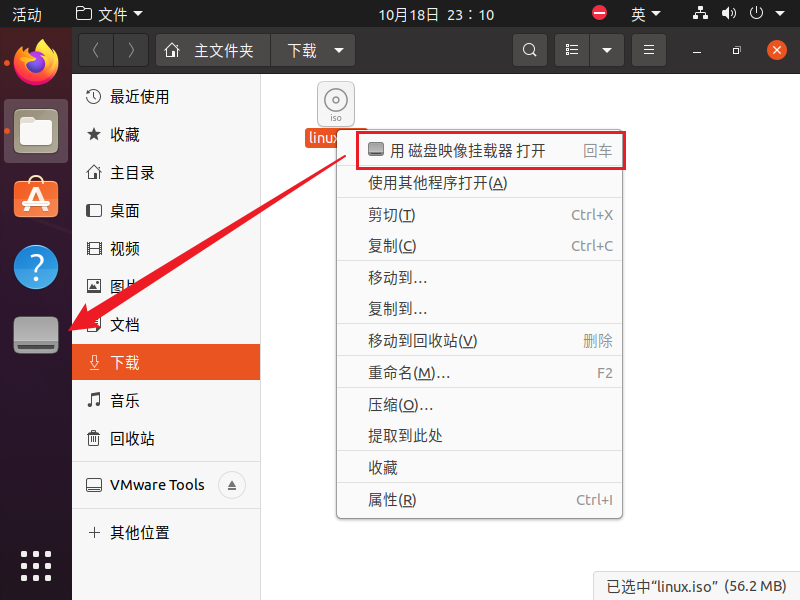

<!-- more -->

## 一、VMware

这个安装就直接网上搜一篇教程就可以了：[VMware 虚拟机安装教程来啦！附超详细图文步骤，电脑小白也能轻松上手！ - 腾讯云开发者社区-腾讯云](https://cloud.tencent.com/developer/news/2740323)，网上很多，另外这个软件需要激活，但是个人用的话，可以搜一下，网上也很多。这里我的 VMware 版本是：


## 二、ubuntu

### 1. 版本选择

上面安装好 VMware 后，就需要开始安装 ubuntu 了，然后就需要选择一个版本，对于我们来说，ubuntu 版本并不是越新越好，更新的 ubuntu 版本里面的一些软件版本，库版本可能都会更高一些，但是厂家提供的一些 sdk 可能用的还是老版本 ubuntu 的一些东西，所以不能太新，我这例一开始用的是 ubuntu 18.04 版本，后来用了新一点的版本，也方便后面折腾，历史版本可以在这里看 [Ubuntu Releases](https://releases.ubuntu.com/)：


点进去就可以看到下载的地方了：


### 2. vmware 安装 ubuntu

因为这里是安装的桌面版本，所以其实网上也有很多教程，这例就不赘述了，网上随便搜一篇就能看，这个还是很简单的。安装的时候我磁盘分配了 200GB，因为后面可能还要用于其他芯片平台的开发：


### 3. VMware Tools

#### 3.1 映像文件下载

安装完 ubuntu 系统后，还需要安装一下 VMware Tools，这样才能实现和宿主机的复制粘贴操作、共享目录等。这里在 VMware 的虚拟机选项卡中选择重新安装 VMware Tools 选项：


然后就会弹出下面的提示：


原来是新版本的 VMware 不再提供 VMware Tools，需要自己下载对应的 [linux.iso](https://packages-prod.broadcom.com/tools/frozen/linux/linux.iso) 映像文件并在 ubuntu 中挂载。这个时候没办法，只能在ubuntu的浏览器中手动输入然后下载（这是因为共享文件夹需要借助VMware Tools实现）：


> 我们创建虚拟机的时候直接添加了一个网络适配器，并配置为NAT模式，所以可以直接联网下载。

下载完毕后我们右键，然后选择【用磁盘映像挂载器打开】：



#### 3.2 安装VMware Tools

挂载映像文件后，我们双击打开挂载后的目录，可以看到如下文件：


可以看到这里有一个压缩包，我们把这个压缩包复制到主目录中，然后【右键】&rarr;【提取到此处】：


这样就算解压完了，我们可以在这里打开终端，会有以下文件：


我们执行这个 `.pl`文件，需要添加`sudo`权限，然后一路`yes`就可以了，安装成功后，ubuntu的界面就会自适应vmware了。

#### 3.4 open-vm-tools-desktop

我安装完毕后发现复制和粘贴无法使用，就是在宿主机中复制的内容，在ubuntu中不可用，ubuntu中复制的，无法直接在宿主机粘贴，网上搜了下，好像是因为这样安装不完全，需要再安装一个open-vm-tools-desktop：

```bash
sudo apt-get install open-vm-tools-desktop -y
```

然后重启再试一下应该就可以了。

> Tips：这里还有一种方式，但是我没有尝试，是参考的 [Ubuntu22.04安装vmware tools后不能复制粘贴](https://zhuanlan.zhihu.com/p/1923015967853744307) 这个帖子：
>
> 首先需要确保VMware tools 服务处于运行状态中的。
>
> ```bash
> systemctl status open-vm-tools
> ```
>
> 编辑/etc/gdm3/custom.conf 配置文件
>
> ```bash
> sudo vim /etc/gdm3/custom.conf
> ```
>
> 将  WaylandEnable=false 这一行最开始的 # 号去掉。然后重新启动虚拟机。

#### 3.5 apt 安装 vm-tools

好像也可以直接这样安装：

```bash
sudo apt install open-vm-tools open-vm-tools-desktop
```

要是成功的话就很简单了，要是不成功，就还是用上面的方式。

## 三、共享目录配置

上面安装好后，我们就可以配置共享目录了：


如上图步骤，添加共享目录即可。然后重启虚拟机，我们看一下这个目录：

```bash
ls /mnt/hgfs/
```

共享目录会放在这里：


我们可以创建一个软链接到家目录，方便后面访问：

```bash
 ln -s /mnt/hgfs/sharedir ~/01sharedfiles
```


> 参考资料：
>
> [【Tools】Ubuntu20.04 安装 VMware Tools 详解_ubuntu20.04 安装 vmtools-CSDN 博客](https://blog.csdn.net/dengjin20104042056/article/details/106396644)
