<!-- more -->

## 一、VMware 的网络模式

### 1. 虚拟机三种网络模式

我们安装完 Vmware，在安装 ubuntu 的时候会创建一个网络适配器，这里会有不同的网络模式：

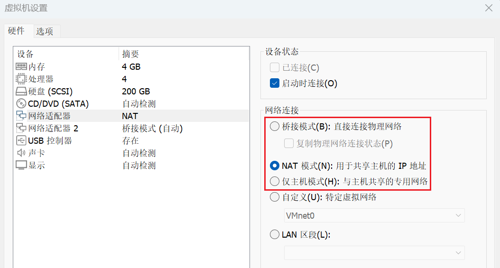


**桥接模式（Bridged）**：在桥接模式下，虚拟机会直接连接到物理网络，就像是网络中的另一台独立主机。这种模式下，虚拟机可以直接与外部网络中的其他设备通信，无需通过宿主机。虚拟机的网络配置（如 IP 地址、网关、DNS 等）需要与宿主机在同一网络段内。桥接模式适用于需要虚拟机直接参与网络通信的场景，但可能会受到 IP 地址资源限制的影响。

**NAT 模式（Network Address Translation）**：NAT 模式允许虚拟机通过宿主机的网络接口访问外部网络。在这种模式下，虚拟机与外部网络之间的通信是通过宿主机进行网络地址转换的。虚拟机在这种模式下拥有独立的 IP 地址，但对外部网络来说，它们的数据包都是从宿主机的 IP 地址发送出去的。NAT 模式适合于 IP 资源紧张或者需要隔离虚拟机网络的环境。

**仅主机模式（Host-Only）**：仅主机模式创建了一个与外部网络隔离的私有网络，只有宿主机和虚拟机之间可以相互通信。在这种模式下，虚拟机无法直接访问外部网络，但可以用于测试和开发环境，其中网络隔离是必需的。如果需要，可以通过宿主机的网络共享功能来提供虚拟机对外部网络的访问。

每种模式都有其特定的应用场景和配置方法。选择合适的网络模式可以帮助虚拟机更好地集成到网络环境中，满足不同的网络需求。在配置虚拟机网络时，应根据实际需求和网络环境来选择最合适的模式。

### 2. 虚拟网络编辑器

还有一个虚拟网络编辑器：

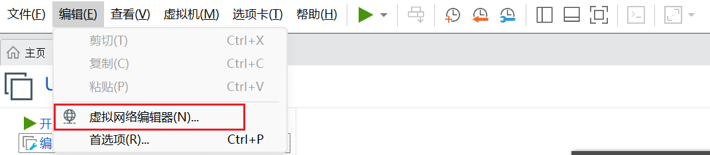

打开后是这样的：

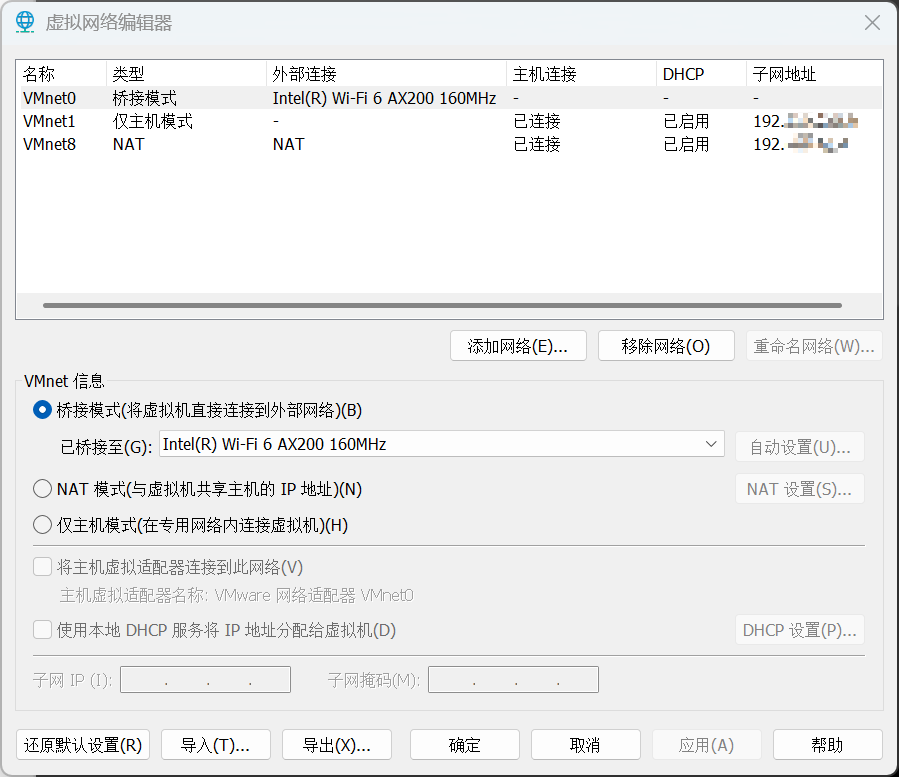

这里看有到 VMnet0（桥接模式）、VMnet1（仅主机模式）、VMnet8（NAT 模式），具体的我们后面再详细说。

### 3. 上面两个什么关系？

VMware 的“虚拟网络编辑器”里看到的 VMnet0、VMnet1、VMnet8，和给虚拟机设置时看到的“网络适配器”中的桥接、NAT、仅主机模式，它们之间的关系简单来说就是：**“虚拟网络编辑器”里的 VMnet 定义了网络的整体环境和规则，而“网络适配器”中的模式选择，则是决定我们的虚拟机具体连接到哪个 VMnet 虚拟网络**。

**虚拟网络编辑器** 中的 **VMnet**：相当于 **创建和配置** 这些虚拟交换机（设置它们的网段、是否启用 DHCP 等）。就像物理交换机一样，每个 VMnet 虚拟网络（VMnet0, 1, 8, 其他自定义网络）都是一台独立的 **虚拟交换机**。

**虚拟机设置** 中的 **网络适配器模式**：相当于决定把我们的虚拟机 **连接到哪一台** 预设好的虚拟交换机上。当我们为一台虚拟机选择“桥接模式”，就等于用一根 **虚拟网线**，将这台虚拟机的 **虚拟网卡**，插入了名为 **VMnet0** 的虚拟交换机上。同样，选择“NAT 模式”就是插入了 **VMnet8** 交换机；选择“仅主机模式”就是插入了 **VMnet1** 交换机。

- **不同“虚拟交换机”的特性和连接方式**：

| 特性维度       | 🛠️ **VMnet0 (桥接模式)**                                      | 🛠️ **VMnet8 (NAT 模式)**                                       | 🛠️ **VMnet1 (仅主机模式)**                                |
| :------------- | :----------------------------------------------------------- | :----------------------------------------------------------- | :------------------------------------------------------- |
| **对应模式**   | 桥接模式 (Bridged)                                           | NAT 模式                                                      | 仅主机模式 (Host-only)                                   |
| **虚拟设备**   | 虚拟交换机                                                   | 虚拟 NAT 设备、虚拟 DHCP 服务器                                  | 虚拟交换机                                               |
| **网络连通性** | 虚拟机直接接入外部网络，与主机所在局域网其他主机及互联网互通 | 虚拟机可通过主机网络访问互联网 ，但外部网络通常无法直接访问虚拟机（需特殊设置） | 虚拟机与主机形成内部封闭网络 ，默认 **不能** 访问外部网络  |
| **主机通信**   | 通过主机物理网卡通信                                         | 通过主机的 VMnet8 虚拟网卡通信                                 | 通过主机的 VMnet1 虚拟网卡通信                             |
| **IP 地址分配** | 通常由外部网络 DHCP 服务器分配，或手动设置与主机网段相同的静态 IP | 通常由 VMnet8 虚拟网络的 DHCP 服务器分配                         | 通常由 VMnet1 虚拟网络的 DHCP 服务器分配                     |
| **应用场景**   | 需要虚拟机在局域网中像独立主机一样被访问                     | 虚拟机需要便捷访问外部网络，且无需在外部网络中可见           | 构建与外界隔离的封闭网络环境，用于安全测试或内部网络调试 |

### 4. 宿主机的网络环境

VMware 安装完成后会在宿主机上生成两块虚拟网卡，这两块网卡与虚拟机管理的两个虚拟交换机相连。如图 1-2.1 所示。

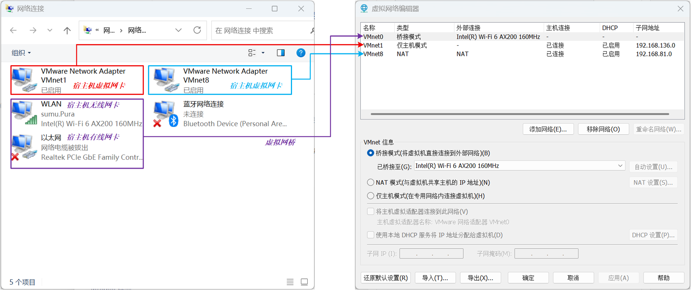

如果将宿主机上的这两块虚拟网卡卸载了，可通过 VMware 的顶部【选项栏】&rarr;【编辑】&rarr;【虚拟网络编辑器】&rarr;【还原默认设置】，重新将虚拟网卡还原。

## 二、三种网络模式

### 1. VMnet0（桥接模式）

#### 1.1 桥接简介

桥接模式是将主机网卡与虚拟机虚拟的网卡利用虚拟网桥进行通信。在桥接的作用下, 类似于把物理主机虚拟为一个交换机, 所有设置桥接模式的虚拟机都将连接到这个交换机的一个接口上；同样物理主机也插在这个交换机中, 所以桥接下的网卡与网卡都是交换模式的, 可以相互访问而不干扰。如下图所示：

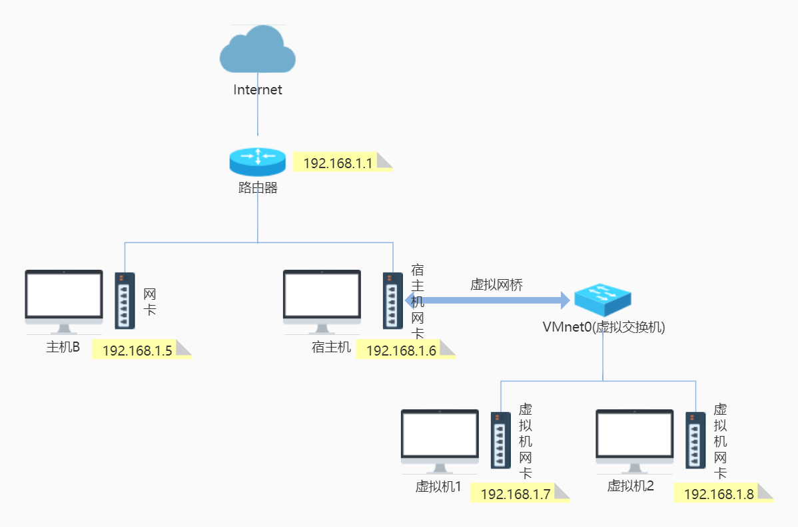

宿主机的某块能上网的网卡会被虚拟成一台交换机，逻辑上是这样的：

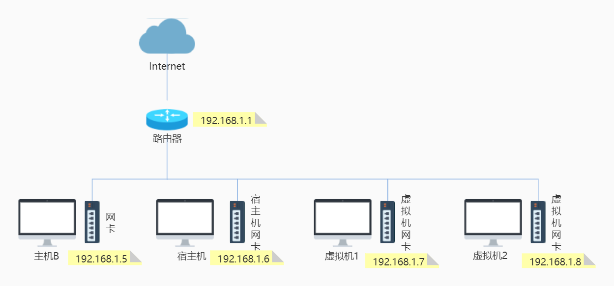

（1）虚拟网桥会转发宿主机网卡接收到的广播和组播信息，以及目标为虚拟交换机网段的单播。所以，与虚拟交换机机连接的虚拟网卡（如: eth0、ens33 等〉能接收到路由器发出的 DHCP 信息及路由更新。

（2）桥接模式是通过虚拟网桥将主机上的网卡与虚拟交换机 VMnet0 连接在一起，虚拟机上的虚拟网卡都连接在虚拟交换机 VMnet0 上，所以桥接模式下，虚拟机 IP 必须与宿主机的 IP 在同一网段且子网掩码、网关与 DNS 也要与宿主机网卡的一致。

（3）如上图中所示，桥接模式的虚拟机会占用宿主机所在局域网内的 IP 地址资源。同时，如果宿主机所在局域网中做了 IP 地址管理，比如 IP 地址需要公司网络部门审批通过后才能使用，那么虚拟机的 IP 地址也会受此管理规则的约束。

（4）默认存在自动获取 ip 机制，只需要将虚拟机设置为 Bridged(桥接模式），虚拟机会自动获取新的 ip，保证 ip 地址与宿主机在同一个网段。

#### 1.2 复制物理网络连接状态？

当笔记本电脑在有线网络和无线网络之间切换时，或者从一个WiFi切换到另一个WiFi时，物理网络的连接状态（如网络可用性、网关变化等）会发生改变。开启复制物理网络连接状态选项后，VMware会**监测宿主机物理网络连接状态的变化，并触发虚拟机网络适配器的刷新操作**，相当于在宿主机网络切换时，让虚拟机也“跟着”重新识别一次网络环境。**本质**就是它是在**链路层** 模拟了一次网线拔插的过程，让虚拟机操作系统意识到“网络环境变了，需要重新协商和配置”。

再来看一下续订IP，它是指网卡从路由器的DHCP服务器获得IP地址的过程。 网卡通过DHCP对IP都有租定时间，等到了一定的时间，我们的电脑会自动续订IP，以方便继续使用。它是一个在操作系统网络层**手动或自动执行的命令**。无论是虚拟机还是物理机，当执行“续订IP”命令（如 Windows 中的 `ipconfig /renew`）时，系统会向DHCP服务器重新请求或确认一个IP地址租约。有两个**触发条件**：

- **手动触发**：用户主动在命令行中执行命令。
- **自动触发**：系统检测到网络连接建立或恢复时，**自动发起**DHCP请求。这正是“复制物理网络连接状态”功能希望达到的效果——**通过触发链路层变化，来诱导操作系统自动执行“续订IP”这个操作**。

总结一下就是：

- **“复制物理网络连接状态”是“因”**：它通过VMware在后台自动制造一个网络重置事件。
- **“自动续订IP”是“果”**：虚拟机操作系统响应这个重置事件，自动执行IP续订流程。

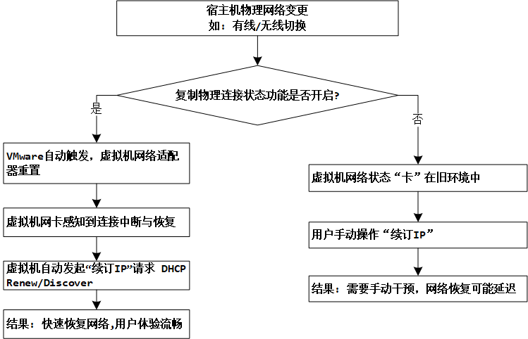

如果我们**关闭**了“复制物理网络连接状态”功能（对应上图中“否”的分支），当宿主机切换网络时，虚拟机的网络适配器不会收到重置信号，它可能仍然保持着旧的IP地址和网关配置，导致无法在新网络中通信。这时，你就需要**手动**进入虚拟机，运行 `ipconfig /renew` 或重启网络服务来恢复连接。

所以，这个选项的实用价值就在于，它把**一个需要用户手动干预的步骤（手动续订IP），变成了一个由VMware自动完成的幕后过程**，极大地提升了笔记本电脑用户使用桥接模式时的网络体验。当然，这个前提是我们使用了**DHCP的方式来分配IP地址**。

总的来说就是：

- 不选择复制物理网络连接状态选项：如果采用DHCP的方式来分配IP地址，当电脑网络从有线或无线网络之间进行移动时，DHCP会重新分配IP地址，即虚拟机IP地址会发生变化。

- 选择复制物理网络连接状态选项：复制网络连接状态仅用于笔记本电脑在有线网络与无线网络之间切换时进行IP地址续订，虚拟机IP地址不变

如果要虚拟机上网，勾不勾该选项，没什么区别。如果不勾的话，无线和有线切换，很有可能IP地址发生变化，需要重新查看。这个选项主要是为了**方便笔记本电脑或其他移动设备**在使用桥接网络时，能在更换网络后保持虚拟机的网络连接稳定性。

#### 1.3 使用示例

##### 1.3.1 桥接网卡

我们把 VMnet8 桥接到无线网卡：

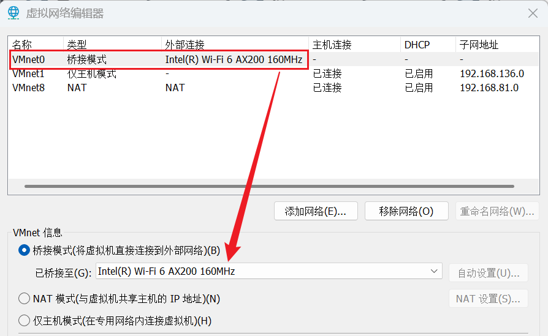

##### 1.3.2 添加网络适配器

我们可以为虚拟机中的 ubuntu 添加一个网络适配器并配置为桥接模式：

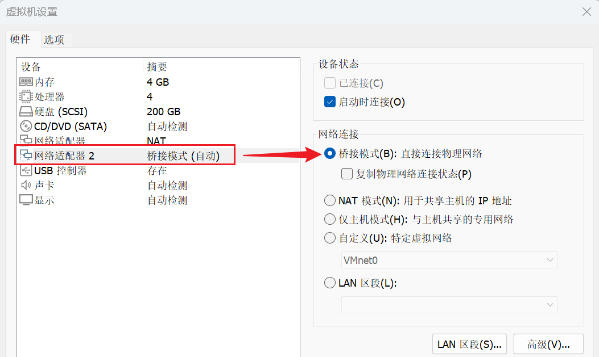

##### 1.3.3 启动虚拟机

启动后我们就可以看一下windows联网的无线网卡的ip地址和ubuntu中桥接模式的网络适配器的ip，会发现他们会在一个网段。

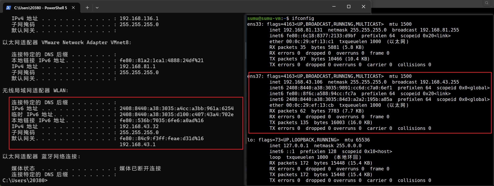

我们可以在ubuntu中使用ens37这个网卡ping一下`www.baidu.com`：

```bash
ping -I ens37 www.baidu.com
```

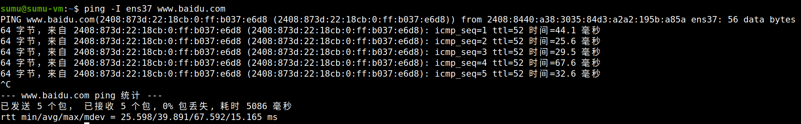

这就说明可以正常联网。

#### 1.4 小结

这种情况其实就类似下面的图中连接方式：

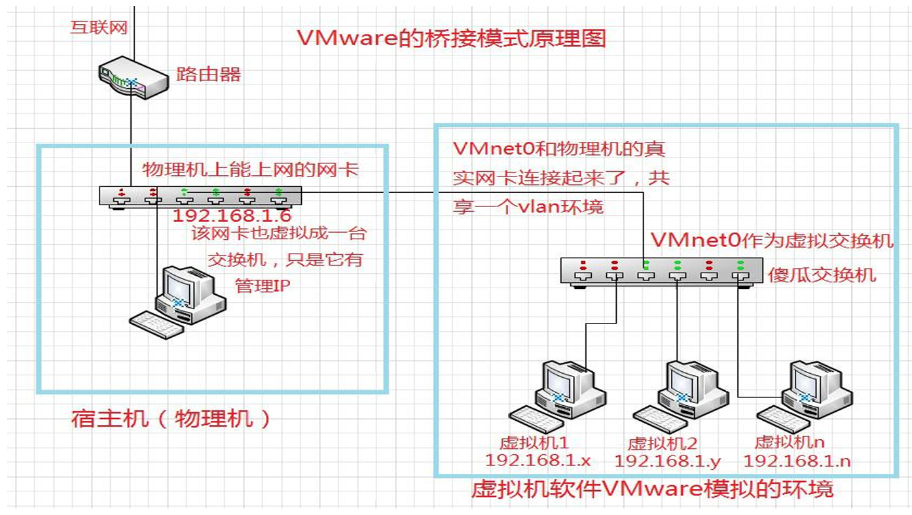

### 2.  VMnet8 (NAT 模式)

#### 2.1 NAT模式简介

用桥接模式虚拟出来的虚拟机，像是宿主机所在局域网内的一台真实机器，它**会占用真实的IP资源，并受此局域网络的管理规则约束**。如果我们网络中的IP资源紧缺，或者是使用新的IP需要通过层层审批以满足管理规则，那么NAT模式就是更合适的选择，这种模式可以避免这些问题带来的困扰。

NAT模式借助虚拟NAT设备和虚拟DHCP服务器，使得虚拟机可以联网，就是做个源NAT，把虚拟机的IP转换成宿主机的某块网 卡的IP，通过那个IP（相当于防火墙的外网口IP）上网。其网络结构如图：

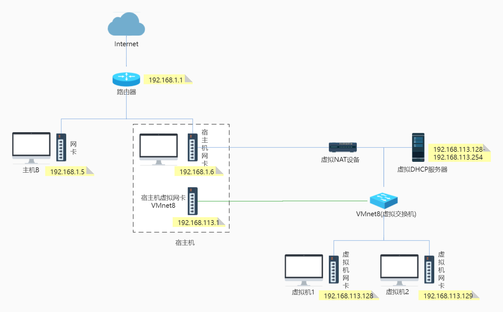

（1）在虚拟机连接Vmnet8虚拟交换机时，虚拟机会将虚拟NAT设备及虚拟DHCP服务器连接到Vmnet8虚拟交换机上。依靠虚拟的NAT设备及虚拟的DHCP设备，如果我们的宿主机已经联网了，那么我们的虚拟机也就可以联网。

（2）同时宿主机上的虚拟网卡VMwareNetwork Adapter VMnet8也会连接到Vmnet8虚拟交换机上，用于宿主机和虚拟机的通信。

（3）虚拟网卡VMwareNetwork Adapter VMnet8只是作为主机与虚拟机通信的接口，虚拟机并不是依靠虚拟网卡VMware Network Adapter VMnet8来联网的。如果禁用掉宿主机上的虚拟网卡VMwareNetwork Adapter VMnet8，虚拟机仍然是可以上网的，只是宿主无法再访问VMnet8网段下的虚拟机了（但虚拟机仍然可以访问宿主机）。

（4）使用NAT模式，就是让虚拟机借助NAT（网络地址转换功能），通过宿主机所在的网络来访问互联网。也就是说，使用NAT模式可以实现虚拟机访问互联网；但由于NAT服务协议对外部网络隐蔽内部网络，因此虚拟机可以通过NAT服务器访问宿主机所在局域网内的其他真实主机，但这些真实主机且不能反过来访问虚拟机。即宿主机、宿主机所在局域网内的其他主机以及互联网中的其他主机都**不能通过NAT服务器**访问虚拟机（宿主机可以通过虚拟网卡VMware Network Adapter VMnet8来访问虚拟机），但是虚拟机能通过NAT服务器访问宿主机、宿主机所在局域网的其他主机以及互联网中的其他主机。

（5）使用NAT模式最大的优势是接入互联网十分简单，你不需要进行其他的配置（BOOTPROTO选择为dhcp的情况下），只要宿主机能访问互联网，虚拟机就能访问互联网。

#### 2.2 使用示例

##### 2.2.1 NAT模式

我们其实创建虚拟机的时候默认用的就是NAT模式，这里默认的网络适配器就是NAT模式的：

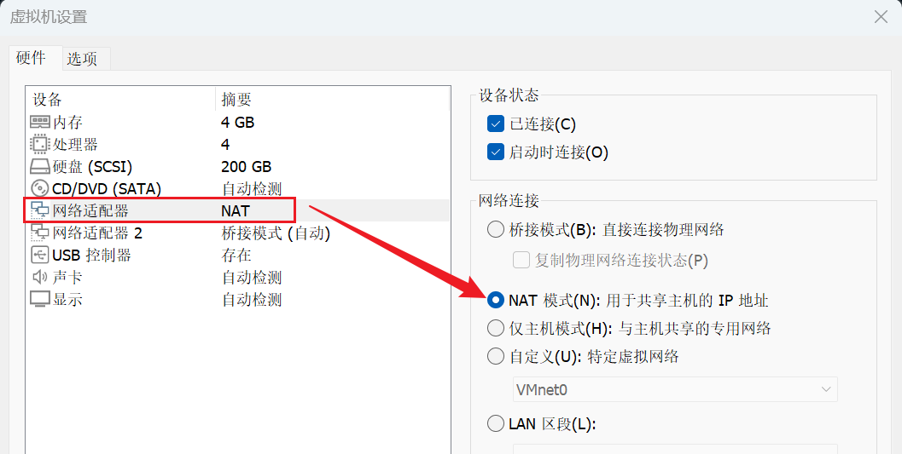

一开始我们直接就是这样实现虚拟机中的ubuntu联网的。可以看一下这个时候NAT设置和DHCP设置的参数：

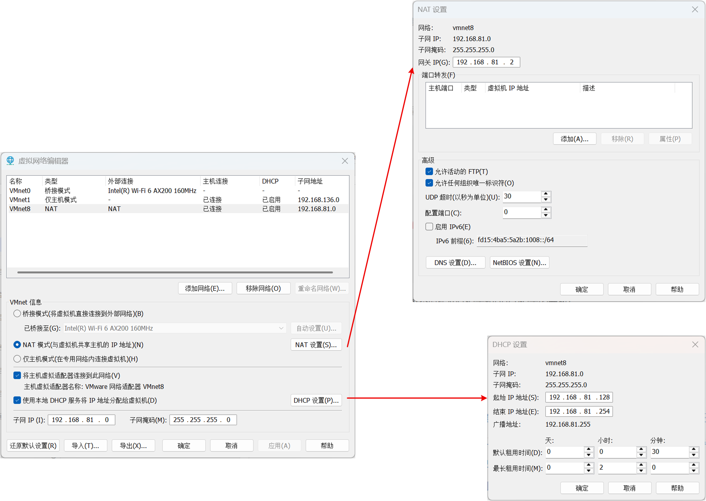

##### 2.2.2 启动虚拟机

我们启动虚拟机看一下网卡：

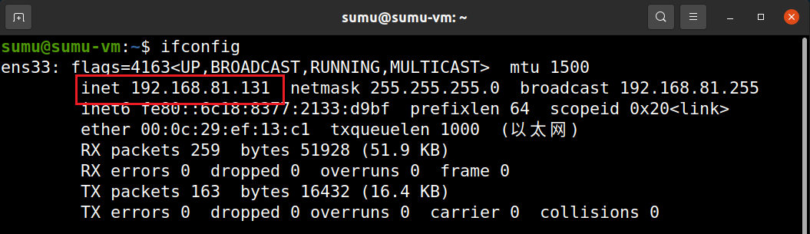

这里的ens33就是我们使用NAT模式的网络适配器。

#### 2.3 小结

NAT模式的原理图如下：

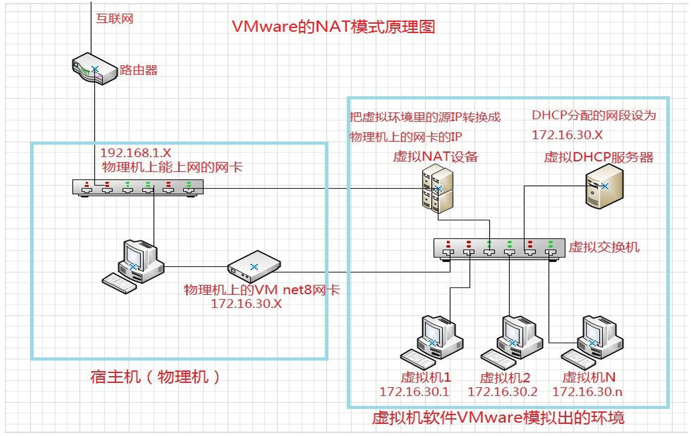

（1）与物理真机不在同一个网段，拥有独立的IP网段。

（2）**拥有一个虚拟的路由器（NAT设备）可以让虚拟机连接到外网环境。**

（3）地址转换：当虚拟机想要访问互联网（例如访问一个网站）时，数据包会先发送到宿主机上的NAT设备。NAT设备会将数据包的**源IP地址**从虚拟机的**私有IP**（如 `192.168.1.10`）**转换**成您宿主机的**公网/物理IP地址**（如 `218.56.123.21`），然后才发送到外部网络。当外部服务器返回响应时，数据包是发回给宿主机的物理IP。NAT设备再根据之前记录的连接会话信息，将数据包的**目标IP地址**从宿主机的物理IP**转换**回虚拟机的私有IP，并转发给虚拟机。

### 3. VMnet1（仅主机模式）

#### 3.1 仅主机模式简介

仅主机模式是指把宿主机上的VMnet1这块网卡和虚拟环境里的虚拟交换机连在一起了，它 们只要是同一个网段的IP就能通信。因为宿主机只是普通的PC，它的网卡收到数据包后是 不会再进行转发了，所以仅主机模式下，虚拟环境里的虚拟机是上不了互联网的。

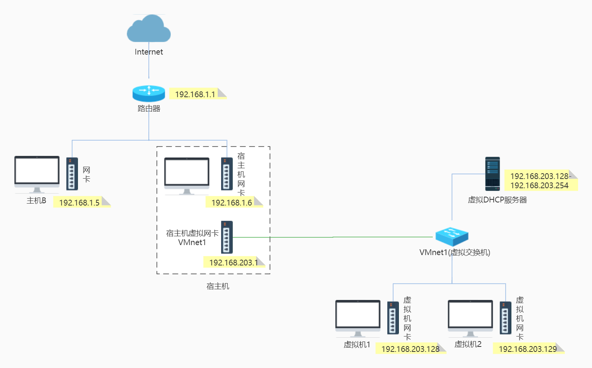

（1）Host-Only模式通过宿主机的虚拟网卡VMwareNetwork Adapter VMnet1来连接虚拟交换机VMnet1，从而达到宿主机与虚拟机通信的目的。但是虚拟机不能主动与宿主机通信（是单向连通的）。

（2）如果想要在Host-Only模式下联网，可以将能联网的主机网卡共享给VMware Network Adapter VMnet1，这样就可以实现虚拟机联网。

（3）如果仅仅想让虚拟机访问互联网，这种方式不推荐，也没有必要。NAT方式是最简单的，基本上不需要做什么操作，就能自动连接上。

#### 3.2 使用示例

后来自己也没有这种模式的需求，就没有尝试了。

#### 3.3 小结

再来看一下基本原理图：

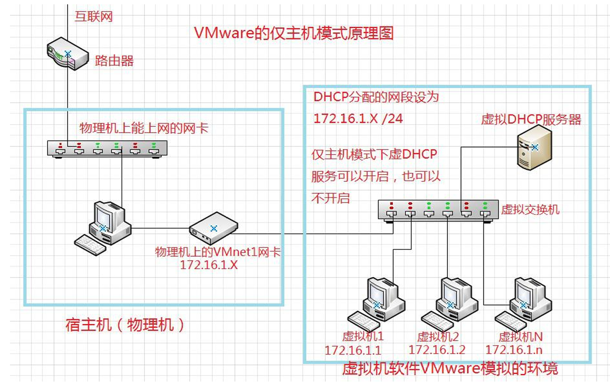

> 参考资料：
>
> [(8 封私信) 终于有人把VMware虚拟机三种网络模式讲清楚了！ - 知乎](https://zhuanlan.zhihu.com/p/666987647)
>
> [一文带你快速了解 VMware 的三种网络模式-腾讯云开发者社区-腾讯云](https://cloud.tencent.com/developer/article/2433678)
>
> [VMware 的三种网络模式详解.pdf](https://limaofu.github.io/t1/VMware的三种网络模式详解.pdf)
>
> [2.VMware 三种网络模式 - certainTao - 博客园](https://www.cnblogs.com/certainTao/p/15643455.html)
>
> [VM桥接模式下 复制物理网络连接状态选项有什么作用？_虚拟机cestos 桥连 复制网络状态是干嘛的-CSDN博客](https://blog.csdn.net/weixin_51559947/article/details/120529913)
