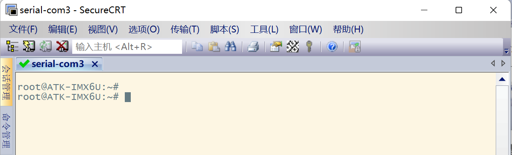
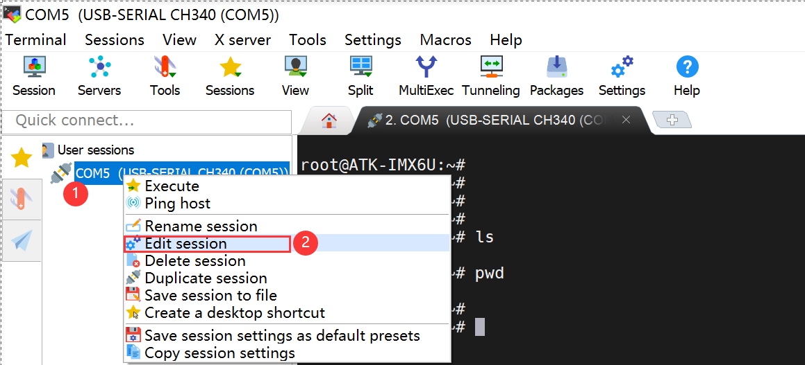

<!-- more -->

## 一、CH340驱动

我们一般在` Windwos `下通过串口来调试程序，或者使用串口作为终端， `I.MX6U-ALPHA`开发板使用 `CH340`芯片实现了 `USB`转串口功能，所以需要进行驱动的安装。

### 1. 连接PC与开发板

先通过`USB`线将开发板的串口和电脑连接起来起来，连接方式如下图：


### 2. 安装驱动

可以在这里下载`CH340`的驱动程序（[CH341SER.EXE - 南京沁恒微电子股份有限公司 (wch.cn)](https://www.wch.cn/downloads/CH341SER_EXE.html)）：

```html
http://www.wch.cn/downloads/CH341SER_EXE.html
```

下载完毕后，双击安装即可，安装成功如下图所示：


此时我们打开电脑的设备管理器，会发现已经识别到了串口：


## 二、串口终端软件

可以使用串口的终端软件有很多比如 Xshell， SecureCRT， MobaXterm，甚至 Ubuntu 的终端都是可以连接开发板上的串口的。我主要是用过两种，就是SecureCRT和MobaXterm。后边主要是用MobaXterm了。注意：这里的演示，需要开发板中已经烧写了u-boot和linux。

### 1. SecureCRT

#### 1.1 安装SecureCRT

以前实习的时候就是用的这个，熟悉一些，就还是用这个啦。我们可以自己去网上找一个安装包就可以了，也有一些绿色中文便携的，懂的都懂哈。软件界面如下图（我换过主题啦）：


#### 1.2 配置SecureCRT

接下来就可以进行配置啦，这里选择串口，然后波特率的话，我用的这个板子是要设置为`115200`否则出来的全是乱码。


连接成功后如下图所示：



接下来我们就可以在这里边使用`Linux`相关命令啦。

### 2. MobaXterm  

#### 2.1 MobaXterm 简介

MobaXterm又名MobaXVT，是一款增强型远程连接工具，类似xshell。它有以下特点：

（1）MobaXterm具有宏的功能，能录下我们的操作，保存下来后，遇到相同的任务，直接运行宏，就能自动重复之前的命令，有效提高效率。

（2）MobaXterm自带文本编辑器，双击文件传输窗口里的文本文件，能直接用自带的文本编辑器打开服务器中的文件。

（3）如果在Windows下运行程序的话，我们需要打开cmd命令行窗口，而打开的窗口多了话，任务栏不免拥挤，切换非常不便。现在我们通过MobaXterm也能打开Windows下的cmd程序，并且能设置打开时的默认路径。

（4）MobaXterm自带Linux环境，不需要装双系统，也不需要装虚拟机，打开MobaXterm的本地终端就能直接进入Linux环境，此时我们的Windows系统俨然成为了Linux服务器。

（5）自动保存日志功能，经过配置，MobaXterm可以将串口显示的所有内容直接写入文件，写入文件的每一行数据也可以增加时间。

MobaXterm 分免费开源版和收费专业版。官网提供 MobaXterm 的免费开源版 “Home Edition” 下载, 免费开源版又分便捷版(解压即用)和安装版(需要一步步安装)。MobaXterm 免费版(persional)和专业版(Professional)除了 sessions 数、SSH tunnels 数和其他一些定制化配置外限制外，免费版在终端底部还多了一个 “UNREGISTERED VERSION” 提示。

#### 2.2 软件安装

这个没什么说的，可以在这里下载[MobaXterm-Download](https://mobaxterm.mobatek.net/download.html)，我们下载免费版本就可以了：


我下载的是MobaXterm(Professional Edition v23.0 Build 5042 (license)）版本然后一路默认安装就可以了，安装完毕后，打开界面如下：


#### 2.3 创建会话

接下来就是创建串口会话，MobaXterm 按如下配置：【 Session（会话）】&rarr;【选择 Serial（串口）类型】&rarr;【选择开发板设备对应的 com 口】&rarr;【选择波特率为 115200（开发板默认波特率为 115200）】&rarr;【高级设置】&rarr;【设置流控为 None】&rarr;【点击确认】。  


#### 2.4 启动本地终端

很多时候我们要打开windows下的命令行，但是win下的命令跟linux是有很多不同的，MobaXterm 为我们提供了一个本地终端，就像一个linux服务器一样，我们直接点击主界面的【start local terminal】


然后便会打开一个本地终端，我们可以在里边使用大部分的linux命令。


【注意】老版本的很可能没有这个功能，有需要的话，最好使用比较新的版本。

#### 2.5 自动保存日志

##### 2.5.1 全局配置

点击主界面菜单栏的【Settings】&rarr;【Configuration】


然后会打开配置界面，按照下图的配置即可。


##### 2.5.2 本地终端效果

本地终端是直接受全局配置影响，可以直接生效的。我们重启终端，开一个本地的终端，然后随便输入几个命令，再看一下刚才设置的日志保存目录，会发现生成了一个文件：


我们打开文件看一下，就会发现里边是我们刚才敲得命令及显示的信息，并且都带时间戳：


##### 2.5.3 串口终端

但是会发现我们的串口终端的日志是没有保存下来的，所以还需要单独对串口终端配置一下，【选中串口终端】&rarr;【右键】&rarr;【Edit session】



然后便会弹出配置界面，然后按照图中步骤开启日志打印，最终重启串口终端即可：


最终保存的效果如下：


