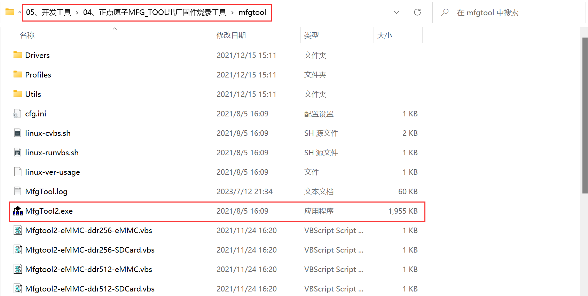
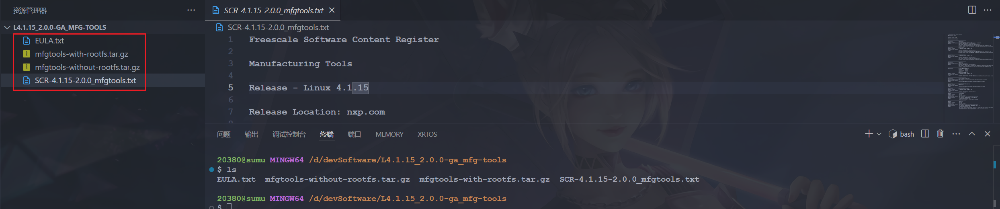
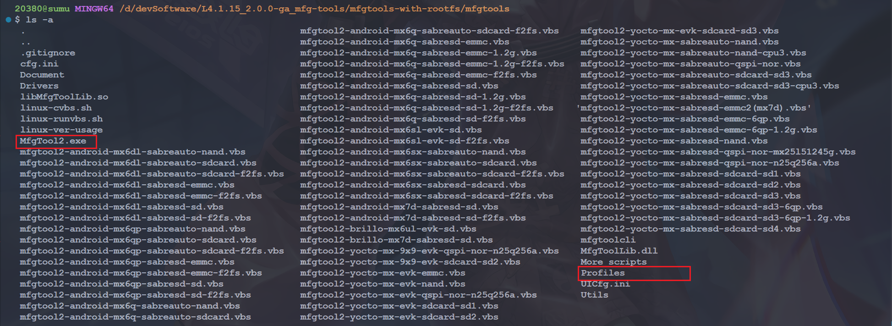
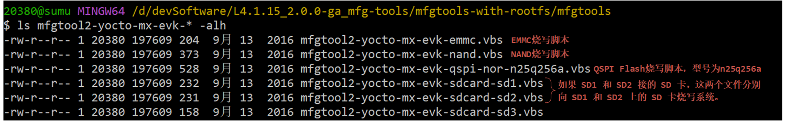
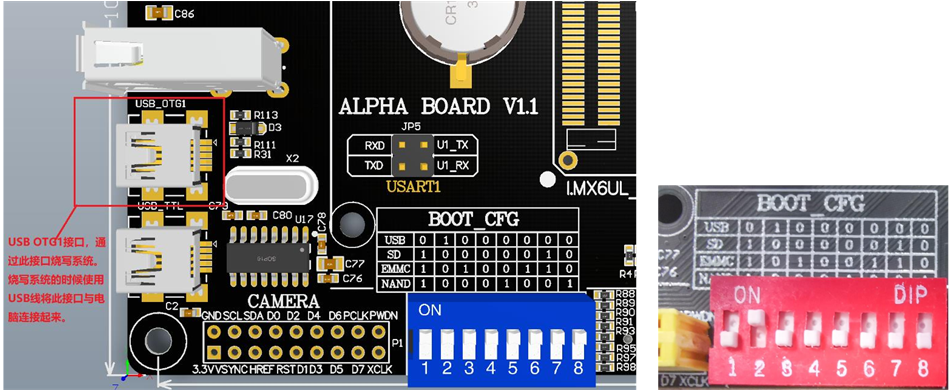
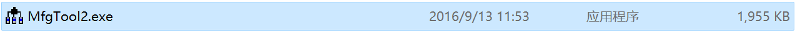
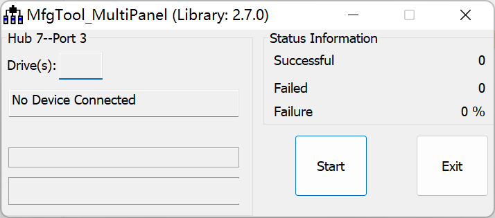
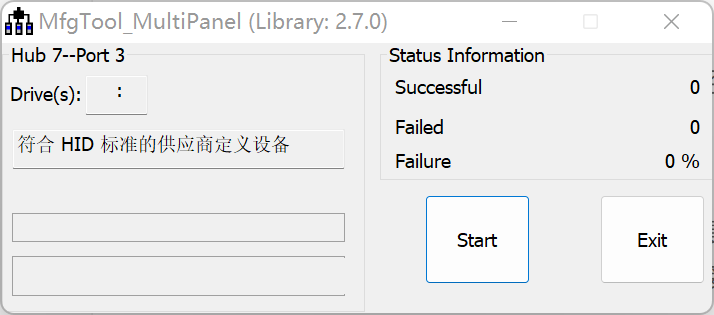
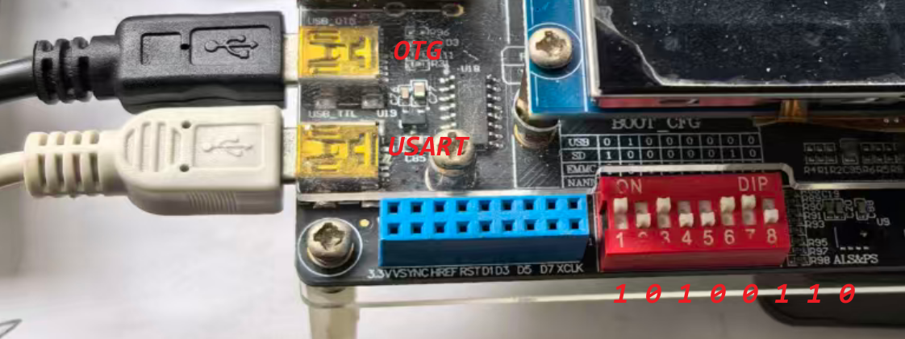

<!-- more -->

这是一个烧写工具，是NXP专门为自己家的芯片出的一个工具，我们是可以通过脚本来使用这个工具烧写我们所需要的文件到开发板中去，而脚本可以根据我们的需求来写。

## 一、ALPHA板开发资料中的mfgtool

这个烧写工具，在正点原子提供的资料里边已经有了，我们使用的话就先用正点原子提供的这一个：

## 二、NXP官方原版mfgtool

我们先对官方原版的mfgtool进行一个了解，方便后边学习定制自己的mfgtool。

### 1. 软件下载

MfgTool 工具是 NXP 提供的专门用于给 I.MX 系列 CPU 烧写系统的软件，可以在 NXP 官网下载到，由于正点原子出厂的系统都是基于NXP维护的4.1.15的相关BSP资源开发的，所以这里的工具，我也选择相同的版本：[IMX6_L4.1.15_2.0.0_MFG_TOOL (nxp.com.cn)](https://www.nxp.com.cn/webapp/sps/download/license.jsp?colCode=IMX6_L4-1-15_2-0-0_MFG-TOOL&appType=file1&location=null&DOWNLOAD_ID=null)。  下载并解压好的文件如下所示：

解压后有两个.txt 文件和两个.gz 压缩包。 .txt 文档就不去看了，重点是这两个 .gz 压缩包，这两个压缩包的区别在名字上已经写的很详细了。“without-rootfs”和“with-rootfs”，一个是带 rootfs 和一个是不带 rootfs。 

### 2. 相关介绍

mfg\_tools 这个工具本意是给 NXP 自己的开发板设计的烧写软件，所以肯定带有自家开发板对应的 uboot、 linux kernel 和 rootfs 的文件。我们肯定是要烧写文件系统的，所以选择 mfgtools-with-rootfs.tar.gz 这个压缩包，继续对其解压， 解压出一个名为 mfgtools-with-rootfs 的文件夹，此文件夹就包含有我们需要的烧写工具。解压后会包含以下文件：

（1）我们只关心上图中 Profiles 这个文件夹，因为后面要烧写文件就放到这个文件夹中。里面存放着的是其实就是镜像文件，这里面镜像文件分为两种：第一种是作为媒介用途的 镜像，包括uboot、dtb与uImage；第二种是真正烧录到emmc、sdcard或者nand flash的镜像文件。多提一句，之所以存在这两种镜像，是因为MFGTools的烧录 原理是先烧录媒介镜像到ram里面，然后启动，再通过这个启动了的媒介镜像把目标镜像烧录到emmc、sdcard或者nand flash里面。

（2）MfgTool2.exe 就是烧写软件，但是我们不会直接打开这个软件烧写， mfg_tools 不仅能烧写I.MX6U，而且也能给 I.MX7、 I.MX6Q 等芯片烧写，所以在烧写之前必须要进行配置，指定烧写的是什么芯片，烧写到哪里去。

（3）Document文件夹中存放了与该工具相关的文档。

（4）Driver目录为Windows 32位和64位操作系统的驱动，驱动一般都不会出现问题，也就无需理会。

（5）More\_scripts目录主要存放一些脚本文件，如果只是单纯使用MFGtool工具 也无需修这些脚本文件，此处暂时无需理会。

（6）还有这些众多的.vbs 文件就是配置脚本，烧写的时候通过双击这些.vbs 文件来打开烧写工具。这些.vbs 烧写脚本既可以根据处理器的不同，由用户自己选择向 I.MX6D、 I.MX6Q、 I.MX6S、 I.MX7、 I.MX6UL 和 I.MX6ULL 等的哪一款芯片烧写系统。也可以根据存储芯片的不同，选择向 EMMC、 NAND 或 QSPI Flash 等的哪一种存储设备烧写，功能非常强大。例如我们现在需要向 I.MX6U 烧写系统 ，那么就需要参考下表所示的 5 个烧写脚本：

<table>
    <tr><td align="center">脚本文件</td><td align="center">描述</td></tr>
    <tr><td align="left">mfgtool2-yocto-mx-evk-emmc.vbs</td><td align="left">EMMC 烧写脚本</td></tr>
    <tr><td align="left">mfgtool2-yocto-mx-evk-nand.vbs</td><td align="left">NAND 烧写脚本</td></tr>
    <tr><td align="left">mfgtool2-yocto-mx-evk-qspi-nor-n25q256a.vbs</td><td align="left">QSPI Flash 烧写脚本，型号为 n25q256a</td></tr>
    <tr><td align="left">mfgtool2-yocto-mx-evk-sdcard-sd1.vbs</td><td align="left" rowspan="2">如果 SD1 和 SD2 接的 SD 卡，这两个文件分 别向 SD1 和 SD2 上的 SD 卡烧写系统。</td></tr>
    <tr><td align="left">mfgtool2-yocto-mx-evk-sdcard-sd2.vbs</td></tr>
</table>

其他的.vbs 烧写脚本用不到，因此可以删除掉。  

## 三、mfgtool启动

前边我们做完准备工作后，USB线应该一端接在电脑，另一端接在开发板的USB OTG口，拨码开关应该对应在从USB启动（0100 0000）的状态。

当一切准备就绪以后，按一下开发板的复位键，（**如果插了 TF 卡，请弹出 TF 卡，否则电脑不能识别 USB！等识别出来以后再插上 TF 卡！**  ）此时就会进入到 USB 模式，如果是第一次进入 USB 模式的话可能会久一点，这个是免驱的，因此不需要安装驱动。一旦第一次设置好设备以后，后面每次连接都不会有任何提示了。

怎么确认连接成功了呢？我们可以双击打开这个文件：

然后会看到如下弹窗：

上边显示【No Device Connected】就说明USB连接不成功，我们可以重启开发板重试一下，若识别到USB，连接成功的话，如下图：

会显示【符合 HID 标准的供应商定义设备】。这里需要注意，我们需要先拔出TF卡，等识别到USB后再插上TF卡即可。

## 四、使用示例

我们这里来烧写一个正点原子ALPHA出厂系统，也方便后面体验开发板使用。我们这里吧出厂系统烧写到eMMC中。

### 1. 接线

这里启动方式要设置为从USB启动，也就是0100 0000。

### 2. 启动开发板

如下图所示，我们先吧开发板启动方式设置为eMMC启动：

