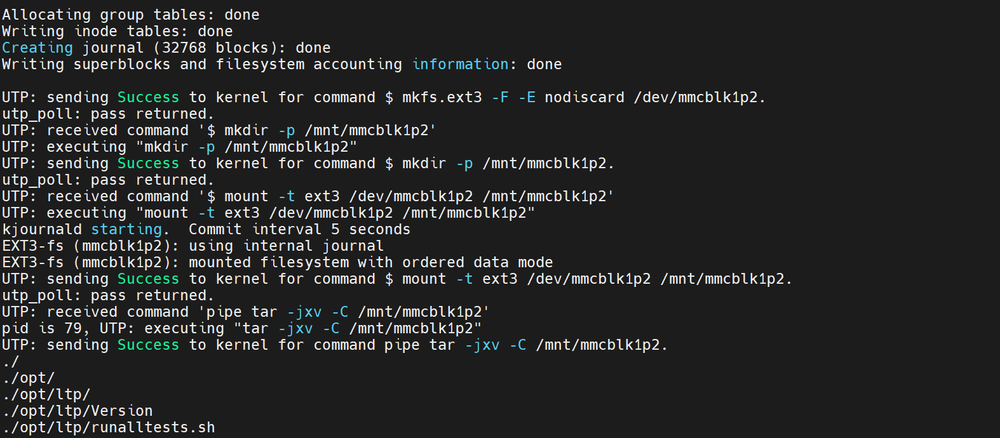

<!-- more -->

## 一、工具下载

这里以 NXP 官方原版工具为例：[Applications Processors with Power-Efficient ARM Cortex-A7 | NXP 半导体](https://www.nxp.com.cn/products/i.MX6ULL)


登录后下载即可。然后解压，会得到以下文件：


我们这里选择带有根文件系统的压缩包继续解压，我们后面继续分析。

## 二、工作流程概述

### 1. 两个阶段

开发板连接电脑以后双击“ mfgtool2-yocto-mx-evk-emmc.vbs ”文件打开软件。


然后就会打开 mfgtool 软件，会有如下弹窗（前提是已经设置为 USB 启动并连接 USB-OTG 到电脑）：


> 【注意】若是使用的是正点原子 alpha linux 开发板，这里需要先拔掉 TF 卡，并且将拨码开关拨到从 USB 启动，否则会识别不到 USB。要是有其他的 MfgTool2.exe 正在运行，这时候就会报 Initialize the library failed，error code：29.

如果出现【符合 HID 标准的供应商定义设备】就说明连接正常，可以进行烧写，如果出现其他的字符那么就要检查连接是否正确。点击【Start】按钮即可开始烧写，烧写什么东西呢？肯定是烧写 uboot、 Linux kernel、 .dtb 和 rootfs，那么这四个文件应该放到哪里 MfgTool 才能访问到呢？ 我们进入如下目录中 ：

```shell
L4.1.15_2.0.0-ga_mfg-tools/mfgtools-with-rootfs/mfgtools/Profiles/Linux/OS Firmware
```

该目录中相关文件如下图所示：


文件夹“ OS Firmware ”是存放系统固件的，我们重点需要关注该目录中的 files、 firmware 这两个文件夹，以及 ucl2.xml 这个文件。在具体看这三个文件和文件夹之前，我们先来简单了解一下 MfgTool 烧写的工作流程：

MfgTool 其实是先通过 USB OTG 先将 uboot、 kernel 和.dtb（设备树）这是三个文件下载到开发板的 DDR 中，注意此时不需要下载 rootfs。就相当于 **直接在开发板的 DDR 上启动 Linux 系统，等 Linux 系统启动以后再向 EMMC 中烧写完整的系统**，包括 uboot、 linux kernel、 .dtb（设备树）和 rootfs，因此 MfgTool 工作过程主要分两个阶段：

- 第一阶段：启动引导

（1）将 firmware 目录中的 uboot、 linux kernel 和.dtb（设备树），通过 USB OTG 将这个文件下载到开发板的 DDR 中，目的就是在 DDR 中启动 Linux 系统，为后面的烧写做准备。这个就对应后面的 BurnStarp 阶段。

> 为什么第一阶段不下载根文件系统？那怎么执行命令？
>
> 嵌入式设备的 DDR（内存）容量通常有限（比如 512MB 或 1GB）。而一个完整的根文件系统（尤其是带有图形界面和很多应用的）可能非常大，轻松达到几百 MB 甚至上 GB。把它也加载到 DDR 中会占用大量宝贵的内存，甚至可能根本放不下。而且通过 USB 将整个根文件系统传输到 DDR 中会非常耗时，不符合“量产工具”高效快速的要求。

- 第二阶段：系统烧写

（2）经过第（1）步的操作，此时 Linux 系统已经运行起来了，系统运行起来以后就可以很方便的完成对 EMMC 的格式化、分区等操作。 EMMC 分区建立好以后就可以从 files 中读取要烧写的 uboot、 linux kernel、 .dtb（设备树）和 rootfs 这 4 个文件，然后将其烧写到 EMMC 中。其实也不仅限于 EMMC，这个烧录的位置由用户指定，可以是 sd card、nand flash，emmc 等。这个对应后面的 Updater 阶段。

### 2. 设备连接后发生了什么？


（1）当 I.MX6 板子上电后，什么都没有初始化，只有 Boot ROM（芯片的内部 ROM）可以运行。Boot ROM 的默认程序会去 **初始化 USB**，并将其配置为 HID 设备。这就是为什么板子设置为 Download 模式并上电后在 PC 端的设备管理器可以看到 HID-compliant device 连上。

（2）一旦 PC 机检测到 HID 设备连上，那么 PC（USB Host）就会去枚举设备并建立连接。建立连接后的第一件事就是传送一个 mini uboot（firmware）到目标板 SoC 的 Chip RAM（芯片的内部 RAM）中然后开始运行 mini uboot（firmware）。mini uboot 会对目标板进行初始化，主要是初始化 DDR/外部 ROM 等设备, 所以之后 DDR 及外部 ROM 已经可以访问了。mini uboot 从 mini uboot 中提取内存初始化代码或数据来执行任务。也可以使用内存初始化脚本来获取初始化数据。

（3） 初始化外部基本接口之后，PC 端会将 mini kernel（firmware）、mini system（firmware）、dtb（firmware）传送给 SoC 并放到 DDR(外部 RAM)指定的地址。然后 PC 发送命令，例如 ucl2.xml 中的：

```xml
<CMD state="BootStrap" type="jump" > Jumping to OS image. </CMD>
```

PC 把这个命令发送给 Boot ROM 让其跳转到 DDR 的 kernel 首地址去执行。

（4）跳转到 kernel 之后，初始化 USB 驱动，并枚举为一个 MSC 设备，此时 SoC 可以和主机进行高速数据传输。

（5）之后 PC 机 MFGTool 工具通过 ucl2.xml 中的脚本逐条执行剩下的指令直到最后遇到 Done 指令。

>【说明】
>
>（1）上面提到的 mini uboot、mini kernel、mini system、dtb 文件均在软件目录下的这个文件夹下：
>
>```shell
>L4.1.15_2.0.0-ga_mfg-tools/mfgtools-with-rootfs/mfgtools/Profiles/Linux/OS Firmware/firmware
>```
>
>（2）mini kernel 必须要配置 USB、USB 大容量存储驱动、SD 卡、UTP 等。详见
>
>```shell
>L4.1.15_2.0.0-ga_mfg-tools/mfgtools-with-rootfs/mfgtools/Document/V2/Manufacturing Tool V2 Linux or Android Firmware Development Guide V2.docx
>```
>
>（3）mini kernel 启动 linuxrc 作为第一个进程，linuxrc 其实是一个脚本，最终通过执行 uuc 来启动 UTP 传输协议。UTP 是作为 USB Mass Storage(v4 Kernel)驱动的扩展，所以启动 UTP 必须对 USB 进行复位然后重新枚举。

### 3. 没有根文件系统？

在启动阶段我们并不会吧自己的根文件系统下载到DDR中，那么，linux启动后怎么使用命令完成对系统的烧写？其实，我们对着ucl2.xml文件看一下，就会发现在第一阶段有这么个命令：


下载了个Initramfs，这个其实就是一个用于引导的**ramdisk文件系统**。它的主要使命，就是提供一个能够执行分区、格式化、文件写入等操作的最小化Linux环境，为后续将真正的目标系统（比如完整的根文件系统）安全地烧录到开发板的eMMC、NAND Flash等存储介质中做好准备。它可以放在DDR中被linux挂载，它位于这个目录下：


需要知道的是，它以.uboot结尾是表示**表示这个文件已经用U-Boot的`mkimage`工具处理过，添加了U-Boot可识别的头部信息**，U-Boot无法直接引导普通的cpio.gz文件，它需要特定的头部信息来识别文件类型、加载地址、入口点等。经过这个处理后，U-Boot就能正确识别并加载这个ramdisk到指定的内存地址。然后在DDR中启动内核时就可以正常挂载这个临时的根文件系统了。

## 三、OS Firmware 目录说明

### 1. firmware 目录

路径为：

```shell
L4.1.15_2.0.0-ga_mfg-tools/mfgtools-with-rootfs/mfgtools/Profiles/Linux/OS Firmware/firmware
```

打开 firmware 文件夹，里面有很多的 .imx 结尾的 uboot 文件、一个 zImage 镜像文件、很多.dtb 结尾的设备树文件。这些文件都是 NXP 官方开发板使用的，不同的板子使用不同的文件，其中我们需要关心的只有下表的这四个文件：  

<table>
    <tbody>
    <tr> <td align="center"> 脚本文件 </td> <td align="center"> 描述 </td> </tr>
    <tr> <td align="left"> zImage </td> <td align="left"> NXP 官方 I.MX6ULL EVK 开发板的 Linux 镜像文件。</td> </tr>
    <tr> <td align="left"> u-boot-imx6ull14x14evk_emmc.imx </td> <td align="left"> NXP 官方 I.MX6ULL EVK 开发板的 uboot 文件。</td> </tr>
    <tr> <td align="left"> zImage-imx6ull-14x14-evk-emmc.dtb </td> <td align="left"> NXP 官方 I.MX6ULL EVK 开发板的设备树。</td> </tr>
    <tr> <td align="left"> fsl-image-mfgtool-initramfs-imx_mfgtools.cpio.gz.u-boot </td> <td align="left"> ramdisk </td> </tr>
    </tbody>
</table>


这四个文件就是 I.MX6ULL EVK 开发板烧写系统的时候 **第一阶段** 所需的文件。**如果要烧写我们的系统，就需要用我们编译出来的 zImage、 u-boot.imx 和 imx6ull-alienteke-mmc.dtb 这三个文件替换掉表中这三个文件。** 但是名字要和表中的一致，因此需要将 u-boot.imx 重命名为 u-boot-imx6ull14x14evk_emmc.imx，将 imx6ull-alientek-emmc.dtb 重命名为 zImage-imx6ull-14x14-evk-emmc.dtb。  **ramdisk**根文件系统一般不用修改，当然，有自己的需要的话应该是也能自己定制。

### 2. files 目录

路径为：

```shell
L4.1.15_2.0.0-ga_mfg-tools/mfgtools-with-rootfs/mfgtools/Profiles/Linux/OS Firmware/files
```

**第二阶段** 就是从 files 目录中读取整个系统文件，并将其烧写到 EMMC 中。 files 目录中的文件和 firmware 目录中的基本差不多，都是不同板子对应的 uboot、设备树文件，我们只关心下表中的四个文件：

<table>
    <tbody>
    <tr> <td align="center"> 脚本文件 </td> <td align="center"> 描述 </td> </tr>
    <tr> <td align="left"> zImage </td> <td align="left"> NXP 官方 I.MX6ULL EVK 开发板的 Linux 镜像文件。</td> </tr>
    <tr> <td align="left"> u-boot-imx6ull14x14evk_emmc.imx </td> <td align="left"> NXP 官方 I.MX6ULL EVK 开发板的 uboot 文件。</td> </tr>
    <tr> <td align="left"> zImage-imx6ull-14x14-evk-emmc.dtb </td> <td align="left"> NXP 官方 I.MX6ULL EVK 开发板的设备树。</td> </tr>
    <tr> <td align="left"> rootfs_nogpu.tar.bz2 </td> <td align="left"> 根文件系统，注意和另外一个 rootfs.tar.bz2 根文件系统区分开。 nogpu 表示此根文件系统不包含 GPU 的内容， I.MX6ULL 没有 GPU，因此要使用此根文件系统。</td> </tr>
    </tbody>
</table>


如果要烧写我们自己编译出来的系统，就需要用我们编译出来的 zImage、 u-boot.imx 和 imx6ull-alientek-emmc.dtb 和 rootfs 这四个文件替换掉上边这四个文件。  

### 3. ucl2.xml 文件  

#### 3.1 整体框架

files 和 firmware 目录下有众多的 uboot 和设备树，那么烧写的时候究竟选择哪一个呢？这个工作就是由 ucl2.xml 文件来完成的。

```xml
<UCL>
	<CFG>
		<!-- 判断向 I.MX 系列的哪个芯片烧写系统 -->
        <!-- 中间部分省略...... -->
	</CFG>
	
	<LIST name="SDCard" desc="Choose SD Card as media">
		<!-- 向 SD 卡烧写 Linux 系统 -->
        <!-- 中间部分省略...... -->
	</LIST>
	
	<LIST name="eMMC" desc="Choose eMMC as media">
	<!-- 向 EMMC 烧写 Linux 系统 -->
        <CMD state="BootStrap" type="boot" body="BootStrap" file ="firmware/u-boot-imx6ul%6uluboot%_emmc.imx" ifdev="MX6UL">Loading U-boot</CMD>
		<CMD state="BootStrap" type="load" file="firmware/zImage" address="0x80800000"
		loadSection="OTH" setSection="OTH" HasFlashHeader="FALSE" ifdev="MX6SL MX6SX MX7D MX6UL MX6ULL">Loading Kernel.</CMD>
		<!-- 中间部分省略...... -->
	</LIST>
	
	<LIST name="Nor Flash" desc="Choose Nor flash as media">
		<!-- 向 Nor Flash 烧写 Linux 系统 -->
        <!-- 中间部分省略...... -->
	</LIST>
	
	<LIST name="Quad Nor Flash" desc="Choose Quad Nor flash as media">
		<!-- 向 Quad Nor Flash 烧写 Linux 系统 -->
        <!-- 中间部分省略...... -->
	</LIST>
	
	<LIST name="NAND Flash" desc="Choose NAND as media">
		<!-- 向 NAND Flash 烧写 Linux 系统 -->
        <!-- 中间部分省略...... -->
	</LIST>
	
	<LIST name="SDCard-Android" desc="Choose SD Card as media">
		<!-- 向 SD 卡烧写 Android 系统 -->
        <!-- 中间部分省略...... -->
	</LIST>
	
	<LIST name="eMMC-Android" desc="Choose eMMC as media">
		<!-- 向 EMMC 烧写 Android 系统 -->
        <!-- 中间部分省略...... -->
	</LIST>
	
	<LIST name="Nand-Android" desc="Choose NAND as media">
		<!-- 向 NAND Flash 烧写 Android 系统 -->
        <!-- 中间部分省略...... -->
	</LIST>
	
	<LIST name="SDCard-Brillo" desc="Choose SD Card as media">
		<!-- 向 SD 卡烧写 Brillo 系统 -->
        <!-- 中间部分省略...... -->
	</LIST>
</UCL>
```

#### 3.2 UCL 标签

ucl2.xml 以“&lt; UCL&gt;”开始，以“&lt;/UCL&gt;”结束。它表示更新 命令列表（Update Command List，UCL），会被 MFGtool 工具中的脚本解析，所有的配置都包含在该标签之下。

#### 3.3 CFG 标签

ucl2.xml 首先会判断当前要向 I.MX 系列的哪个芯片烧写系统，相关代码如下：

```xml
  <CFG>
    <STATE name="BootStrap" dev="MX6SL" vid="15A2" pid="0063"/>
    <STATE name="BootStrap" dev="MX6D" vid="15A2" pid="0061"/>
    <STATE name="BootStrap" dev="MX6Q" vid="15A2" pid="0054"/>
    <STATE name="BootStrap" dev="MX6SX" vid="15A2" pid="0071"/>
    <STATE name="BootStrap" dev="MX6UL" vid="15A2" pid="007D"/>
    <STATE name="BootStrap" dev="MX7D" vid="15A2" pid="0076"/>
    <STATE name="BootStrap" dev="MX6ULL" vid="15A2" pid="0080"/>
    <STATE name="Updater"   dev="MSC" vid="066F" pid="37FF"/>
  </CFG>
```

这个标签之间是配置相关内容，通过读取芯片的 VID 和 PID 即可判断出当前要烧写什么处理器的系统，如果 VID = 0X15A2，PID = 0080，那么就表示要给 I.MX6ULL 烧写系统。

它是 MFGtool 工具的一些全局配置，如在第一阶段（BootStrap）设备枚举，dev 的值可以 为 MX6SL、MX6D、MX6Q、MX6SX、MX6UL、MX6ULL、MX7D 其中的一个或 多个（因为 MFGtool 工具可以同时烧录多个开发板），如果 USB 的 vid 为 15A2，pid 为 0080，那么 MFGtool 工具会将 dev 识别为 MX6ULL，这 USB 中 的 vid 与 pid 是由芯片本身决定的，当 dev 为 MX6ULL 时，在后续的烧录任务中会通过 ifdev MX6ULL 进行选择执行哪些语句，然后将 name 设置为 BootStrap，标识当前处于第 一阶段，不同的阶段执行的处理是不一样的。这个阶段简单来说就是将开发板的 USB OTG 接口 连接电脑，并且被 MFGtool 工具识别，才能有接下来的烧录操作。

如果 USB 中的 vid 为 066F，pid 为 37FF，则表示进入第二阶段，将 dev 标识为 MSG，而 name 则被设置为 Updater。

简单来说，烧录分为两个阶段，BurnStarp 和 Updater，通过全局配置设备的 vid 和 pid，来选择操作的设备（开发板）。

#### 3.4 LIST 标签

```xml
<LIST name="eMMC" desc="Choose eMMC as media">
	<!-- 向 EMMC 烧写 Linux 系统 -->
        <CMD state="BootStrap" type="boot" body="BootStrap" file ="firmware/u-boot-imx6ul%6uluboot%_emmc.imx" ifdev="MX6UL">Loading U-boot</CMD>
		<CMD state="BootStrap" type="load" file="firmware/zImage" address="0x80800000"
		loadSection="OTH" setSection="OTH" HasFlashHeader="FALSE" ifdev="MX6SL MX6SX MX7D MX6UL MX6ULL">Loading Kernel.</CMD>
		<!-- 中间部分省略...... -->
</LIST>
```

“&lt; LIST&gt;”和“&lt;/LIST&gt;”之间的是针对不同存储芯片的烧写命令。 这就是前面说的 列表配置，list 后面有 name、desc 等参数，name 则表示选择 cfg.ini 文件中 的 list 内容中的配置，可以为 SDCard、eMMC、NAND Flash 等。而 desc 参数用来说明目的，选择烧录 的位置，如 Choose SD Cardas media、Choose eMMC as media、Choose NAND as media 等。

#### 3.5 CMD 标签

```xml
<CMD state="BootStrap" type="boot" body="BootStrap" file ="firmware/u-boot-imx6ul%6uluboot%_emmc.imx" ifdev="MX6UL">Loading U-boot</CMD>
<CMD state="BootStrap" type="load" file="firmware/zImage" address="0x80800000" loadSection="OTH" setSection="OTH" HasFlashHeader="FALSE" ifdev="MX6SL MX6SX MX7D MX6UL MX6ULL">Loading Kernel.</CMD>
```

在 \< LIST \> \</LIST \> 标签下有多个 \< CMD \> \</CMD \> 标签，这是命令标签，在不同的 阶段命令是不一样的，MFGtool 工具的命令分为主机特定命令（Host Specific Commands）与固件特定命令（Firmware Specific Commands），其中主机特定命令是由 MFGtool 工具解析和执行，而固件特定命令由 目标设备上的固件运行解析和执行。

命令标签下有多个属性，如 state 用于表示该命令在哪个阶段被执行，type 表示执行命令的类型，body 表示命令的参数，flie 则是其他参数，如需要烧录哪个文件，最后 的 Loading Kernel、Loading U-boot 则是命令描述。

##### 3.5.1 两种命令

- 主机特定命令（Host Specific Commands）的命令类型有多种，其他参数也有多种，具体见下表（空余处表示无参数）。

<table class="docutils align-default">
    <colgroup>
        <col style="width: 12%">
        <col style="width: 12%">
        <col style="width: 10%">
        <col style="width: 66%">
    </colgroup>
    <thead>
        <tr class="row-odd">
            <th>
                <p> 命令类型 </p>
            </th>
            <th>
                <p> 命令参数 </p>
            </th>
            <th>
                <p> 其他参数 </p>
            </th>
            <th>
                <p> 说明 </p>
            </th>
        </tr>
    </thead>
    <tbody>
        <tr class="row-even">
            <td>
                <p> load </p>
            </td>
            <td> </td>
            <td>
                <p> file </p>
            </td>
            <td>
                <p> 烧录的镜像文件的路径和文件名 </p>
            </td>
        </tr>
        <tr class="row-odd">
            <td>
                <p> </p>
            </td>
            <td> </td>
            <td>
                <p> Address </p>
            </td>
            <td>
                <p> 镜像存放的 RAM 地址 </p>
            </td>
        </tr>
        <tr class="row-even">
            <td>
                <p> </p>
            </td>
            <td> </td>
            <td>
                <p> loadSection </p>
            </td>
            <td>
                <p> ROM 代码使用的参数，应设置为“OTH”</p>
            </td>
        </tr>
        <tr class="row-odd">
            <td>
                <p> </p>
            </td>
            <td> </td>
            <td>
                <p> setSection </p>
            </td>
            <td>
                <p> 设置为 OTH，如果还有其他镜像，设置为 APP </p>
            </td>
        </tr>
        <tr class="row-even">
            <td>
                <p> </p>
            </td>
            <td> </td>
            <td>
                <p> HasFlashHeader </p>
            </td>
            <td>
                <p> 镜像如果包含 flash header，设为 TRUE，否则设置为 FALSE </p>
            </td>
        </tr>
        <tr class="row-odd">
            <td>
                <p> </p>
            </td>
            <td> </td>
            <td>
                <p> CodeOffset </p>
            </td>
            <td>
                <p> 第一次执行的指令的地址偏移量。注意：该命令仅适用于除 i.MX50 HID 模式设备之外的 Bulk-IO 模式 i.MX 设备。</p>
            </td>
        </tr>
        <tr class="row-even">
            <td>
                <p> jump </p>
            </td>
            <td> </td>
            <td> </td>
            <td>
                <p> 通知 ROM 代码跳转到 RAM 映像运行 </p>
            </td>
        </tr>
        <tr class="row-odd">
            <td>
                <p> boot </p>
            </td>
            <td>
                <p> 保留 </p>
            </td>
            <td>
                <p> flie </p>
            </td>
            <td>
                <p> 加载映像到 RAM </p>
            </td>
        </tr>
        <tr class="row-even">
            <td>
                <p> </p>
            </td>
            <td> </td>
            <td>
                <p> if </p>
            </td>
            <td>
                <p> 执行判断 </p>
            </td>
        </tr>
    </tbody>
</table>


- 固件特定命令（Firmware Specific Commands）的命令类型有多种，其他参数也有多种：

<table class="docutils align-default">
    <colgroup>
        <col style="width: 9%">
        <col style="width: 8%">
        <col style="width: 83%">
    </colgroup>
    <thead>
        <tr class="row-odd">
            <th class="head">
                <p> 命令 </p>
            </th>
            <th class="head">
                <p> 参数 </p>
            </th>
            <th class="head">
                <p> 说明 </p>
            </th>
        </tr>
    </thead>
    <tbody>
        <tr class="row-even">
            <td>
                <p>?</p>
            </td>
            <td> </td>
            <td>
                <p> 请求以 XML 格式发送设备标识信息 </p>
            </td>
        </tr>
        <tr class="row-odd">
            <td>
                <p>! </p>
            </td>
            <td>
                <p> integer </p>
            </td>
            <td>
                <p> 根据参数进行重启操作 </p>
            </td>
        </tr>
        <tr class="row-even">
            <td>
                <p>$</p >
            </td>
            <td>
                <p> string </p>
            </td>
            <td>
                <p> 执行 shell 命令，这是最常用的命令类型 </p>
            </td>
        </tr>
        <tr class="row-odd">
            <td>
                <p> flush </p>
            </td>
            <td> </td>
            <td>
                <p> 等待所有数据传输完成并处理 </p>
            </td>
        </tr>
        <tr class="row-even">
            <td>
                <p> ffs </p>
            </td>
            <td> </td>
            <td>
                <p> 对 SD 卡进行分区并将引导流闪存到它 </p>
            </td>
        </tr>
        <tr class="row-odd">
            <td>
                <p> read </p>
            </td>
            <td>
                <p> string </p>
            </td>
            <td>
                <p> 读取参数指定的文件并将其发送给主机。如果没有这样的文件，将返回相应的状态 </p>
            </td>
        </tr>
        <tr class="row-even">
            <td>
                <p> send </p>
            </td>
            <td> </td>
            <td>
                <p> 从主机接收文件 </p>
            </td>
        </tr>
        <tr class="row-odd">
            <td>
                <p> selftest </p>
            </td>
            <td> </td>
            <td>
                <p> 进行自我诊断， 返回通过或适当状态。在当前版本中未实现 </p>
            </td>
        </tr>
        <tr class="row-even">
            <td>
                <p> save </p>
            </td>
            <td>
                <p> string </p>
            </td>
            <td>
                <p> 将命令“send”接收的文件保存到指定为参数的文件中。</p>
            </td>
        </tr>
        <tr class="row-odd">
            <td>
                <p> pipe </p>
            </td>
            <td>
                <p> string </p>
            </td>
            <td>
                <p> 执行 shell 命令并从管道的输入端读取数据。 MFGtool 工具会将文件发送到管道输出端 </p>
            </td>
        </tr>
        <tr class="row-even">
            <td>
                <p> wff </p>
            </td>
            <td> </td>
            <td>
                <p> 准备将固件写入 flash </p>
            </td>
        </tr>
        <tr class="row-odd">
            <td>
                <p> wfs </p>
            </td>
            <td> </td>
            <td>
                <p> 准备将固件写入 SD Card </p>
            </td>
        </tr>
        <tr class="row-even">
            <td>
                <p> ffs </p>
            </td>
            <td> </td>
            <td>
                <p> 将固件写入 SD Card </p>
            </td>
        </tr>
    </tbody>
</table>


如果命令被命名为”push”即 type =”push”，这意味着 命令由目标设备而不是主机解析和执行，主机唯一要做的就是将命令发送到目标设备，通过 body 进行发 送命令。（固件特定命令已删减，且空余处表示无参数）。如果命令被命名为”push”即 type =”push”，这意味着命令由目标设备而不是主机解析和执行，主机唯一要做的就是将命令发送到目标设备，通过 body 进行发送命令。

##### 3.5.2 文件匹配

看上面这条命令：

```xml
<CMD state="BootStrap" type="boot" body="BootStrap" file ="firmware/u-boot-imx6ul%6uluboot%_emmc.imx" ifdev="MX6UL">Loading U-boot</CMD>
```

这个文件里的%都是啥？这里其实要用到后面的 cfg.ini 或者 xxx.vbs 文件，我们后面再说。

## 四、启动脚本与配置

### 1. xxx.vbs 文件

上边确定了处理器以后就要确定向什么存储设备烧写系统，这个时候就要用到 mfgtool2-yocto-mx-evk-emmc.vbs 脚本文件了，此文件内容如下：  

```vbscript
Set wshShell = CreateObject("WScript.shell")
wshShell.run "mfgtool2.exe -c ""linux"" -l ""eMMC"" -s ""board=sabresd"" -s ""mmc=1"" -s ""6uluboot=14x14evk"" -s ""6uldtb=14x14-evk"""
Set wshShell = Nothing
```

第 2 行：就是 “ wshShell.run ” 这一行，这里一行调用了 mfgtool2.exe 这个软件，并且还给出了一系列的参数，其中就有 “ eMMC ” 字样，说明是向 EMMC 烧写系统，要烧写的存储设备就这样确定下来了。“ wshShell.run ”后面还有一堆的其他参数，这些参数都有对应的值，如下所示：  

```shell
board=sabresd
mmc=1
6uluboot=14x14evk
6uldtb=14x14-evk
```

是不是很眼熟，还记得上面的哪条命令吧：

```xml
<CMD state="BootStrap" type="boot" body="BootStrap" file ="firmware/u-boot-imx6ul%6uluboot%_emmc.imx" ifdev="MX6UL">Loading U-boot</CMD>
```

就像这条命令的 6uluboot，会被 14x14evk 取代，所以这里的文件就是 `firmware/u-boot-imx6ul14x14evk_emmc.imx`，即：


也就是说这些参数最终将会被 ucl2.xml 文件所使用，最终用于确定各个文件名。另外这个-l 参数，据我猜测是决定 LIST 标签中的 name，这里的 name 是 eMMC, 就会对应：

```xml
<LIST name="eMMC" desc="Choose eMMC as media">
<!-- 中间部分省略...... -->
</LIST>
```

### 2. UICfg.ini 文件

```ini
[UICfg]
PortMgrDlg=1
```

UICfg.ini 文件是用来配置同时烧录多少个开发板，即配置其多通道的烧录。我们此处并不量产，默认配置为 1。

### 3. cfg.ini 文件

```shell
L4.1.15_2.0.0-ga_mfg-tools/mfgtools-with-rootfs/mfgtools/cfg.ini
```


cfg.ini 文件主要是用来配置目标芯片类型和板子信息及存储器的方式等内容的，其主要文件内容 包括四部分内容，分别是 profiles、platform、list、variable。需要注意的是，这个文件实际是给 ucl2.xml 文件使用的，用于确认里面%...%之间的值，相当于一个默认的配置文件，**它里面的值会被 xxx.vbs 文件中的命令所取代**。

- profiles

```ini
[profiles]
chip = Linux
```

表示要使用 Profiles 目录下哪个文件夹的内容进行烧录。如以上配置使用“/profiles/Linux/OS Firmware/ucl2.xml”目录 下的 ucl2.xml 配置烧录。会被 `mfgtool2.exe -c ""xxx""` 覆盖。

- platform

```ini
[platform]
board = SabreSD
```

开发板名字，目前没有作用，可以忽略

- list

```ini
[LIST]
name = SDCard
```

表示使用“/profiles/CHIP_PROFILE/OS Firmware/ucl2.xml”文件中 的哪个 list 配置进行烧录，如将 name 设置为 SDCard，则使用 ucl2.xml 文 件中 SDCard 一栏的配置进行烧录。会被 `mfgtool2.exe -l ""xxx""` 覆盖。

```xml
<LIST name="SDCard" desc="Choose SD Card as media">
    <!-- 向 SD 卡烧写 Linux 系统 -->
    <!-- 中间部分省略...... -->
</LIST>
<LIST name="eMMC" desc="Choose eMMC as media">
	<!-- 向 EMMC 烧写 Linux 系统 -->
	<!-- 中间部分省略...... -->
</LIST>
```

- variable

variable 中是一些环境变量，在 list 列表配置中会引用的环境 变量，会被会被 `mfgtool2.exe -s ""xxx=variable""` 覆盖。

```ini
[variable]
board = sabresd
mmc = 0
sxuboot=sabresd
sxdtb=sdb
7duboot=sabresd
7ddtb=sdb
6uluboot=14x14ddr3arm2
6uldtb=14x14-ddr3-arm2
6ulldtb=14x14-ddr3-arm2
ldo=
plus=
lite=l
initramfs=fsl-image-mfgtool-initramfs-imx_mfgtools.cpio.gz.u-boot
seek = 1
sxnor=qspi2
7dnor=qspi1
6ulnor=qspi1
nor_part=0
```

例如

```ini
initramfs=fsl-image-mfgtool-initramfs-imx_mfgtools.cpio.gz.u-boot
```

在”/profiles/CHIP_PROFILE/OS Firmware/ucl2.xml”文件中会被引用

```xml
<CMD state="BootStrap" type="load" file="firmware/%initramfs%" address="0x83800000"
		loadSection="OTH" setSection="OTH" HasFlashHeader="FALSE" ifdev="MX6SL MX6SX MX7D MX6UL MX6ULL">Loading Initramfs.</CMD>
```

其引用的方式为”%…%”，在两 个百分号（%）之间，通过变量 initramfs 进行传递。

## 五、烧写过程分析

我们接下来实例分析一下点击这个 mfgtool2-yocto-mx-evk-emmc.vbs 之后会发生什么。

### 1. 参数配置

我们看一下这个 mfgtool2-yocto-mx-evk-emmc.vbs 脚本：

```vb
Set wshShell = CreateObject("WScript.shell")
wshShell.run "mfgtool2.exe -c ""linux"" -l ""eMMC"" -s ""board=sabresd"" -s ""mmc=1"" -s ""6uluboot=14x14evk"" -s ""6uldtb=14x14-evk"""
Set wshShell = Nothing
```

可以得到这些配置项：

```ini
board=sabresd
mmc=1
6uluboot=14x14evk
6uldtb=14x14-evk

name=eMMC
```

我们结合一下 cfg.ini，我们会得到传入 ucl2.xml 文件的各个参数的值：

```ini
[profiles]
chip = Linux

[platform]
board = SabreSD

[LIST]
name = eMMC

[variable]
board = sabresd
mmc = 1
sxuboot=sabresd
sxdtb=sdb
7duboot=sabresd
7ddtb=sdb
6uluboot=14x14evk
6uldtb=14x14-evk
6ulldtb=14x14-ddr3-arm2
ldo=
plus=
lite=l
initramfs=fsl-image-mfgtool-initramfs-imx_mfgtools.cpio.gz.u-boot
seek = 1
sxnor=qspi2
7dnor=qspi1
6ulnor=qspi1
nor_part=0
```

### 2. CFG

首先进入 CFG 标签，开始选择器件，这里正点原子 alpha 开发板使用的是 imx6ull，所以这里 dev 肯定是 "MX6ULL"。

```xml
  <CFG>
    <!-- 其他的省略 -->
    <STATE name="BootStrap" dev="MX6ULL" vid="15A2" pid="0080"/>
    <STATE name="Updater"   dev="MSC" vid="066F" pid="37FF"/>
  </CFG>
```

### 3. LIST

前面根据最终配置参数，我们的 name = eMMC，所以会选到这个 LIST：

```xml
<LIST name="eMMC" desc="Choose eMMC as media">
    <!-- 其他的省略 -->
</LIST>
```

后面我们只需要关注这个标签里的命令即可。

### 4. CMD——BootStrap

#### 4.1 BootStrap——uboot

```xml
<CMD state="BootStrap" type="boot" body="BootStrap" file ="firmware/u-boot-imx6q%plus%%board%_sd.imx" ifdev="MX6Q">Loading U-boot</CMD>
<CMD state="BootStrap" type="boot" body="BootStrap" file ="firmware/u-boot-imx6dl%board%_sd.imx" ifdev="MX6D">Loading U-boot</CMD>
<CMD state="BootStrap" type="boot" body="BootStrap" file ="firmware/u-boot-imx6sx%board%_emmc.imx" ifdev="MX6SX">Loading U-boot</CMD>
<CMD state="BootStrap" type="boot" body="BootStrap" file ="firmware/u-boot-imx7d%7duboot%_sd.imx" ifdev="MX7D">Loading U-boot</CMD>
<CMD state="BootStrap" type="boot" body="BootStrap" file ="firmware/u-boot-imx6ul%6uluboot%_emmc.imx" ifdev="MX6UL">Loading U-boot</CMD>
<CMD state="BootStrap" type="boot" body="BootStrap" file ="firmware/u-boot-imx6ul%lite%%6uluboot%_emmc.imx" ifdev="MX6ULL">Loading U-boot</CMD>
		
```

前面我们知道 dev 是等于 MX6ULL，所以这里只需要关注：

```shell
<CMD state="BootStrap" type="boot" body="BootStrap" file ="firmware/u-boot-imx6ul%lite%%6uluboot%_emmc.imx" ifdev="MX6ULL">Loading U-boot</CMD>
```

%lite%根据前面的配置文件为 l，%6uluboot%为 14x14evk，所以这里展开就是：

```xml
<CMD state="BootStrap" type="boot" body="BootStrap" file ="firmware/u-boot-imx6ull14x14evk_emmc.imx" ifdev="MX6ULL">Loading U-boot</CMD>
```

这个时候就使用的是这个文件：


这个时候，mfgtool 就会将这个 imx 文件下载到 DRAM 中。

#### 4.2 BootStarp——kernel

接下来是内核：

```xml
<CMD state="BootStrap" type="load" file="firmware/zImage" address="0x12000000" loadSection="OTH" setSection="OTH" HasFlashHeader="FALSE" ifdev="MX6Q MX6D">Loading Kernel.</CMD>
<CMD state="BootStrap" type="load" file="firmware/zImage" address="0x80800000" loadSection="OTH" setSection="OTH" HasFlashHeader="FALSE" ifdev="MX6SL MX6SX MX7D MX6UL MX6ULL">Loading Kernel.</CMD>
```

不管哪一款芯片，内核镜像的名字都是 zimage, 只是下载的位置不同，我们这里是 MX6ULl，所以是这个：

```xml
<CMD state="BootStrap" type="load" file="firmware/zImage" address="0x80800000" loadSection="OTH" setSection="OTH" HasFlashHeader="FALSE" ifdev="MX6SL MX6SX MX7D MX6UL MX6ULL">Loading Kernel.</CMD>
```

使用的就是这个文件：


#### 4.3 BootStrap——Initramfs

```xml
<CMD state="BootStrap" type="load" file="firmware/%initramfs%" address="0x12C00000"
	loadSection="OTH" setSection="OTH" HasFlashHeader="FALSE" ifdev="MX6Q MX6D">Loading Initramfs.</CMD>
<CMD state="BootStrap" type="load" file="firmware/%initramfs%" address="0x83800000"
	loadSection="OTH" setSection="OTH" HasFlashHeader="FALSE" ifdev="MX6SL MX6SX MX7D MX6UL MX6ULL">Loading Initramfs.</CMD>
```

这个文件就是启动阶段linux系统使用的最小根文件系统，只包含一些简单命令。根据前面的配置文件，这里的%initramfs%是：

```ini
initramfs=fsl-image-mfgtool-initramfs-imx_mfgtools.cpio.gz.u-boot
```

所以这里展开就是：

```xml
<CMD state="BootStrap" type="load" file="firmware/fsl-image-mfgtool-initramfs-imx_mfgtools.cpio.gz.u-boot" address="0x83800000" loadSection="OTH" setSection="OTH" HasFlashHeader="FALSE" ifdev="MX6SL MX6SX MX7D MX6UL MX6ULL">Loading Initramfs.</CMD>
```

就是这个文件：


#### 4.4 BootStrap——device tree

然后就是设备树啦，我们来看一下 ：

```xml
	<CMD state="BootStrap" type="load" file="firmware/zImage-imx6q%plus%-%board%%ldo%.dtb" address="0x18000000"
		loadSection="OTH" setSection="OTH" HasFlashHeader="FALSE" ifdev="MX6Q">Loading device tree.</CMD>
	<CMD state="BootStrap" type="load" file="firmware/zImage-imx6dl-%board%%ldo%.dtb" address="0x18000000"
		loadSection="OTH" setSection="OTH" HasFlashHeader="FALSE" ifdev="MX6D">Loading device tree.</CMD>
	<CMD state="BootStrap" type="load" file="firmware/zImage-imx6sx-%sxdtb%-emmc.dtb" address="0x83000000"
		loadSection="OTH" setSection="OTH" HasFlashHeader="FALSE" ifdev="MX6SX">Loading device tree.</CMD>
	<CMD state="BootStrap" type="load" file="firmware/zImage-imx7d-%7ddtb%.dtb" address="0x83000000"
		loadSection="OTH" setSection="OTH" HasFlashHeader="FALSE" ifdev="MX7D">Loading device tree.</CMD>
	<CMD state="BootStrap" type="load" file="firmware/zImage-imx6ul-%6uldtb%-emmc.dtb" address="0x83000000"
		loadSection="OTH" setSection="OTH" HasFlashHeader="FALSE" ifdev="MX6UL">Loading device tree.</CMD>
	<CMD state="BootStrap" type="load" file="firmware/zImage-imx6ul%lite%-%6uldtb%-emmc.dtb" address="0x83000000"
		loadSection="OTH" setSection="OTH" HasFlashHeader="FALSE" ifdev="MX6ULL">Loading device tree.</CMD>
```

我们直接看这个 MX6ULL：

```xml
<CMD state="BootStrap" type="load" file="firmware/zImage-imx6ul%lite%-%6uldtb%-emmc.dtb" address="0x83000000" loadSection="OTH" setSection="OTH" HasFlashHeader="FALSE" ifdev="MX6ULL">Loading device tree.</CMD>
```

根据前面的配置文件，我们得到%lite%= l，%6uldtb%= 14x14-evk，所以这里命令展开就是：

```xml
<CMD state="BootStrap" type="load" file="firmware/zImage-imx6ull-14x14-evk-emmc.dtb" address="0x83000000" loadSection="OTH" setSection="OTH" HasFlashHeader="FALSE" ifdev="MX6ULL">Loading device tree.</CMD>
```

就是这个文件：


#### 4.5 BootStrap——jump

这里就来到了第一阶段的结尾，则是 Jumping to OS image，应该就是去启动这个已经下载到 DRAM 的 Linux 系统，从而进入到系统烧写的第二个阶段，在看第二阶段的代码前，先总结一下第一阶段烧写了哪些固件，基于 i.mx6ul 这款 SoC，下载到 DRAM 的固件如下：

<table>
    <tbody>
        <tr>
            <td style="text-align: center"> 固件 </td>
            <td style="text-align: center"> 下载文件 </td>
        </tr>
        <tr>
            <td style="text-align: center"> uboot </td>
            <td> firmware/u-boot-imx6ull14x14evk_emmc.imx </td>
        </tr>
        <tr>
            <td style="text-align: center"> kernel </td>
            <td> firmware/zImage </td>
        </tr>
        <tr>
            <td style="text-align: center"> initramfs </td>
            <td> firmware/fsl-image-mfgtool-initramfs-imx_mfgtools.cpio.gz.u-boot </td>
        </tr>
        <tr>
            <td style="text-align: center"> dtb </td>
            <td> firmware/zImage-imx6ull-14x14-evk-emmc.dtb </td>
        </tr>
    </tbody>
</table>


这里结束，我们其实已经在开发板上运行起来了一个 linux 系统，后续第二阶段就是通过这个 linux 系统将相关的 uboot、kernel、dtb、rootfs 等烧写到 eMMC 中去。

### 5. CMD——Updater

#### 5.1 Updater——create partition

一开始先创建分区：

```xml
	<CMD state="Updater" type="push" body="send" file="mksdcard.sh.tar">Sending partition shell</CMD>
	<CMD state="Updater" type="push" body="$ tar xf $FILE "> Partitioning...</CMD>
	<CMD state="Updater" type="push" body="$ sh mksdcard.sh /dev/mmcblk%mmc%"> Partitioning...</CMD>
```

我们看一下这个 mksdcard.sh.tar 文件里面是什么：


我们打开这个脚本看一眼：

```shell
#!/bin/sh

# partition size in MB
BOOT_ROM_SIZE=10

# wait for the SD/MMC device node ready
while [ ! -e $1 ]
do
sleep 1
echo “wait for $1 appear”
done

# call sfdisk to create partition table
# destroy the partition table
node=$1
dd if=/dev/zero of=${node} bs=1024 count=1

sfdisk --force ${node} << EOF
${BOOT_ROM_SIZE}M,500M,0c
600M,,83
EOF
```

我们再来看一下%mmc%，根据前面的配置，这个值应该是 1，所以最后一个命令就是：

```xml
<CMD state="Updater" type="push" body="$ sh mksdcard.sh /dev/mmcblk1"> Partitioning...</CMD>
```

可以看到是通过 mksdcard.sh 使用 sfdisk 工具对/dev/mmcblk1 进行分区。脚本的命令解析一下就是：

```shell
node=/dev/mmcblk1
BOOT_ROM_SIZE=10
# 所以有
dd if=/dev/zero of=/dev/mmcblk1 bs=1024 count=1

sfdisk --force /dev/mmcblk1 << EOF
10M,500M,0c
600M,,83
EOF
```

#### 5.2 Updater——burn uboot

我们来看一下这几条 CMD.

- clear u-boot arg

```xml
<!-- burn uboot -->
<CMD state="Updater" type="push" body="$ dd if=/dev/zero of=/dev/mmcblk%mmc% bs=1k seek=768 conv=fsync count=8">clear u-boot arg</CMD>
```

首先是清空要烧写 uboot 的区域，我们前面知道%mmc%= 1，所以这里就是：

```xml
<CMD state="Updater" type="push" body="$ dd if=/dev/zero of=/dev/mmcblk1 bs=1k seek=768 conv=fsync count=8">clear u-boot arg</CMD>
```

- access boot partition and send

```xml
<CMD state="Updater" type="push" body="$ echo 0 > /sys/block/mmcblk%mmc%boot0/force_ro">access boot partition 1</CMD>
<!-- 中间省略 -->
<CMD state="Updater" type="push" body="send" file="files/u-boot-imx6ul%lite%%6uluboot%_emmc.imx" ifdev="MX6ULL">Sending u-boot.bin</CMD>
<CMD state="Updater" type="push" body="$ dd if=$FILE of=/dev/mmcblk%mmc%boot0 bs=512 seek=2">write U-Boot to sd card</CMD>
<CMD state="Updater" type="push" body="$ echo 1 > /sys/block/mmcblk%mmc%boot0/force_ro"> re-enable read-only access </CMD>
<CMD state="Updater" type="push" body="$ mmc bootpart enable 1 1 /dev/mmcblk%mmc%">enable boot partion 1 to boot</CMD>
```

这里这几个变量是：

```ini
%mmc%=1
%lite%=l
%6uluboot%=14x14evk
```

变量的值替换后就是：

```xml
<CMD state="Updater" type="push" body="$ echo 0 > /sys/block/mmcblk1boot0/force_ro">access boot partition 1</CMD>
<!-- 中间省略 -->
<CMD state="Updater" type="push" body="send" file="files/u-boot-imx6ull14x14evk_emmc.imx" ifdev="MX6ULL">Sending u-boot.bin</CMD>
<CMD state="Updater" type="push" body="$ dd if=$FILE of=/dev/mmcblk1boot0 bs=512 seek=2">write U-Boot to sd card</CMD>
<CMD state="Updater" type="push" body="$ echo 1 > /sys/block/mmcblk1boot0/force_ro"> re-enable read-only access </CMD>
<CMD state="Updater" type="push" body="$ mmc bootpart enable 1 1 /dev/mmcblk1">enable boot partion 1 to boot</CMD>
```

这里的过程是先发送，再写入，发送的时候是这个目录的文件：


这里要先了解一些 eMMC 的分区，在 eMMC 器件里有两种存储器，SRAM（静态随机访问存储器）和 NAND 闪存。SRAM 是位于控制器 ASIC 里面为了数据暂时保存以及被控制器微处理器快速访问的易失性存储器。NAND 阵列是由一个或者多个晶片组成的非易失性存储器，大概的框图如下：


mmcblk1boot0 其实就代表 eMMC 的 **Boot Area Partitions**（Boot Area 包含两个 Boot Area Partitions），一般是拿来存储 Bootloader，支持 SOC 从 eMMC 启动系统。详细的就不再说了，以后学习的时候再详细了解。

#### 5.3 Updater——create fat partition

创建一个 fat 分区:

```xml
<CMD state="Updater" type="push" body="$ while [ ! -e /dev/mmcblk%mmc%p1 ]; do sleep 1; echo \"waiting...\"; done ">Waiting for the partition ready</CMD>
<CMD state="Updater" type="push" body="$ mkfs.vfat /dev/mmcblk%mmc%p1">Formatting rootfs partition</CMD>
<CMD state="Updater" type="push" body="$ mkdir -p /mnt/mmcblk%mmc%p1"/>
<CMD state="Updater" type="push" body="$ mount -t vfat /dev/mmcblk%mmc%p1 /mnt/mmcblk%mmc%p1"/>
```

这里吧%mmc%= 1 替换一下就是：

```xml
<CMD state="Updater" type="push" body="$ while [ ! -e /dev/mmcblk1p1 ]; do sleep 1; echo \"waiting...\"; done ">Waiting for the partition ready</CMD>
<CMD state="Updater" type="push" body="$ mkfs.vfat /dev/mmcblk1p1">Formatting rootfs partition</CMD>
<CMD state="Updater" type="push" body="$ mkdir -p /mnt/mmcblk1p1"/>
<CMD state="Updater" type="push" body="$ mount -t vfat /dev/mmcblk1p1 /mnt/mmcblk1p1"/>
```

这里先格式化分区，然后用 mount 命令挂载。

#### 5.4 Updater——burn zImage

```xml
<!-- burn zImage -->
<CMD state="Updater" type="push" body="send" file="files/zImage">Sending kernel zImage</CMD>
<CMD state="Updater" type="push" body="$ cp $FILE /mnt/mmcblk%mmc%p1/zImage">write kernel image to sd card</CMD>
```

这里就是烧写 zImage 文件，这里替换一下变量值就是：

```xml
<!-- burn zImage -->
<CMD state="Updater" type="push" body="send" file="files/zImage">Sending kernel zImage</CMD>
<CMD state="Updater" type="push" body="$ cp $FILE /mnt/mmcblk1p1/zImage">write kernel image to sd card</CMD>
```

就是把 zimage 烧写到 mmcblk1p1 这个分区中。这里会先发送然后再拷贝，使用的文件是这个：


#### 5.5 Updater——burn dtb

接下来是烧写设备树文件，这里只看 MX6ULL 的两行命令

```xml
<CMD state="Updater" type="push" body="send" file="files/zImage-imx6ul%lite%-%6uldtb%-emmc.dtb" ifdev="MX6ULL">Sending Device Tree file</CMD>

<CMD state="Updater" type="push" body="$ cp $FILE /mnt/mmcblk%mmc%p1/imx6ul%lite%-%6uldtb%.dtb" ifdev="MX6ULL">write device tree to sd card</CMD>
```

变量值为：

```ini
mmc = 1
6uluboot=14x14evk
6uldtb=14x14-evk
6ulldtb=14x14-ddr3-arm2
```

替换后如下所示：

```xml
<CMD state="Updater" type="push" body="send" file="files/zImage-imx6ull-14x14-evk-emmc.dtb" ifdev="MX6ULL">Sending Device Tree file</CMD>

<CMD state="Updater" type="push" body="$ cp $FILE /mnt/mmcblk1p1/imx6ull-14x14-evk.dtb" ifdev="MX6ULL">write device tree to sd card</CMD>
```

这里有点奇怪，就是执行 cp 命令复制过程中把 zImage-imx6ull-14x14-evk-emmc.dtb 后面的-emmc 去掉了，可能是内核中设备树名字的问题，反正这里知道是复制设备树到对应文件中就是了。

#### 5.6 Updater——burn m4 demo bins

这个看起来是烧写一些 demo 文件：

```xml
<!-- burn m4 demo bins-->
<CMD state="Updater" type="push" body="send" file="files/imx7d_sabresd_m4_TCM_helloworld.bin" ifdev="MX7D">Sending helloworld demo</CMD>
<CMD state="Updater" type="push" body="$ cp $FILE /mnt/mmcblk%mmc%p1/imx7d_sabresd_m4_TCM_helloworld.bin" ifdev="MX7D">write demo image to eMMC</CMD>
<CMD state="Updater" type="push" body="send" file="files/imx7d_sabresd_m4_TCM_mcctty.bin" ifdev="MX7D">Sending mcctty demo</CMD>
<CMD state="Updater" type="push" body="$ cp $FILE /mnt/mmcblk%mmc%p1/imx7d_sabresd_m4_TCM_mcctty.bin" ifdev="MX7D">write demo image to eMMC</CMD>
<CMD state="Updater" type="push" body="send" file="files/imx7d_sabresd_m4_TCM_Pingpang.bin" ifdev="MX7D">Sending pingpong demo</CMD>
<CMD state="Updater" type="push" body="$ cp $FILE /mnt/mmcblk%mmc%p1/imx7d_sabresd_m4_TCM_Pingpang.bin" ifdev="MX7D">write demo image to eMMC</CMD>

<CMD state="Updater" type="push" body="$ umount /mnt/mmcblk%mmc%p1">Unmounting vfat partition</CMD>
```

不过其实这里是 MX7D 才有，MX6ULL 没有，这里就不用管了。这里烧写完后面把 mmcblk1p1 卸载。

#### 5.7 Updater——burn rootfs

接下来是烧写根文件系统：

```xml
<CMD state="Updater" type="push" body="$ mkfs.ext3 -F -E nodiscard /dev/mmcblk%mmc%p2">Formatting rootfs partition</CMD>
<CMD state="Updater" type="push" body="$ mkdir -p /mnt/mmcblk%mmc%p2"/>
<CMD state="Updater" type="push" body="$ mount -t ext3 /dev/mmcblk%mmc%p2 /mnt/mmcblk%mmc%p2"/>
<CMD state="Updater" type="push" body="pipe tar -jxv -C /mnt/mmcblk%mmc%p2" file="files/rootfs.tar.bz2" ifdev="MX6SL MX6D MX6Q MX6SX">Sending and writting rootfs</CMD>
<CMD state="Updater" type="push" body="pipe tar -jxv -C /mnt/mmcblk%mmc%p2" file="files/rootfs_nogpu.tar.bz2" ifdev="MX6UL MX7D MX6ULL">Sending and writting rootfs</CMD>
<CMD state="Updater" type="push" body="frf">Finishing rootfs write</CMD>
<CMD state="Updater" type="push" body="$ umount /mnt/mmcblk%mmc%p2">Unmounting rootfs partition</CMD>
<CMD state="Updater" type="push" body="$ echo Update Complete!">Done</CMD>
```

我们根据配置文件对变量进行替换：

```xml
<CMD state="Updater" type="push" body="$ mkfs.ext3 -F -E nodiscard /dev/mmcblk1p2">Formatting rootfs partition</CMD>
<CMD state="Updater" type="push" body="$ mkdir -p /mnt/mmcblk1p2"/>
<CMD state="Updater" type="push" body="$ mount -t ext3 /dev/mmcblk1p2 /mnt/mmcblk1p2"/>
<CMD state="Updater" type="push" body="pipe tar -jxv -C /mnt/mmcblk1p2" file="files/rootfs.tar.bz2" ifdev="MX6SL MX6D MX6Q MX6SX">Sending and writting rootfs</CMD>
<CMD state="Updater" type="push" body="pipe tar -jxv -C /mnt/mmcblk1p2" file="files/rootfs_nogpu.tar.bz2" ifdev="MX6UL MX7D MX6ULL">Sending and writting rootfs</CMD>
<CMD state="Updater" type="push" body="frf">Finishing rootfs write</CMD>
<CMD state="Updater" type="push" body="$ umount /mnt/mmcblk1p2">Unmounting rootfs partition</CMD>
<CMD state="Updater" type="push" body="$ echo Update Complete!">Done</CMD>
```

一开始也是格式化了一个分区/dev/mmcblk1p2，然后对其进行挂载：

```xml
<CMD state="Updater" type="push" body="$ mkfs.ext3 -F -E nodiscard /dev/mmcblk1p2">Formatting rootfs partition</CMD>
<CMD state="Updater" type="push" body="$ mkdir -p /mnt/mmcblk1p2"/>
<CMD state="Updater" type="push" body="$ mount -t ext3 /dev/mmcblk1p2 /mnt/mmcblk1p2"/>
```

接下来是发送和写入根文件系统：

```xml
<CMD state="Updater" type="push" body="pipe tar -jxv -C /mnt/mmcblk1p2" file="files/rootfs.tar.bz2" ifdev="MX6SL MX6D MX6Q MX6SX">Sending and writting rootfs</CMD>
<CMD state="Updater" type="push" body="pipe tar -jxv -C /mnt/mmcblk1p2" file="files/rootfs_nogpu.tar.bz2" ifdev="MX6UL MX7D MX6ULL">Sending and writting rootfs</CMD>
<CMD state="Updater" type="push" body="frf">Finishing rootfs write</CMD>
```

这里这个 pipe tar 命令有点没看懂，网上搜了下也没见这么用的，我猜测是 pipe 是管道，这个命令直接把根文件系统解压后写入 mmcblk1p2 这个分区，这里我们使用的是 MX6ULL，所以这里根文件系统是 ootfs\_nogpu.tar.bz2：


这个根文件系统包不包含 rootfs 这一级目录？解压后直接是根文件系统？我们解压看一下，为防止一堆文件出现，我们先创建一个目录：

```shell
cd /d/devSoftware/L4.1.15_2.0.0-ga_mfg-tools/mfgtools-with-rootfs/mfgtools/Profiles/Linux/OS\ Firmware/files
mkdir temp
cp rootfs_nogpu.tar.bz2 temp/
cd temp
tar xf rootfs_nogpu.tar.bz2
```

这里需要注意，由于是 linux 根文件系统，这里会存储在大量的软链接，而 windows 下是没有软链接的概念的，所以这些文件解压时会报错，不用管，我们只是看看顶层目录长啥样而已。然后我们看一下这个目录：


会发现直接就是根文件系统了，所以我么打包的时候也要注意，要保证解压出来的文件不在压缩包名的子目录中。到这里，烧写的第二阶段就结束了，之后就可以将拨码开关拨到 eMMC 启动，就可以启动系统了。

#### 5.8 Updater——总结

第二阶段烧写了哪些文件？

<table>
    <tbody>
        <tr>
            <td style="text-align: center"> 固件 </td>
            <td style="text-align: center"> 下载文件 </td>
        </tr>
        <tr>
            <td style="text-align: center"> uboot </td>
            <td> files/u-boot-imx6ull14x14evk_emmc.imx </td>
        </tr>
        <tr>
            <td style="text-align: center"> kernel </td>
            <td> files/zImage </td>
        </tr>
        <tr>
            <td style="text-align: center"> dtb </td>
            <td> files/zImage-imx6ull-14x14-evk-emmc.dtb </td>
        </tr>
        <tr>
            <td style="text-align: center"> rootfs </td>
            <td> files/rootfs_nogpu.tar.bz2 </td>
        </tr>
    </tbody>
</table>


## 六、NXP官方系统烧写

> 正点原子的alpha开发板是参考按照nxp imx6ul evk评估板设计的，所以其实是可以直接烧写nxp官方镜像的，就是可能会有一些问题，但是并不影响启动。

### 1. 系统烧写到EMMC

我们先来体验一下将NXP官方的镜像烧写到正点原子的开发板中，简单了解一下烧写过程。正点原子的 EMMC 核心版用的也是 512MB 的 DDR3 加 8G 的 EMMC，因此烧写 NXP 官方的系统是没有任何问题的。基本步骤如下：

- （1）连接好 USB，拨码开关拨到 USB 下载模式。

- （2）弹出 TF 卡，然后按下开发板复位按键，后续将系统烧写到EMMC中去，所以不需要 TF 卡。

- （3）打开 MobaXterm，连接开发板，注意，此时需要两根USB线，一个连接在USB OTG，用于烧写程序，另一个连接在串口，用于显示开发板串口的打印信息。


- （4）双击“mfgtool2-yocto-mx-evk-emmc.vbs”，打开下载软件，如果出现【符合 HID 标准的供应商定义设备】等字样就说明下载软件已经准备就绪。


- （5）点击【Start】按钮开发烧写 NXP 官方系统，在uboot烧写完成并启动后，串口就会有打印信息输出。烧写过程如图所示：


然后我们可以在 MobaXterm 中看到当前的烧写过程，过程很漫长（主要是烧写根文件系统有大量的文件要拷贝，就很慢），这里就截取了一部分。



- （6）烧写完成状态如下图所示：


- （7）然后我们点击【Stop】，最后点击【Exit】退出即可。

### 2. 重启测试

上边烧写完毕后，我们拔出 USB 线，将开发板上的拨码开关拨到 EMMC 启动模式(1010 0110)，然后重启开发板，此时就会从 EMMC 启动。只是启动以后的系统是 NXP 官方给 I.MX6ULL EVK 开发板制作的，这个系统需要输入用户名，用户名为“root”，没有密码，如下图：


在“imx6ul7d login：”后面输入“root”用户名，然后点击回车键即可进入系统中，进入系统以后就可以进行其他操作了。由此可以看出，NXP 官方的系统其实是可以在正点原子的 EMMC 版核心板上运行的 。 正常来讲，若是有显示屏，则也会有一些显示信息，但是可能不清楚，并且位置也不是很对：


> 参考资料
>
> [技术分享-NXP MFGTool软件烧录原理 - 飞凌嵌入式行业资讯 - 保定飞凌嵌入式技术有限公司 (forlinx.com)](https://www.forlinx.com/article-new-c22/367.html)
>
> [doc.embedfire.com/linux/imx6/base/zh/latest/building_image/burning_NXP_firmware.HTML](https://doc.embedfire.com/linux/imx6/base/zh/latest/building_image/burning_NXP_firmware.html)
