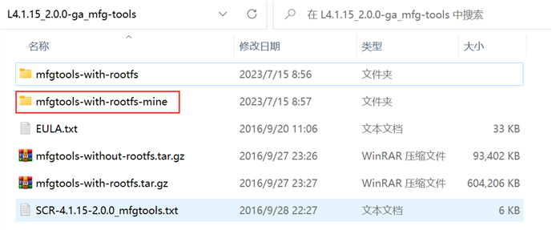
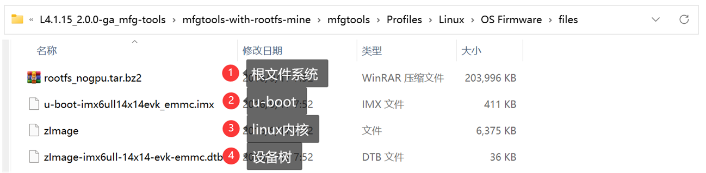
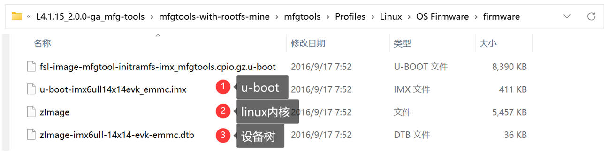
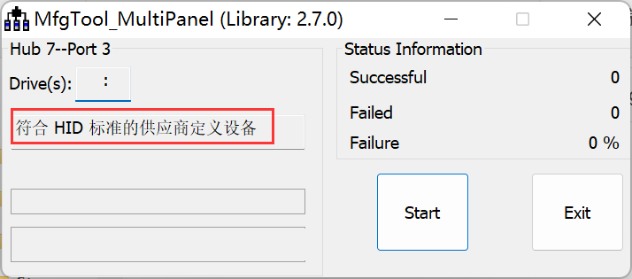
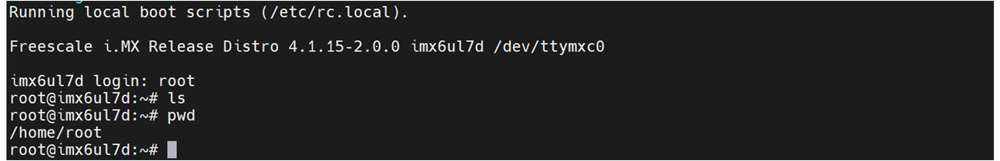

<!-- more -->

前面分析mfgtool的时候，工具的目录里边有很多我们不需要的文件，看着挺烦人的，我们最少需要哪些文件？这一部分我们以官方的系统为例进行一个学习。我们这里就以EMMC为例进行学习说明，SD卡和NAND也是一样的步骤。

## 一、准备工具目录

我们复制一个 mfgtools-with-rootfs 目录，然后重命名：



接着我们删除其中的 mfgtools-with-rootfs-mine/mfgtools/\*.vbs 文件，再删除 mfgtools-with-rootfs-mine/mfgtools/Profiles/Linux/OS Firmware目录中的 files 目录、firmware 目录和ulc2.xml文件，这些删除的东西我们后边都会重新创建并修改，最终创建一个自己的mfgtool。

## 二、文件准备

### 1. files目录文件

我们的files目录需要那些文件？其实我们只需要四个文件：u-boot、linux内核镜像、dtb设备树和rootfs根文件系统，我们使用的是EMMC的板子，所以我们可以从官方的 mfgtool 中的OS Firmware目录中找到这些文件，我们直接复制到自己的目录中：



### 2. firmware目录文件

firmware目录文件需要u-boot、linux内核和dtb，在这个里边不需要根文件系统，firmware目录中的文件主要是完成烧写的第一个过程。我们也可以从mfgtool 中的OS Firmware目录中找到这些文件，我们直接复制到自己的目录中：



firmware 目录下的 fsl-image-mfgtool-initramfs-imx_mfgtools.cpio.gz.u-boot 文件是一个最小的根文件系统，这个也要放进去。

### 3. 新建 .vbs 文件

vbs文件用于调用mfgtool.exe烧写工具，并传入相关参数的，我们需要重新自己新建一个自己的，我们直接复制 mfgtool2-yocto-mx-evk-emmc.vbs 文件到 mfgtools-with-rootfs-mine/mfgtools目录即可（当然也可以命名为其他），文件内容不要做任何修改， .vbs 文件我们就新建好了。文件内容如下：

```vbscript
Set wshShell = CreateObject("WScript.shell")
wshShell.run "mfgtool2.exe -c ""linux"" -l ""eMMC"" -s ""board=sabresd"" -s ""mmc=1"" -s ""6uluboot=14x14evk"" -s ""6uldtb=14x14-evk"""
Set wshShell = Nothing
```

在此脚本下，后边我们在ucl2.xml文件中遇到%6uluboot%就会被替换为14x14evk，遇到 %6uldtb%会被替换为14x14-evk，但是后边在这里自定义的可以直接写死，在实际开发需要支持多种芯片的时候可以采用此种方法传递参数，然后我们可以在 ucl2.xml 中通过 %variable_name%来引用。

【注意】这里的其实是修改了 mfgtools-with-rootfs-mine/mfgtools/cfg.ini中的参数，cfg.ini文件中是默认的配置，要修改的话就在脚本中修改，重新传入即可。

### 4. 新建 ucl2.xml 文件

ucl2.xml文件位于mfgtools-with-rootfs-mine/mfgtools/Profiles/Linux/OS Firmware目录下，它决定了mfgtool的烧写的详细过程以及烧写的文件。我们新建一个ucl2.xml文件（也可以复制原来的进行修改）：

```xml
<!--
* Copyright (C) 2012, Freescale Semiconductor, Inc. All Rights Reserved.
* The CFG element contains a list of recognized usb devices.
*  DEV elements provide a name, class, vid and pid for each device.
*
* Each LIST element contains a list of update instructions.
*  "Install" - Erase media and install firmware.
*  "Update" - Update firmware only.
*
* Each CMD element contains one update instruction of attribute type.
*  "pull" - Does UtpRead(body, file) transaction.
*  "push" - Does UtpWrite(body, file) transaction.
*  "drop" - Does UtpCommand(body) then waits for device to disconnect.
*  "boot" - Finds configured device, forces it to "body" device and downloads "file".
*  "find" - Waits for "timeout" seconds for the "body" device to connect.
*  "show" - Parse and show device info in "file".  
-->


<UCL>
  <CFG>
    <STATE name="BootStrap" dev="MX6ULL" vid="15A2" pid="0080"/>
    <STATE name="Updater"   dev="MSC" vid="066F" pid="37FF"/>
  </CFG>

  <LIST name="eMMC" desc="Choose eMMC as media">
    <!-- firmware/u-boot-imx6ull14x14evk_emmc.imx (lite="l"  6uluboot="14x14evk") -->
	<CMD state="BootStrap" type="boot" body="BootStrap" file ="firmware/u-boot-imx6ul%lite%%6uluboot%_emmc.imx" ifdev="MX6ULL">Loading U-boot</CMD>
	<!-- firmware/zImage -->
	<CMD state="BootStrap" type="load" file="firmware/zImage" address="0x80800000"
		loadSection="OTH" setSection="OTH" HasFlashHeader="FALSE" ifdev="MX6SL MX6SX MX7D MX6UL MX6ULL">Loading Kernel.</CMD>
    <!-- firmware/fsl-image-mfgtool-initramfs-imx_mfgtools.cpio.gz.u-boot -->
	<CMD state="BootStrap" type="load" file="firmware/%initramfs%" address="0x83800000"
		loadSection="OTH" setSection="OTH" HasFlashHeader="FALSE" ifdev="MX6SL MX6SX MX7D MX6UL MX6ULL">Loading Initramfs.</CMD>
	<!-- firmware/zImage-imx6ull-14x14evk-emmc.dtb (lite="l"  6uldtb="14x14evk") -->
	<CMD state="BootStrap" type="load" file="firmware/zImage-imx6ul%lite%-%6uldtb%-emmc.dtb" address="0x83000000"
		loadSection="OTH" setSection="OTH" HasFlashHeader="FALSE" ifdev="MX6ULL">Loading device tree.</CMD>

	<CMD state="BootStrap" type="jump" > Jumping to OS image. </CMD>

	<!-- create partition -->
	<CMD state="Updater" type="push" body="send" file="mksdcard.sh.tar">Sending partition shell</CMD> 
	<CMD state="Updater" type="push" body="$ tar xf $FILE "> Partitioning...</CMD>
	<CMD state="Updater" type="push" body="$ sh mksdcard.sh /dev/mmcblk%mmc%"> Partitioning...</CMD>

	<!-- burn uboot -->
	<CMD state="Updater" type="push" body="$ dd if=/dev/zero of=/dev/mmcblk%mmc% bs=1k seek=768 conv=fsync count=8">clear u-boot arg</CMD>
	<!-- access boot partition -->
	<!-- files/u-boot-imx6ull14x14evk_emmc.imx (lite="l"  6uluboot="14x14evk")  -->
	<CMD state="Updater" type="push" body="$ echo 0 > /sys/block/mmcblk%mmc%boot0/force_ro">access boot partition 1</CMD><!-- 取消分区只读保护 -->
	<CMD state="Updater" type="push" body="send" file="files/u-boot-imx6ul%lite%%6uluboot%_emmc.imx" ifdev="MX6ULL">Sending u-boot.bin</CMD>
	<CMD state="Updater" type="push" body="$ dd if=$FILE of=/dev/mmcblk%mmc%boot0 bs=512 seek=2">write U-Boot to eMMC</CMD>
	<CMD state="Updater" type="push" body="$ echo 1 > /sys/block/mmcblk%mmc%boot0/force_ro"> re-enable read-only access </CMD><!-- 开启分区只读保护 -->
	<CMD state="Updater" type="push" body="$ mmc bootpart enable 1 1 /dev/mmcblk%mmc%">enable boot partion 1 to boot</CMD>

	<!-- create fat partition -->
	<CMD state="Updater" type="push" body="$ while [ ! -e /dev/mmcblk%mmc%p1 ]; do sleep 1; echo \"waiting...\"; done ">Waiting for the partition ready</CMD>
	<CMD state="Updater" type="push" body="$ mkfs.vfat /dev/mmcblk%mmc%p1">Formatting rootfs partition</CMD>
	<CMD state="Updater" type="push" body="$ mkdir -p /mnt/mmcblk%mmc%p1"/>
	<CMD state="Updater" type="push" body="$ mount -t vfat /dev/mmcblk%mmc%p1 /mnt/mmcblk%mmc%p1"/>

	<!-- burn zImage -->
    <!-- files/zImage -->
	<CMD state="Updater" type="push" body="send" file="files/zImage">Sending kernel zImage</CMD>
	<CMD state="Updater" type="push" body="$ cp $FILE /mnt/mmcblk%mmc%p1/zImage">write kernel image to eMMC</CMD>

	<!-- burn dtb -->
    <!-- files/zImage-imx6ull-14x14evk-emmc.dtb (lite="l"  6uldtb="14x14-evk") -->
	<CMD state="Updater" type="push" body="send" file="files/zImage-imx6ul%lite%-%6uldtb%-emmc.dtb" ifdev="MX6ULL">Sending Device Tree file</CMD>
	<CMD state="Updater" type="push" body="$ cp $FILE /mnt/mmcblk%mmc%p1/imx6ul%lite%-%6uldtb%.dtb" ifdev="MX6ULL">write device tree to eMMC</CMD>

	<CMD state="Updater" type="push" body="$ sleep 1">delay</CMD>
	<CMD state="Updater" type="push" body="$ sync">Sync...</CMD>
	<CMD state="Updater" type="push" body="$ umount /mnt/mmcblk%mmc%p1">Unmounting vfat partition</CMD>

	<!-- burn rootfs -->
	<CMD state="Updater" type="push" body="$ mkfs.ext3 -F -E nodiscard /dev/mmcblk%mmc%p2">Formatting rootfs partition</CMD>
	<CMD state="Updater" type="push" body="$ mkdir -p /mnt/mmcblk%mmc%p2"/>
	<CMD state="Updater" type="push" body="$ mount -t ext3 /dev/mmcblk%mmc%p2 /mnt/mmcblk%mmc%p2"/>
	<CMD state="Updater" type="push" body="pipe tar -jxv -C /mnt/mmcblk%mmc%p2" file="files/rootfs_nogpu.tar.bz2" ifdev="MX6UL MX7D MX6ULL">Sending and writting rootfs</CMD>
	<CMD state="Updater" type="push" body="frf">Finishing rootfs write</CMD>
	<CMD state="Updater" type="push" body="$ umount /mnt/mmcblk%mmc%p2">Unmounting rootfs partition</CMD>
	<CMD state="Updater" type="push" body="$ echo Update Complete!">Done</CMD>
  </LIST>
</UCL>

```

【注意】上边的文件中，%mmc%将会被替换为1，lite="l"（小写的L）， 6uldtb="14x14-evk"，6uluboot="14x14evk"。

## 三、烧写测试

这里就按照之前烧写官方系统的时候的方式就可以了，直接双击 mfgtool2-yocto-mx-evk-emmc.vbs 文件，开发板确保已经连接到电脑，便会打开mfgtool：



然后我们点击【Start 】等待烧写完毕。

## 四、重启测试

上边烧写完毕后，我们拔出 USB 线，将开发板上的拨码开关拨到 EMMC 启动模式，然后重启开发板，此时就会从 EMMC 启动。若是烧写成功的话，就会看到与上边NXP官方系统烧写一节的笔记中一样的情况：



能到这一步，说明我们改造的mfgtool可以正常使用。
