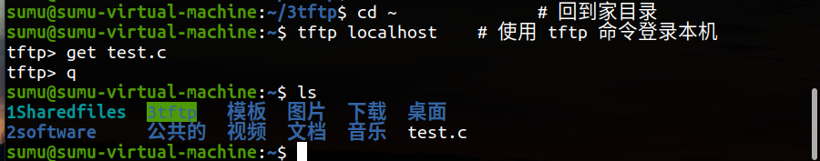
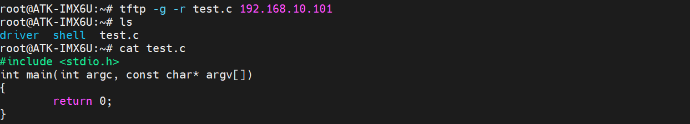

<!-- more -->

## 一、开发环境

### 1. Windows

```markdown
版本	       Windows 11 专业版
版本号	      23H2
安装日期	  2024/9/16
操作系统版本  22631.4169
体验	       Windows Feature Experience Pack 1000.22700.1034.0
```

其中 Windows 通过连接路由器的 WiFi 上网，

### 2. Ubuntu

Ubuntu 安装在 Windows 中的 VMware 中。

- VMware

```markdown
产品：VMware® Workstation 17 Pro
版本：17.6.0 build-24238078
```

- Ubuntu

```markdown
# uname -a
Linux sumu-vm 5.15.0-139-generic #149~20.04.1-Ubuntu SMP Wed Apr 16 08:29:56 UTC 2025 x86_64 x86_64 x86_64 GNU/Linux

# lsb_release -a
No LSB modules are available.
Distributor ID:	Ubuntu
Description:	Ubuntu 20.04.6 LTS
Release:	20.04
Codename:	focal
```

### 3. 开发板

正点原子 I.MX6ULL-ALPHA 开发板，系统使用的是出厂系统。

- U-Boot

```markdown
U-Boot 2016.03-gee88051 (Nov 05 2021 - 17:59:02 +0800)

CPU:   Freescale i.MX6ULL rev1.1 792 MHz (running at 396 MHz)
CPU:   Industrial temperature grade (-40C to 105C) at 29C
Reset cause: POR
Board: I.MX6U ALPHA|MINI
I2C:   ready
DRAM:  512 MiB
MMC:   FSL_SDHC: 0, FSL_SDHC: 1

```

- Linux 内核

```markdown
# uname -a
Linux ATK-IMX6U 4.1.15-g06f53e4 #1 SMP PREEMPT Sat Nov 27 18:39:27 CST 2021 armv7l armv7l armv7l GNU/Linux

# cat /etc/issue
Freescale i.MX Release Distro 4.1.15-2.1.0 \n \l
```

## 二、 TFTP 环境搭建

其实这一部分在之前已经写过笔记了（01/嵌入式开发01HQ课程体系/LV09-uboot与linux/LV09-01-环境搭建-01-TFTP与NFS），这里就当复习回顾吧。

### 1.  TFTP 简介

 TFTP （ Trivial File Transfer Protocol ，简单文件传输协议）是 TCP/IP 协议族中的一个用来在客户机与服务器之间进行简单文件传输的协议，提供不复杂、开销不大的文件传输服务，它的端口号为 69 。我们可以使用 TFTP 来加载内核镜像、设备树和其他较小的文件到开发板 DDR 上，从而实现网络挂载。

 TFTP 文件在服务器中，客户端将文件下载到本地，然后本地和服务器端都会有相同的这样一个文件。

### 2.  TFTP 环境搭建

#### 2.1 查看是否已安装

在终端执行以下命令检查  tftp 相关服务是否安装：

```shell
dpkg -s tftpd-hpa 
```

#### 2.2 安装和配置 xinetd 

##### 2.2.1 安装xinetd 

在终端执行以下命令安装  xinetd ：

```shell
sudo apt-get install xinetd
```

##### 2.2.2 配置xinetd.conf

这里我们直接用下边的命令打开 xinetd.conf 配置文件(不检查是否存在了，直接打开，没有的话就是空文件，配置完后边直接保存就可以了)：

```shell
sudo vi /etc/xinetd.conf 
```

打开后将文件修改为以下内容：

```shell
# Simple configuration file for xinetd
#
# Some defaults, and include /etc/xinetd.d/

defaults
{

# Please note that you need a log_type line to be able to use log_on_success
# and log_on_failure. The default is the following :
# log_type = SYSLOG daemon info

}

includedir /etc/xinetd.d
```

最后直接保存即可。

#### 2.3  TFTP 服务器目录创建

接下来创建一个目录用作 TFTP 服务器的站点，在终端执行以下命令：

```shell
mkdir -p /home/sumu/3tftp 
sudo chmod 777 /home/sumu/3tftp/ 
```

#### 2.4 安装TFTP相关服务

##### 2.4.1 安装  tftp-hpa  和  tftpd-hpa 

在终端执行以下命令：

```shell
sudo apt-get install tftp-hpa tftpd-hpa
```

##### 2.4.2  ftpd-hpa 配置文件修改

```shell
sudo vi /etc/default/tftpd-hpa # 打开配置文件
```

修改为以下内容：

```shell
# /etc/default/tftpd-hpa

TFTP_USERNAME="tftp"
TFTP_DIRECTORY="/home/sumu/3tftp"
TFTP_ADDRESS=":69"
# TFTP_OPTIONS="--secure"
TFTP_OPTIONS="-c -s -l"
```

只是修改了 TFTP_DIRECTORY 的值，后边改为我们自己创建的 TFTP 服务目录，后边客户端要下载的文件需要放到该目录下。

##### 2.4.3  tftp 配置文件修改

在终端执行以下命令打开相关配置文件，若没有 xinetd.d 这个目录，我们可以自己手动创建）：

```shell
sudo vi /etc/xinetd.d/tftp
```

打开后，一般应该是新文件，我们添加如下内容：

```shell
server tftp
{
        socket_type = dgram
        wait = yes
        disable = no
        user = root
        protocol = udp
        server = /usr/sbin/in.tftpd
        server_args = -s /home/sumu/3tftp -c
        #log_on_success += PID HOST DURATION 
        #log_on_failure += HOST 
        per_source = 11
        cps =100 2
        flags =IPv4
}
```

【注意】 server_args = -s 后面要添加自己的 tftp 工作目录。

#### 2.5 重启相关服务

在终端执行以下命令：

```shell
sudo service tftpd-hpa restart # 重启 tftpd-hpa
sudo service xinetd restart    # 重启 xinetd
```

【注意】看到有个资料上说，每次重新打开 ubuntu  若要使用 tftp 都需要重启，这里先记下，后边出现问题的话可以重启再试一下。

## 三、TFTP功能测试

### 1. ubuntu本地测试

- 在服务器目录创建一个新文件

```shell
cd /home/sumu/3tftp # 进入到服务器工作目录
sudo touch test.c # 创建一个新文件
```

文件内容如下：

```c
#include <stdio.h>
int main(int argc, const char* argv[])
{
    return 0;
}
```

- 本机登录tftp服务器

```shell
cd ~              # 回到家目录
tftp localhost    # 使用 tftp 命令登录本机
```

当我们本地登录成功后，命令提示符会变成如下形式：

```shell
tftp> 
```

- 下载服务器中文件

```shell
tftp> get test.c
```

- 退出  tftp 

```shell
tftp> quit
```

退出 tftp 服务后，我们就会回到刚所在的目录里，我们下载的文件也将会被保存到这里

- 查看是否下载成功

```shell
ls
```

若显示有 test.c文件，那么表示我们的 TFTP 服务安装配置成功。



### 2. linux开发板测试

开发板中是正点原子出厂系统，肯定是有tftp功能的，但是其实我们经常会再uboot中使用tftp下载linux内核镜像，然后启动内核，一般来说官方的uboot和linux都应该是支持的。

#### 2.1 开发板ip配置

按照上一节《[01-开发环境/15-网络环境/LV001-网络环境搭建.md](/sdoc/dev-env/env-net/126b0f095e543d43e27f40f1)》配置好uboot、开发板、windows的IP，使其三者可以互相ping通。三者的IP如下：

```shell
开发板 IP   ： 192.168.10.103
虚拟机 IP   ： 192.168.10.101
电脑网口的 IP： 192.168.10.100
```

#### 2.2 传输文件到开发板

我们搭建 TFTP 环境就是为了能将文件从 Ubuntu 传输到我们的 linux 开发板，当我们配置好 Linux 开发板和 ubuntu 的网络环境，两者之间互相可以 ping 通的时候，我们可以这样来实现文件的传输，在开发板的终端(我一般使用MobaXterm )中执行：

```shell
tftp -g -r <file_name> <Ubuntu_IP>
```

这样便会将 Ubuntu 中 TFTP 服务器目录下的文件下载到开发板的当前目录下。例如，

```shell
tftp -g -r test.c 192.168.10.101
```

若是能下载成功，那么就会在当前目录生成下载的文件：


