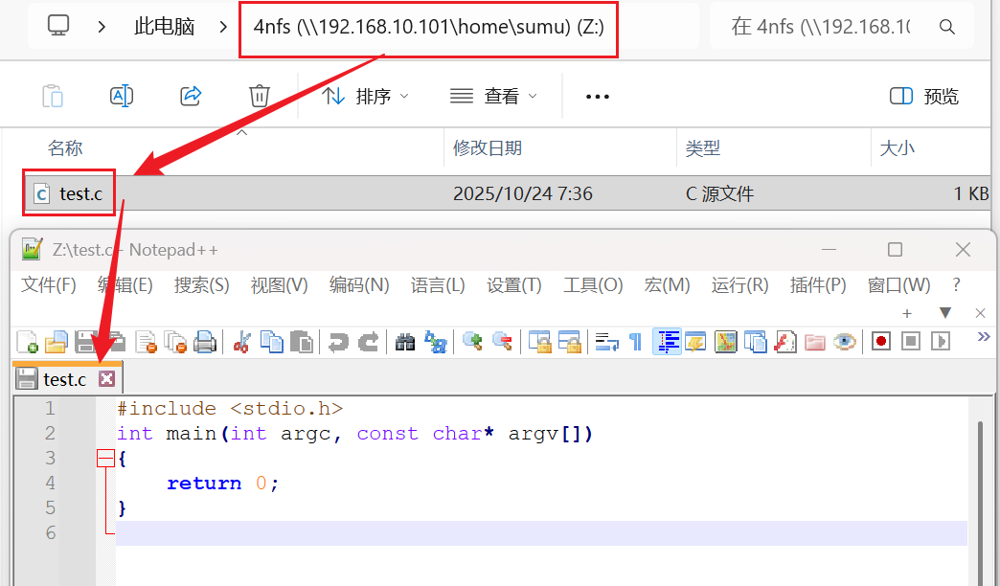

<!-- more -->


## 一、开发环境

### 1. Windows

```markdown
版本	       Windows 11 专业版
版本号	      23H2
安装日期	  2024/9/16
操作系统版本  22631.4169
体验	       Windows Feature Experience Pack 1000.22700.1034.0
```

其中 Windows 通过连接路由器的 WiFi 上网，

### 2. Ubuntu

Ubuntu 安装在 Windows 中的 VMware 中。

- VMware

```markdown
产品：VMware® Workstation 17 Pro
版本：17.6.0 build-24238078
```

- Ubuntu

```markdown
# uname -a
Linux sumu-vm 5.15.0-139-generic #149~20.04.1-Ubuntu SMP Wed Apr 16 08:29:56 UTC 2025 x86_64 x86_64 x86_64 GNU/Linux

# lsb_release -a
No LSB modules are available.
Distributor ID:	Ubuntu
Description:	Ubuntu 20.04.6 LTS
Release:	20.04
Codename:	focal
```

### 3. 开发板

正点原子 I.MX6ULL-ALPHA 开发板，系统使用的是出厂系统。

- U-Boot

```markdown
U-Boot 2016.03-gee88051 (Nov 05 2021 - 17:59:02 +0800)

CPU:   Freescale i.MX6ULL rev1.1 792 MHz (running at 396 MHz)
CPU:   Industrial temperature grade (-40C to 105C) at 29C
Reset cause: POR
Board: I.MX6U ALPHA|MINI
I2C:   ready
DRAM:  512 MiB
MMC:   FSL_SDHC: 0, FSL_SDHC: 1

```

- Linux 内核

```markdown
# uname -a
Linux ATK-IMX6U 4.1.15-g06f53e4 #1 SMP PREEMPT Sat Nov 27 18:39:27 CST 2021 armv7l armv7l armv7l GNU/Linux

# cat /etc/issue
Freescale i.MX Release Distro 4.1.15-2.1.0 \n \l
```

## 二、 NFS 环境搭建

### 1.  NFS 简介

NFS （ Network File System ，网络文件系统），是由 SUN 公司研制的 UNIX 表示层协议( presentation layer protocol )，基于 UDP/IP ，使用 nfs 能够在不同计算机之间通过网络进行文件共享，能使使用者访问网络上别处的文件就像在使用自己的计算机一样。我们可以在 Ubuntu 上制作开发板的根文件系统，然后使用 NFS 来加载根文件系统到开发板的 DDR 上。

NFS 可以将远程的计算机磁盘挂载到本地，像本地磁盘一样操作，文件还是在服务器中，只是服务器将文件共享给了客户端，客户端实际并没有这些文件。就像我们使用的网盘一样，文件在网盘中，在本地的电脑中实际并不存在，但是我们可以查看这些文件。

### 2.  NFS 搭建

#### 2.1 查看是否已安装

在终端执行以下命令：

```shell
dpkg -s nfs-kernel-server
```

若是没有安装的话则会有以下提醒：

```shell
dpkg-query: 系统没有安装软件包 nfs-kernel-server，因而没有相关的信息
使用 dpkg --info (= dpkg-deb --info) 来检测打包好的文件
```

#### 2.2 安装 NFS 

在终端执行以下命令：

```shell
sudo apt-get install nfs-kernel-server
```

#### 2.3  NFS 共享目录

接下来我们创建一个目录用于 NFS 共享服务：

```shell
sudo mkdir -p /home/sumu/4nfs 
sudo chmod -R 777 /home/sumu/4nfs/
```

#### 2.4  NFS 服务配置

在终端执行以下命令打开相关配置文件：

```shell
sudo vi /etc/exports
```

然后在文件的尾部添加以下内容：

```shell
/home/sumu/4nfs *(rw,sync,no_subtree_check,no_root_squash)
```

-  /home/sumu/4nfs 是 nfs 服务器的工作目录，即客户端要访问的文件需要放到该目录下。
-  \* 表示允许所有的网络段访问。

-  rw 表示访问者具有可读写权限。
-  sync 表示将缓存写入设备中，可以说是同步缓存的意思。
-  no_subtree_check  如果共享 /usr/bin 之类的子目录时， NFS 不检查父目录的权限（默认）
-  no_root_squash 表示访问者具有 root 权限。

【注意】

（1） ubuntu17.10  之后的版本 nfs  默认只支持协议 3 和 4 ，但后续我们使用的 uboot(2013.01)  默认使用协议 2 ，所以需要在 /etc/default/nfs-kernel-server  文件末尾加一句如下内容：

```shell
RPCNFSDOPTS="--nfs-version 2,3,4 --debug --syslog"
```

然后重启 nfs  服务即可。

（2）配置文件权限的 () 里面不能有空格。

#### 2.5 重启 NFS 服务

在终端执行以下命令：

```shell
sudo /etc/init.d/nfs-kernel-server restart
# 或者
sudo service nfs-kernel-server restart
```

【注意】在有的资料中看到以后每次重新打开 ubuntu  若要使用 nfs  都需要重启，在这里记录一下，后边遇到问题，可以首先尝试该种方法。

#### 2.6 本地挂载与卸载共享目录

- 挂载

```shell
sudo mount -t nfs localhost:/home/sumu/4nfs /mnt/nfs_temp/
```

- 卸载

```shell
sudo umount /mnt/nfs_temp/
```

#### 2.7 查看 NFS 共享目录

在终端执行以下命令：

```shell
showmount -e
```

若是前边配置没有问题，则会显示如下信息：

```shell
Export list for vm:
/home/sumu/4nfs *
```

执行这个命令的时候可能会有如下提示：

```shell
Command 'showmount' not found, but can be installed with:
sudo apt install nfs-common
```

此时我们按照提示安装相关服务即可：

```shell
sudo apt install nfs-common
```

#### 2.8 检查 NFS 是否启动

```shell
sudo systemctl status nfs-server
```

若 NFS 服务已经启动，则会有以下提示信息：

```shell
● nfs-server.service - NFS server and services
     Loaded: loaded (/lib/systemd/system/nfs-server.service; enabled; vendor pr>
    Drop-In: /run/systemd/generator/nfs-server.service.d
             └─order-with-mounts.conf
     Active: active (exited) since Wed 2022-08-17 21:18:16 CST; 13min ago
    Process: 8515 ExecStartPre=/usr/sbin/exportfs -r (code=exited, status=0/SUC>
    Process: 8516 ExecStart=/usr/sbin/rpc.nfsd (code=exited, status=0/SUCCESS)
   Main PID: 8516 (code=exited, status=0/SUCCESS)
        CPU: 15ms

8月 17 21:18:16 vm systemd[1]: Starting NFS server and services...
8月 17 21:18:16 vm systemd[1]: Finished NFS server and services.

```

## 二、NFS 功能测试

### 1. ubuntu 本地测试

#### 1.1 在共享目录创建测试文件

```shell
cd /home/sumu/4nfs  # 进入到服务器工作目录
sudo touch test.c   # 创建一个新文件
```

创建的文件内容如下：

```c
#include <stdio.h>
int main(int argc, const char* argv[])
{
    return 0;
}
```

#### 1.2 挂载 NFS 共享目录

```shell
cd ~       # 回到家目录

# 使用 nfs 挂载工作目录到 /mnt 
sudo mkdir -p /mnt/nfs_temp
sudo mount -t nfs localhost:/home/sumu/4nfs /mnt/nfs_temp 

# 查看是否挂载成功
ls /mnt/nfs_temp
```

若显示有 test.c 文件，且内容如下：


那么表示我们的 NFS 服务安装配置成功。

### 2. linux 开发板测试

开发板中是正点原子出厂系统，肯定是有 tftp 功能的，但是其实我们经常会再 uboot 中使用 tftp 下载 linux 内核镜像，然后启动内核，一般来说官方的 uboot 和 linux 都应该是支持的。

#### 2.1 开发板 ip 配置

按照上一节《LV02-03-网络环境-01-网络开发环境搭建》配置好 uboot、开发板、windows 的 IP，使其三者可以互相 ping 通。三者的 IP 如下：

```shell
开发板 IP   ： 192.168.10.103
虚拟机 IP   ： 192.168.10.101
电脑网口的 IP： 192.168.10.100
```

#### 2.2 挂载共享目录到开发板

一般来说我们搭建 NFS 环境也是为了能将文件从 Ubuntu 传输到我们的 linux 开发板，当我们配置好 Linux 开发板和 ubuntu 的网络环境，两者之间互相可以 ping 通的时候，我们可以这样来实现文件的传输。

在开发板上查看 NFS 服务器的共享目录：

```shell
# 需要开发板支持showmount命令，且可以与服务器ping通
showmount -e 192.168.10.101 
```


然后在开发板的终端中执行：

```shell
mkdir -p ~/nfs_temp # 创建临时挂载目录
mount -t nfs -o nolock,nfsvers=3 <Ubuntu_IP>:<Ubuntu_NFS_dir> ~/nfs_temp/
df                 # 查看挂载目录
umount ~/nfs_temp/ # 卸载挂载目录
```

这样我们便可以将 ubuntu 中的 Ubuntu\_NFS\_dir 目录也就是 NFS 共享目录下的文件挂载到 Linux 开发板的 \~/nfs_temp/ 中，我们可以直接在 \~/nfs\_temp/ 中拷贝我们需要的文件。例如我们在终端执行：

```shell
mkdir -p ~/nfs_temp
mount -t nfs -o nolock,nfsvers=3 192.168.10.101:/home/sumu/4nfs ~/nfs_temp
df                 # 查看挂载目录
ls ~/nfs_temp
```

若是挂载成功，那么便会有以下信息：


中间有一次目录中什么也没有是因为我之前挂载过，但是吧目录删掉了，也把服务器的文件删了，重新添加就好了。

### 3. windows 挂载测试

#### 3.1 启动 windows 的 NFS 服务

- （1）【控制面板】&rarr;【程序】&rarr;【启用或者关闭 Windows 功能】


- （2）【勾选 NFS 服务】&rarr;【确定】&rarr;【重启系统】


#### 3.2 挂载 nfs 目录

- （1）【打开文件资源管理器】&rarr;【映射网络驱动器】


- （2）【选择驱动器编号】&rarr;【输入地址】


地址的格式为：

```shell
# \\<nfs_server_ip>\<nfs_path>
# 在这里就是：
\\192.168.10.101\home\sumu\4nfs
```

- （3）若是成功挂载则会有如下显示：


我们打开看一下就会发现有如下文件：



