<!-- more -->

## 一、开发板资源

我使用的是正点原子的 I.MX6U-ALPHA 开发板，后边都是以此进行开发学习。这款开发板分为底板和核心板，下边就先来了解这个开发平台吧。

### 1. 整体情况

- i.MX6ULL Linux 阿尔法开发板正面图如下

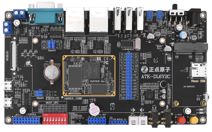

- i.MX6ULL Linux 阿尔法开发板背面图如下

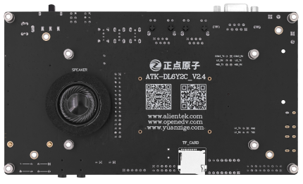

### 2. I.MX6U-ALPHA 开发板底板资源

我们先来看一下底板上的资源，如下图所示：

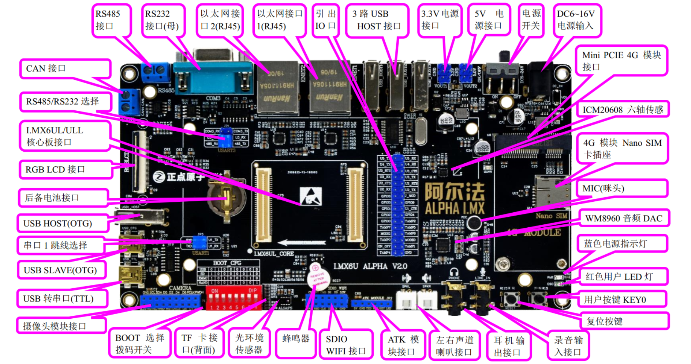

开发板的外形尺寸为 100mm\*180mm 大小，它所具有的资源如下：

>◆ 1 个核心板接口，支持 I.MX6UL/6ULL 等核心板
>◆ 1 个电源指示灯（蓝色）
>◆ 1 个状态指示灯（红色）
>◆ 1 个六轴（陀螺仪+加速度）传感器芯片， ICM20608
>◆ 1 个高性能音频编解码芯片， WM8960
>◆ 1 路 CAN 接口，采用 TJA1050 芯片
>◆ 1 路 485 接口，采用 SP3485 芯片
>◆ 1 路 RS232 串口（母）接口，采用 SP3232 芯片
>◆ 1 个 ATK 模块接口，支持正点原子蓝牙/GPS/MPU6050/手势识别等模块  
>◆ 1 个光环境传感器（光照、距离、红外三合一）
>◆ 1 个摄像头模块接口
>◆ 1 个 OLED 模块接口
>◆ 1 个 USB 串口，可用于代码调试
>◆ 1 个 USB SLAVE(OTG)接口，用于 USB 从机通信
>◆ 1 个 USB HOST(OTG)接口，用于 USB 主机通信
>◆ 1 个有源蜂鸣器
>◆ 1 个 RS232/RS485 选择接口
>◆ 1 个串口选择接口
>◆ 1 个 TF 卡接口（在板子背面）
>◆ 2 个 10M/100M 以太网接口（RJ45）
>◆ 1 个录音头（MIC/咪头）
>◆ 1 路立体声音频输出接口
>◆ 1 路立体声录音输入接口
>◆ 1 个小扬声器（在板子背面）
>◆ 2 个扬声器外接接口，左右声道。
>◆ 1 组 5V 电源供应/接入口
>◆ 1 组 3.3V 电源供应/接入口
>◆ 1 个直流电源输入接口（输入电压范围： DC6~18V）
>◆ 1 个启动模式选择配置接口
>◆ 1 个 RTC 后备电池座，并带电池
>◆ 1 个复位按钮，可用于复位 MPU 和 LCD
>◆ 1 个功能按钮
>◆ 1 个电源开关，控制整个板的电源
>◆ 1 个 Mini PCIE 4G 模块接口
>◆ 1 个 Nano SIM 卡接口
>◆ 1 个 SDIO WIFI 接口  

该开发板采用核心板+底板形式，板上很多资源都可以灵活配置，以满足不同条件下的使用；引出了 105 个 IO 口，极大的方便扩展及使用。  

### 3. I.MX6U 核心板资源  

正点原子的 I.MX6ULL 核心板根据存储芯片的不同分为 EMMC 和 NAND 两种，根据对外提供的接口可以分为邮票孔和 BTB 两种。正点原子 I.MX6ULL 核心板的特点包括：  

- 体积小巧。核心板仅 46mm\*36mm 大小，方便使用到各种项目里面。
- 集成方便。核心板使用 120P BTB 连接座，可以非常方便的集成到客户 PCB 上，更换简单，方便维修测试。
- 资源丰富。核心板板载： 256MB/512MB DDR3L、可以选择 NAND 或 EMMC 等存储器，基本可以满足各种应用需求。
- 性能稳定。核心板采用 6 层板设计，单独地层、电源层，且关键信号采用等长线走线，保证运行稳定、可靠。
- 不管是 NAND 还是 EMMC 核心板均通过了 CE 和 FCC 认证。
- 人性化设计。底部放有详细丝印，方便安装；按功能分区引出 IO 口，方便布线。  

#### 3.1 BTB 接口的 NAND 版本核心板

BTB 接口的 NAND 版本核心板上的资源如下所示：

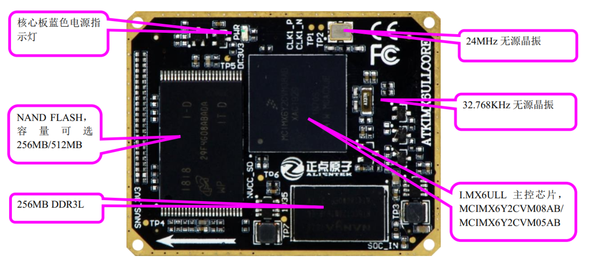

上图是 BTB 接口的 NAND 版本核心板 。整个核心板的外形尺寸为 46mm\*36mm 大小，非常小巧，并且采用了贴片板对板连接器，使得其可以很方便的应用在各种项目上。 I.MX6ULL NAND 版核心板为工业级工作温度，可以应用在温度要求严格的场合。  它所具有的资源如下：

>◆ CPU： MCIMX6Y2CVM05AB(工业级)或 MCIMX6Y2CVM08AB（工业级），主频分别为 528MHz 和 800MHz(实际为 792MHz)， BGA289
>◆ 外扩 DDR3L： NT5CC128M16JR-EK， 256MB 字节，工业级
>◆ NAND FLASH： MT29F2G08ABAEAWP-IT 或 MT29F4G08ABADAWP-IT，分别为 256MB/512MB 字节，均为工业级
>◆ 两个 2\*30 的防反插 BTB 座，共引出 120 PIN 。  

#### 3.2 BTB 接口的 EMMC 版本核心板

BTB 接口的 EMMC 版本核心板资源如下图所示：

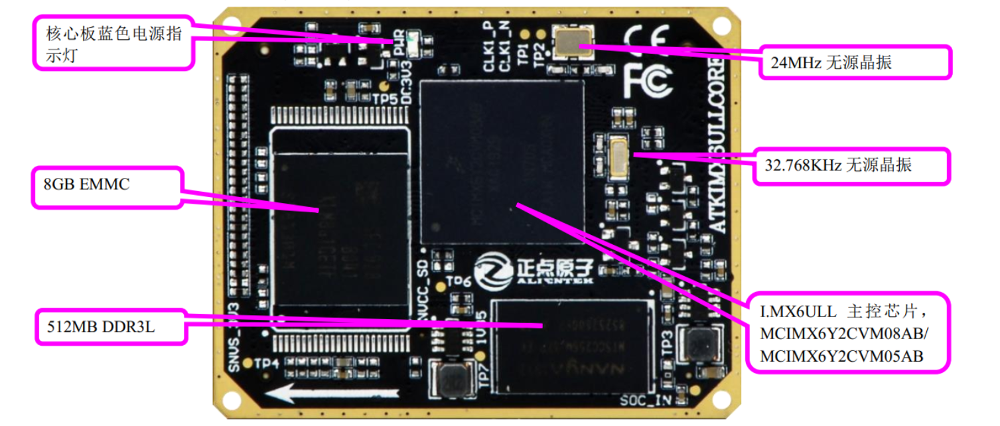

EMMC 版本的核心和 NAND 版本的基本一样，不同之处在于将 NAND 换成了 EMMC，将 DDR3L 换成了 512MB 的商业级。因此正点原子的 EMMC 核心板为商业级的工作温度范围。  它所具有的资源如下：

>◆ CPU： MCIMX6Y2CVM08AB（工业级）， 800MHz(实际 792MHz)， BGA289
>◆ 外扩 DDR3L： NT5CC256M16EP-EK， 512MB 字节，商业级。
>◆ EMMC： KLM8G1GET，这是一个 8GB 的 EMMC 芯片。
>◆ 两个 2*30 的防反插 BTB 座，共引出 120 PIN  

#### 3.3 核心板资源说明

##### 3.3.1 核心板电源指示灯  

这是核心板板载的一个蓝色 LED 灯，用于指示核心板供电是否正常，如果核心板供电正常的话此灯就会点亮。  

##### 3.3.2 NAND/EMMC 存储芯片  

这是核心板上板载的存储芯片，分为 NAND 和 EMMC 两种。对于 NAND 版本的核心板共有 256MB 和 512MB 两 种 容 量 的 NAND ， 型 号 分 别 为 MT29F2G08ABAEAWP-IT 或 MT29F4G08ABADAWP-IT，这两种型号的 NAND FLASH 工作温度范围都为工业级。 EMMC 版本的核心板使用 8GB 的 EMMC，型号为 KLM8G1GET。  

##### 3.3.3 DDR3L 芯片  

这是核心板板载的 DDR3L 芯片， NAND 版本核心板的 DDR3L 容量为 256MB， EMMC 版本的核心板的 DDR3L 容量为 512MB。型号分别为 NT5CC128M16JR-EK 和 NT5CC256M16EPEK。如果要用于 UI 开发，那么最好选择 512MB 的 DDR3L。

##### 3.3.4 CPU  

这是核心板的 CPU，型号为 MCIMX6Y2CVM08AB， MCIMX6Y2CVM08AB 主频为 800MHz(实际 792MHz)。该芯片采用 Coretx-A7 内核，自带 32KB 的 L1 指令 Cache、 32KB 的 L1 数据 Cache、 128KB 的 L2Cache、集成 NEON 和 SIMDv2、支持硬件浮点(FPU)计算单元，浮点计算架构为 VFPv4-D32、 1 个 RGB LCD 接口、 2 个 CAN 接口、 2 个 10M/100M 网络接口、2 个 USB OTG 接口(USB2.0)、 2 路 ADC、 8 个串口、 3 个 SAI、 4 个定时器、 8 路 PWM、 4 路 I2C 接口、 4 路 SPI 接口、一路 CSI 摄像头接口、 2 个 USDHC 接口，支持 4 位 SD 卡，最高可以支持 UHS-I SDR 104 模式，支持 1/4/8 位的 EMMC，最高可达 HS200 模式、一个外部存储接口、支持 16 位的 LPDDR2-800、 DDR3-800 和 DDR3L-800、支持 8 位的 MLC/SLC NAND Flash，支持 2KB、 4KB 和 8KB 页大小，以及 124 个通用 IO 口等。  

##### 3.3.5 32.768KHz 晶振  

这是一个无源的 32.768KHz 晶振，供 I.MX6U 内部 RTC 使用。  

##### 3.3.6 24MHz 晶振  

这是一个无源的 24MHz 晶振，供 I.MX6U 使用。

##### 3.3.7 核心板接口

另外， I.MX6U 核心板的接口在底部，通过两个 2\*30 的板对板端子（3710M 母座）组成，总共引出了 104 个 IO，通过这个接口，可以实现与 I.MX6U-ALPHA 底板对接。  

### 4. I.MX6U-ALPHA 硬件资源说明

将按逆时针的顺序依次介绍板载的硬件资源：

#### 4.1 CAN 接口  

这是开发板板载的 CAN 总线接口（CAN），通过 2 个端口和外部 CAN 总线连接，即 CANH 和 CANL。这里提醒： CAN 通信的时候，必须 CANH 接 CANH， CANL 接 CANL，否则可能通信不正常！  

#### 4.2 RS232/485 选择接口  

这是开发板板载的 RS232（COM3） /485 选择接口（JP1），因为 RS485 基本上就是一个半双工的串口，为了节约 IO， RS232（COM3）和 RS485 共用一个串口，通过 JP1 来设置当前是使用 RS232（COM3）还是 RS485。这样的设计还有一个好处。就是开发板既可以充当 RS232 到 TTL 串口的转换，又可以充当 RS485 到 TTL485 的转换。（注意，这里的 TTL 高电平是 3.3V）  

#### 4.3 I.MX6ULL 核心板接口  

这是开发板底板上面的核心板接口，由 2 个 2\*30 的贴片板对板接线端子（3710F 公座）组成，可以用来插正点原子的 I.MX6UL/ULL 核心板等，从而学习 I.MX6UL/6ULL 等芯片，达到一个开发板，学习多款 SOC 的目的，减少重复投资。  

#### 4.4 RGBLCD 接口  

这是转接板自带的 RGB LCD 接口（LCD），可以连接各种正点原子的 RGB LCD 屏模块，并且支持触摸屏（电阻/电容屏都可以）。采用的是 RGB888 格式，可显示 1677 万色，色彩显示丰富。  

#### 4.5 后备电池接口  

这是 I.MX6UL/ULL 后备区域的供电接口，可以用来给 I.MX6UL/ULL 的后备区域提供能量，在外部电源断电的时候，维持 SNVS 区域数据的存储，以及 RTC 的运行。  

#### 4.6 USB HOST(OTG)  

这是开发板板载的一个侧插式的 USB-A 座（USB_HOST），由于 I.MX6U 的 USB 支持 OTG 功能，所以 USB 既可作 HOST，又可做 SLAVE。我们可以通过这个 USB-A 座，连接 U 盘/USB 鼠标/USB 键盘等其他 USB 从设备，从而实现 USB 主机功能。不过特别注意，由于 USB HOST 和 USB SLAVE 是共用一个 USB 端口，所以两者不可以同时使用。

#### 4.7 USB 串口/串口 1

这是 USB 串口同 I.MX6U 的串口 1 进行连接的接口（JP5），标号 RXD 和 TXD 是 USB 转串口的 2 个数据口（对 CH340C 来说），而 U1\_TX(TXD)和 U1\_RX(RXD)则是 I.MX6U 串口 1 的两个数据口。他们通过跳线帽对接，就可以连接在一起了，从而实现 I.MX6U 的串口通信。

设计成 USB 串口，主要是因为电脑上串口正在消失，尤其是笔记本，几乎清一色的没有串口。所以板载了 USB 串口可以方便调试。而在板子上并没有直接连接在一起，则是出于使用方便的考虑。这样设计，可以把 I.MX6U-ALPHA 开发板当成一个 USB 转 TTL 串口，来和其他板子通信，而其他板子的串口，也可以方便地接到开发板上。  

#### 4.8 USB SLAVE(OTG)  

这是开发板板载的一个 MiniUSB 头（USB_SLAVE），用于 USB 从机（SLAVE）通信，与上面的 USB HOST 一起作为 OTG 功能。通过此 MiniUSB 头，开发板就可以和电脑进行 USB 通信了。注意：该接口不能和 USB HOST 同时使用。  

开发板总共板载了两个 MiniUSB 头，一个（USB_TTL）用于 USB 转串口，连接 CH340C 芯片；另外一个（USB_SLAVE）用于 I.MX6U 内部 USB。同时开发板可以通过此 MiniUSB 头供电，板载两个 MiniUSB 头（不共用），主要是考虑了使用的方便性，以及可以给板子提供更大的电流（两个 USB 都接上）这两个因素。  

#### 4.9 USB 转串口  

这是开发板板载的另外一个 MiniUSB 头（USB\_TTL），用于 USB 连接 CH340C 芯片，从实现 USB 转串口。同时，此 MiniUSB 接头也是开发板的电源提供口。  

#### 4.10 摄像头模块接口  

这是开发板板载的一个摄像头模块接口（P1），摄像头模块（需自备），对准插入到此插槽中。  

#### 4.11 启动(BOOT)拨码开关  

I.MX6U 支持多种启动方式，比如 SD 卡、 EMMC、 NAND、 QSPI FALSH 和 USB 等，要想从某一种设备启动就必须先设置好启动拨码开关。

I.MX6U-ALPHA 开发板用了一个 8P 的拨码开关来选择启动方式，正点原子开发板支持从 SD 卡、 EMCM、 NAND 和 USB 这四种启动方式，这四种启动方式对应的拨码开关拨动方式已经写在了开发板上。在使用的时候根据自己的实际需求设置拨码开关即可。  

#### 4.12 TF 卡接口  

这是开发板板载的一个标准 TF 卡接口（TF\_CARD），该接口在开发板的背面，采用小型的 TF 卡接口， USDHC 方式驱动，有了这个 TF 卡接口，就可以满足海量数据存储的需求。  

#### 4.13 光环境传感器  

这是开发板板载的一个光环境三合一传感器（U9），它可以作为：环境光传感器、近距离（接近）传感器和红外传感器。通过该传感器，开发板可以感知周围环境光线的变化，接近距离等，从而可以实现类似手机的自动背光控制。  

#### 4.14 蜂鸣器  

这是一个有源蜂鸣器，通过高低电平控制蜂鸣器的开关。  

#### 4.15 SDIO WIFI 接口  

这是开发板上的一个 SDIO WIFI(P4)接口，可以通过此接口连接正点原子出品的 SDIO WIFI 模块。 SDIO WIFI 接口和 TF 卡共用一个 USDHC 接口，因此 **不能同时和 TF 卡使用**。  

#### 4.16 ATK 模块接口  

这是开发板板载的一个正点原子通用模块接口（JP2），目前可以支持正点原子开发的 GPS 模块、蓝牙模块、 MPU6050 模块、激光测距模块和手势识别模块等，直接插上对应的模块，就可以进行开发。

#### 4.17 左右声道喇叭接口  

开发板板载了一个高性能的音频解码芯片 WM8960，此芯片可以驱动左右声道 2 个 8Ω，1W 的小喇叭，这两个接口用于外接两个左右声道小喇叭。不过在 I.MX6U-ALPHA 开发板的背面已经默认焊接了一个小喇叭，这个小喇叭接到了右声道上，因此如果要在此接口的右声道上外接小喇叭，那么必须先将开发板上自带的喇叭拆掉，否则 WM8960 驱动能力可能不足。  

#### 4.18 耳机输出接口  

这是开发板板载的音频输出接口（PHONE），该接口可以插 3.5mm 的耳机，当 WM8960 放音的时候，就可以通过在该接口插入耳机，欣赏音乐。此接口支持耳机插入检测，如果耳机不插入的话默认通过喇叭播放音乐，如果插入耳机的话就关闭喇叭，通过耳机播放音乐。  

#### 4.19 录音输入接口  

这是开发板板载的外部录音输入接口（LINE\_IN），通过咪头只能实现单声道的录音，而通过这个 LINE\_IN，可以实现立体声录音。  

#### 4.20 复位按键  

这是开发板板载的复位按键（RESET），用于复位 I.MX6U，还具有复位液晶的功能，因为液晶模块的复位引脚和 I.MX6U 的复位引脚是连接在一起的，当按下该键的时候， I.MX6U 和液晶一并被复位。

#### 4.21 用户按键 KEY  

这是开发板板载的 1 个机械式输入按键（KEY0），可以做为普通按键输入使用。  

#### 4.22 红色用户 LED 灯  

这是开发板板载的 1 个 LED 灯，为红色，用户可以使用此 LED 灯。在调试代码的时候，使用 LED 来指示程序状态，这是不错的一个辅助调试方法。  

#### 4.23 蓝色电源指示 LED 灯  

这是开发板电源指示 LED 灯，为蓝色，当板子供电正常的时候此灯就会常亮。如果此灯不亮的话就说明开发板供电有问题(排除 LED 灯本身损坏的情况)。  

#### 4.24 WM8960 音频 DAC  

这是一颗欧胜公司出品的音频 DAC 芯片，用于实现音乐播放与录音。  

#### 4.25 MIC(咪头)  

这是开发板的板载录音输入口（MIC），该咪头直接接到 WM8960 的输入上，可以用来实现录音功能。  

#### 4.26 Nano SIM 卡接口  

这是开发板上的 Nano SIM 卡接口，如果要使用 4G 模块的话就需要在此接口中插入 NanoSIM 卡。  

#### 4.27 ICM20608 六轴传感器  

这是开发板板载的一个六轴传感器芯片(U6)，型号为 ICM20608，此芯片采用 SPI 接口与 I.MX6U 相连接。 ICM20608 内部集成 1 个三轴加速度传感器和 1 个三轴陀螺仪，该传感器在姿态测量方面应用非常广泛。

#### 4.28 Mini PCIE 4G 接口

这是开发板板载的一个 Mini PCIE 座，但是本质上走的 USB 协议，通过此接口可以连接 4G 模块，比如高新兴物联的 ME3630。接上 4G 模块以后 I.MX6U-ALPHA 开发板就可以实现 4G 上网功能，对于不方便布网线或者没有 WIFI 的场合来说是个不错的选择。  

#### 4.29 DC6\~16V 电源输入  

这是开发板板载的一个外部电源输入口（DC_IN），采用标准的直流电源插座。开发板板载了 DC-DC 芯片（JW5060T），用于给开发板提供高效、稳定的 5V 电源。由于采用了 DC-DC 芯片，所以开发板的供电范围十分宽，大家可以很方便的找到合适的电源（只要输出范围在 DC6\~16V 的基本都可以）来给开发板供电。在耗电比较大的情况下，比如用到 4.3 屏/7 寸屏/网口的时候，建议使用外部电源供电，可以提供足够的电流给开发板使用。  

#### 4.30 电源开关  

这是开发板板载的电源开关（K1）。该开关用于控制整个开发板的供电。这是一个两段式拨动开关，拨到右边关闭开发板电源，整个开发板都将断电，电源指示灯（ PWR）会随之熄灭。拨到右边打开开发板电源，整个板子开始供电，电源指示灯(PWR)点亮。  

#### 4.31 5V 电源输入/输出  

这是开发板板载的一组 5V 电源输入输出排针（2\*3）（VOUT2），该排针用于给外部提供 5V 的电源，也可以用于从外部接 5V 的电源给板子供电。USB 供电的时候，最大电流不能超过 500mA，外部供电的时候，最大可达 3000mA。  

#### 4.32 3.3V 电源输入/输出  

这是开发板板载的一组 3.3V 电源输入输出排针（2\*3）（VOUT1），用于给外部提供 3.3V 的电源，也可以用于从外部接 3.3V 的电源给板子供电。  最大电流不能超过 3000mA  。

#### 4.33 3 路 USB HOST 接口  

这是开发板板载的 3 路 USB HOST 接口， I.MX6U 有两个 USB 接口，正点原子的 I.MX6UALPHA 开发板通过 GL850 芯片将 I.MX6U 的 USB2 扩展成了 4 路 USB HOST，其中一路用于连接 4G 模块，另外 3 路作为 USB HSOT，用户可以通过这三路 USB HOST 接口连接 USB 鼠标、 USB 键盘、 U 盘等设备。  

#### 4.34 引出的 IO 口  

这是开发板 IO 引出端口 JP6，采用 2\*16 排针，总共引出 31 个 IO 口。  

#### 4.35 以太网接口 1(RJ45)  

I.MX6U 有两个网络接口： ENET1 和 ENET2，这是 ENET1 网络接口，可以用来连接网线，实现网络通信功能。该接口使用 I.MX6U 内部的 MAC 控制器外加 PHY 芯片，实现 10/100M 网络的支持。  

#### 4.36 以太网接口 2(RJ45)  

这是开发板板载的以太网接口 2，也就是 I.MX6U 的 ENET2 网络接口。  

#### 4.37 RS232 接口（母）  

这是开发板板载的另外一个 RS232 接口（COM3），通过一个标准的 DB9 母头和外部的串口连接。通过这个接口，我们可以连接带有串口的电脑或者其他设备，实现串口通信。

#### 4.38 RS485 接口  

这是开发板板载的 RS485 总线接口（RS485），通过 2 个端口和外部 485 设备连接。RS485 通信的时候，必须 A 接 A， B 接 B。否则可能通信不正常。

### 5. I.MX6U-ALPHA 软件资源说明  

上面我们了解了正点原子 I.MX6U-ALPHA 开发板的硬件资源。接下来，需要了解一下 I.MX6U-ALPHA 开发板的软件资源。这里主要是写一下正点原子出厂的开发板自带的系统的各个部分的版本：

<table>
  <tbody>
    <tr>
        <td align="center"> 类型 </td>
        <td align="center"> 说明 </td>
    </tr>
    <tr>
        <td align="left"> u-boot </td>
        <td align="left"> NXP 官方提供的 uboot-imx-rel_imx_4.1.15_2.1.0_ga，其中的 u-boot 版本为 2016.03 </td>
    </tr>
    <tr>
        <td align="left"> linux 内核 </td>
        <td align="left"> NXP 官方提供的 linux-imx-rel_imx_4.1.15_2.1.0_ga，其中的 linux 内核版本为 4.1.15 </td>
    </tr>
    <tr>
        <td align="left"> 根文件系统 rootfs </td>
        <td align="left"> busybox(busybox-1.29.0) buildroot(buildroot-2019.02.6)</td>
    </tr>
    <tr>
        <td align="left"> QT5 根文件系统 </td>
        <td align="left"> QT 版本为 5.6.1 </td>
    </tr>
    <tr>
        <td align="left"> 交叉编译器 </td>
        <td align="left"> arm-linux-gnueaihf，版本 4.9.4 </td>
    </tr>
  </tbody>
</table>

## 二、核心板说明

### 1. 我使用的核心板？

接下来，需要来了解一下主控芯片，我所购买的开发板的核心板实物图如下：

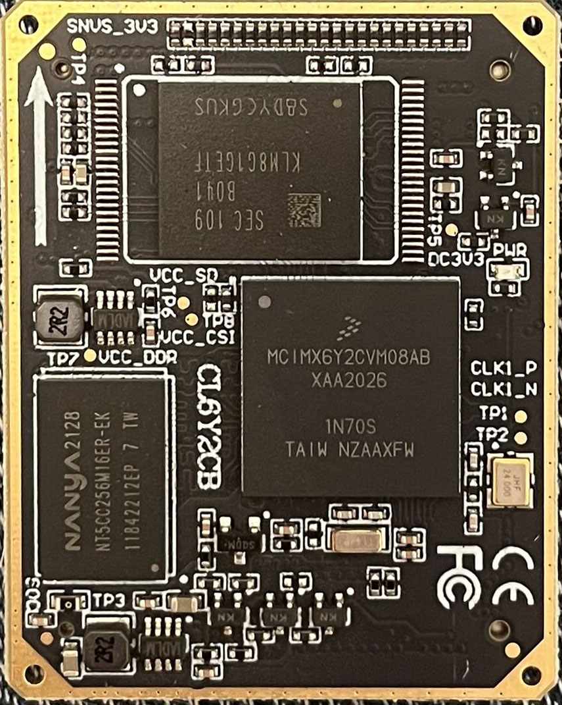

对比上边对核心板资源的了解，可以知道，使用的主控芯片为 **MCIMX6Y2CVM08AB**（NXP），EMMC 型号为 **KLM8G1GETF-B041**（三星 eMMC5.1），DDR3L 型号为 **NT5CC256M16EP-EK(512MB)**（Nanya）。该芯片挂在 I.MX6U 的 MMDC 接口上。

> 两种核心板实物？图中箭头所指的位置为 DDR3L，虽然可能看不太清楚
>
> 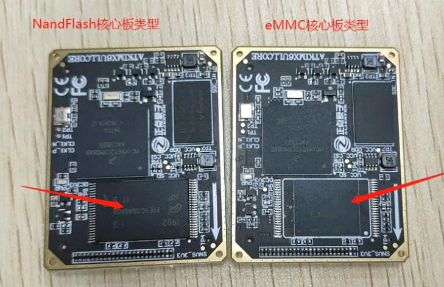

### 2. 芯片型号？

我使用的 I.MX6U-ALPHA 开发板配套的 I.MX6U 核心板，采用的是 **MCIMX6Y2CVM08AB**（800MHz，实际 792MHz）作为主控 CPU， 为工业级。

> （1）它自带 32KB 的 L1 指令和数据 Cache、 128KB 的 L2 Cache。
>
> （2）集成 NEON，集成双精度硬件浮点计算单元 VFPv3，并具有 128KB OCRAM。
>
> （3）具有 2 个通用定时器（GPT）、 4 个周期定时器（EPIT）、 8 个 PWM、 1 个 SDMA 控制器、 4 个 ECSPI、 3 个看门狗、 3 个 SAI、 4 个 IIC、 7 个串口、 2 个 USB（高速，带 PHY）、 2 个 FlexCAN、 2 个 12 位 ADC、 1 个 SPDIF 接口、 1 个 SRTC、 1 个 RTC、 2 个 USDHC 接口、 1 个 RGB LCD 控制器（ELCDIF）、 2 个 10/100M 以太网 MAC 控制器、 1 个摄像头接口、 1 个硬件随机数生成器、以及 124 个通用 IO 口等。

根据芯片型号的不同主频以为 528Mhz、 700MHz(实际 696MHz)、800MHz(实际 792MHz)，轻松应对各种应用。  它是 NXP 出的一款 i.MX 6 系列应用处理器，我们去搜这款芯片的 datasheet（[i.MX 6ULL Applications Processors Data Sheet](https://www.nxp.com.cn/docs/en/data-sheet/IMX6ULLIEC.pdf)）的话，会发现它属于 i.MX 6ULL 单核处理器，它的命名规则如下

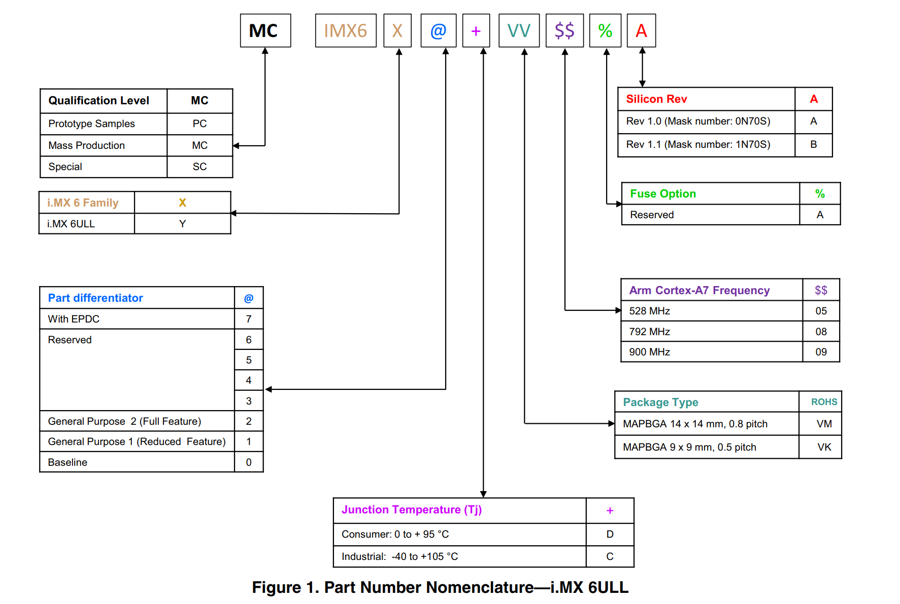

i.MX 6ULL 的结构框图如下：

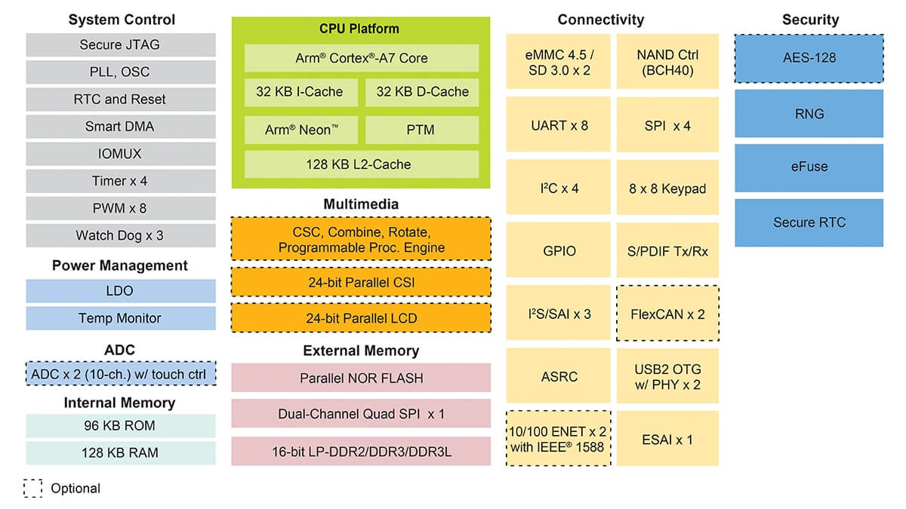

## 三、资料查找

当我们学习一款芯片的时候，肯定最开始要看他的数据手册，也就是芯片手册，厂家还会提供参考手册等来帮助我们了解芯片的各个外设，甚至还会提供 SDK，烧录工具，指导手册等等，那么这款芯片的相关资料去哪找？

### 1. NXP 官网

官网是这个：[恩智浦半导体官方网站 | NXP 半导体](https://www.nxp.com.cn/)

### 2. i.MX 6ULL 介绍页

[i.MX 6ULL 应用处理器_Arm® Cortex®-A7 单核，频率为 900 MHz | NXP 半导体](https://www.nxp.com.cn/products/processors-and-microcontrollers/arm-processors/i-mx-applications-processors/i-mx-6-processors/i-mx-6ull-single-core-processor-with-arm-cortex-a7-core:i.MX6ULL)：

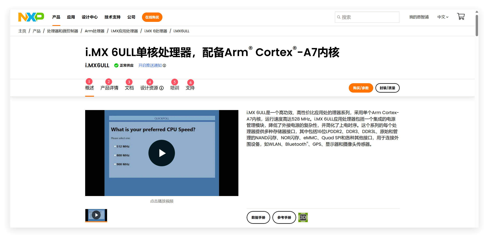

其实我们所需要的大部分资料都可以在这六个部分找到。

#### 2.1 文档

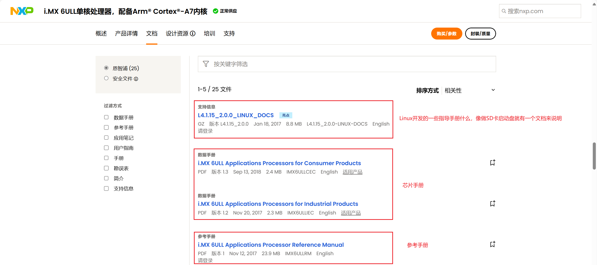

- Linux 开发文档：[L4.1.15_2.0.0_LINUX_DOCS (nxp.com.cn)](https://www.nxp.com.cn/webapp/Download?colCode=L4.1.15_2.0.0-LINUX-DOCS&docLang=en)

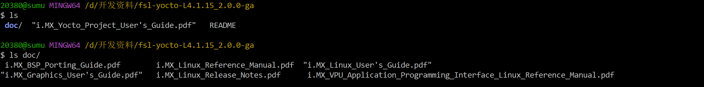

这个压缩包在评估套件的文档里比较好找。

- 芯片手册：[i.MX 6ULL Applications Processors for Consumer Products (nxp.com.cn)](https://www.nxp.com.cn/docs/en/data-sheet/IMX6ULLCEC.pdf)

- 参考手册：[i.MX 6ULL Applications Processor Reference Manual (nxp.com.cn)](https://www.nxp.com.cn/webapp/Download?colCode=IMX6ULLRM&lang_cd=zh)

#### 2.2 硬件

这里是 NXP 推出的一款 evk 评估板：

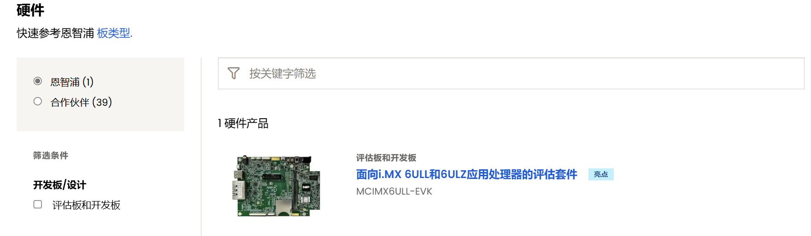

官方提供的一些东西都是基于这块开发板进行的：[MCIMX6ULL-EVK_i.MX6ULL 评估套件 | NXP 半导体](https://www.nxp.com.cn/design/design-center/development-boards-and-designs/i-mx-evaluation-and-development-boards/evaluation-kit-for-the-i-mx-6ull-and-6ulz-applications-processor:MCIMX6ULL-EVK)

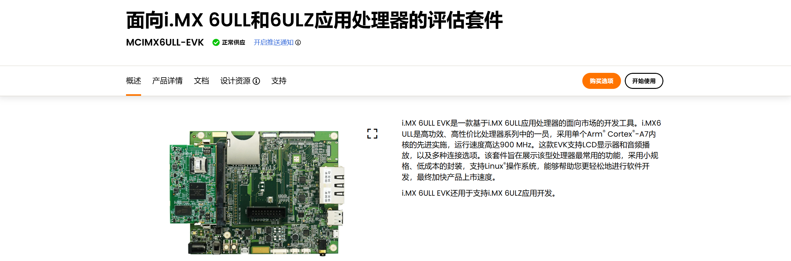

这里也会为我们提供一系列的参考资料，比如开发板的原理图等硬件资料：

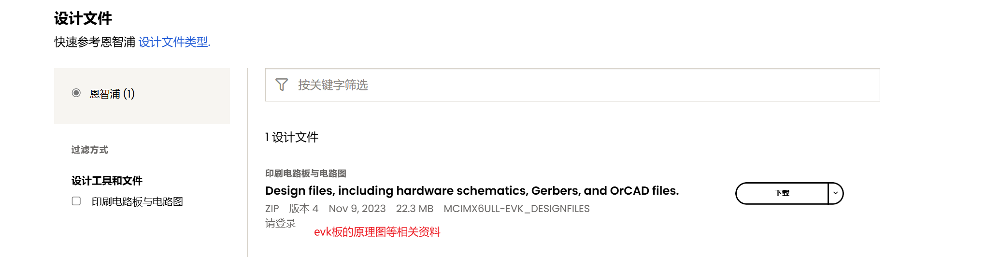

我们可以下载下来看一眼：[Design files, including hardware schematics, Gerbers, and OrCAD files. (nxp.com.cn)](https://www.nxp.com.cn/webapp/Download?colCode=MCIMX6ULL-EVK_DESIGNFILES)

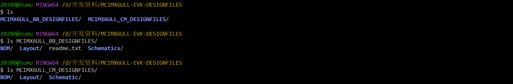

#### 2.3 软件

##### 2.3.1 SDK

这里可以下载到 NXP 为这款芯片提供的 SDK：

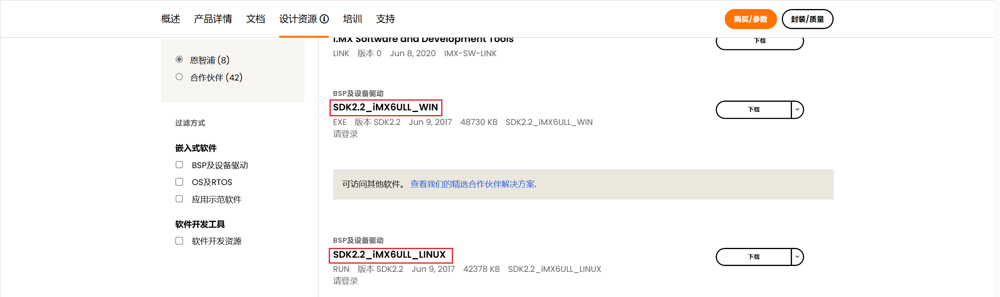

windows 版本和 linux 版本都有。两个链接是：

- [SDK2.2_iMX6ULL_WIN (nxp.com.cn)](https://www.nxp.com.cn/webapp/sps/download/license.jsp?colCode=SDK2.2_iMX6ULL_WIN&appType=file1&DOWNLOAD_ID=null)
- [SDK2.2_iMX6ULL_LINUX (nxp.com.cn)](https://www.nxp.com.cn/webapp/sps/download/license.jsp?colCode=SDK2.2_iMX6ULL_LINUX&appType=file1&DOWNLOAD_ID=null)

##### 2.3.2 mfgtool

我们还可以在这里看到 mfgtool 工具，这个是 NXP 提供的烧写工具：

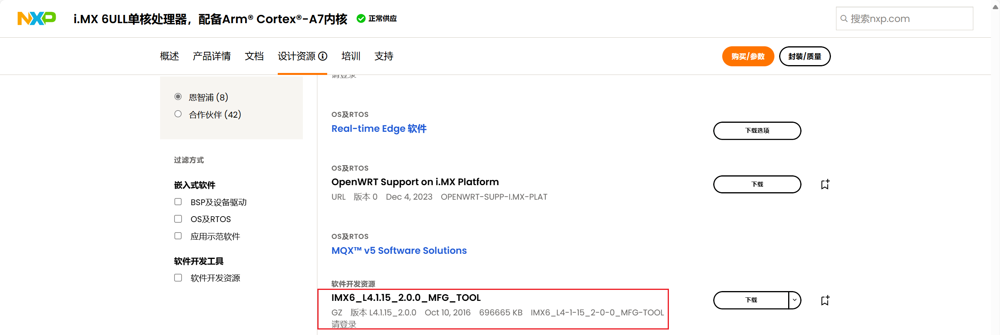

- [IMX6_L4.1.15_2.0.0_MFG_TOOL (nxp.com.cn)](https://www.nxp.com.cn/webapp/sps/download/license.jsp?colCode=IMX6_L4-1-15_2-0-0_MFG-TOOL&appType=file1&DOWNLOAD_ID=null)

### 3. 资料总结

#### 3.1 MCIMX6ULL-EVK 评估板

- NXP 官网主页：[MCIMX6ULL-EVK_i.MX6ULL Evaluation Kit | NXP 半导体](https://www.nxp.com.cn/design/design-center/development-boards-and-designs/i-mx-evaluation-and-development-boards/evaluation-kit-for-the-i-mx-6ull-and-6ulz-applications-processor:MCIMX6ULL-EVK)

- 原理图等资源 [Design files, including hardware schematics, Gerbers, and OrCAD files. ](https://www.nxp.com.cn/webapp/Download?colCode=MCIMX6ULL-EVK_DESIGNFILES)

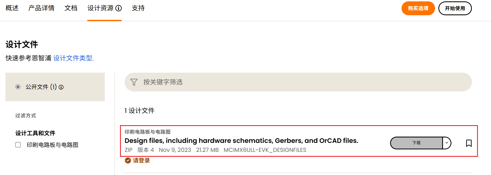

- 用户指南：[i.MX 6ULL EVK Board Hardware User's Guide](https://www.nxp.com.cn/webapp/Download?colCode=IMX6ULLEVKHUG&lang_cd=zh)（在这个页面找：[Applications Processors with Power-Efficient ARM Cortex-A7 | NXP 半导体](https://www.nxp.com.cn/products/i.MX6ULL)）

- SDK：[SDK2.2_iMX6ULL_WIN](https://www.nxp.com.cn/webapp/Download?colCode=SDK2.2_iMX6ULL_WIN&appType=license)、[SDK2.2_iMX6ULL_LINUX](https://www.nxp.com.cn/webapp/Download?colCode=SDK2.2_iMX6ULL_LINUX&appType=license)

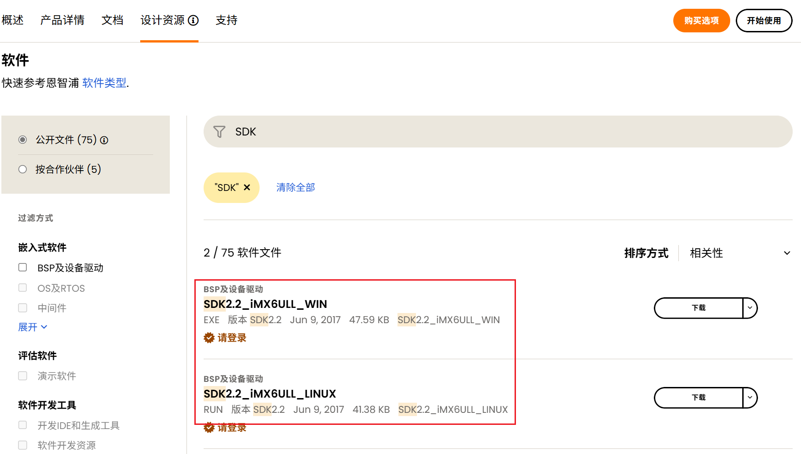

#### 3.2 mfgtool

- [IMX6_L4-1-15_2-0-0_MFG-TOOL](https://www.nxp.com.cn/webapp/sps/download/license.jsp?colCode=IMX6_L4-1-15_2-0-0_MFG-TOOL&appType=file1&location=null&DOWNLOAD_ID=null)

- [nxp-imx/mfgtools: Freescale/NXP I.MX Chip image deploy tools.](https://github.com/nxp-imx/mfgtools)

#### 3.3 i.MX6ULL

- 详情页：[i.MX 6ULL单核处理器，配备Arm® Cortex®-A7内核](https://www.nxp.com.cn/products/i.MX6ULL)

- 数据手册：[IMX6ULLCEC.pdf](https://www.nxp.com.cn/docs/en/data-sheet/IMX6ULLCEC.pdf)、[IMX6ULLIEC.pdf](https://www.nxp.com.cn/docs/en/data-sheet/IMX6ULLIEC.pdf)

- 参考手册：[i.MX 6ULL Applications Processor Reference Manual](https://www.nxp.com.cn/webapp/Download?colCode=IMX6ULLRM&lang_cd=zh)

- Linux下的一些文档：[L4.1.15_2.0.0-LINUX-DOCS](https://www.nxp.com.cn/webapp/Download?colCode=L4.1.15_2.0.0-LINUX-DOCS&docLang=en)

### 4. 一些其他资料

#### 4.1 网站

<table>
    <tbody>
    <tr>
        <td align="center">分类</td>
        <td align="center">网址</td>
        <td align="center">说明</td>
    </tr>
    <tr>
        <td align="center" rowspan="5">官方网站</td>
        <td align="left"><a href="https://www.arm.com/" target="_blank">https://www.arm.com/</a></td>
        <td align="left">ARM官方网站，在这里我们可以找到Cotex-Mx以及ARMVx的一些文档</td>
    </tr>
    <tr>
        <td align="left"><a href="https://www.nxp.com.cn/" target="_blank">https://www.nxp.com.cn/ </a></td>
        <td align="left">NXP官方网站</td>
    </tr>
    <tr>
        <td align="left"><a href="https://www.nxpic.org.cn/" target="_blank">https://www.nxpic.org.cn/</a></td><td align="left">NXP 官方社区</td>
    </tr>
    <tr>
        <td align="left"><a href="https://u-boot.readthedocs.io/en/latest/" target="_blank">https://u-boot.readthedocs.io/en/latest/</a></td><td align="left">u-boot官网</td>
    </tr>
    <tr>
        <td align="left"><a href="https://www.kernel.org/" target="_blank">https://www.kernel.org/</a></td><td align="left">linux内核官网</td>
    </tr>
    </tbody>
</table>

#### 4.2 文档

<table>
    <tbody>
    <tr>
        <td align="center">分类</td>
        <td align="center">网址</td>
        <td align="center">说明</td>
    </tr>
    <tr>
        <td align="center" rowspan="4">NXP</td>
        <td align="left"><a href="https://github.com/nxp-imx" target="_blank">https://github.com/nxp-imx</a></td>
        <td align="left">NXP imx开发资源GitHub组织，里边会有u-boot和linux内核的仓库</td>
    </tr>
    <tr>
        <td align="left"><a href="https://elixir.bootlin.com/linux/latest/source" target="_blank">https://elixir.bootlin.com/linux/latest/source</a></td>
        <td align="left">在线阅读linux kernel源码</td>
    </tr>
    <tr>
        <td align="left"><a href="https://github.com/nxp-imx/linux-imx/releases/tag/rel_imx_4.1.15_2.1.0_ga" target="_blank">nxp-imx/linux-imx/releases/tag/rel_imx_4.1.15_2.1.0_ga</a></td>
        <td align="left">NXP linux内核仓库tags中的rel_imx_4.1.15_2.1.0_ga</td>
    </tr>
    <tr>
        <td align="left"><a href="https://github.com/nxp-imx/uboot-imx/releases/tag/rel_imx_4.1.15_2.1.0_ga" target="_blank">nxp-imx/uboot-imx/releases/tag/rel_imx_4.1.15_2.1.0_ga</a></td>
        <td align="left">NXP u-boot仓库tags中的rel_imx_4.1.15_2.1.0_ga</td>
    </tr>
    <tr>
        <td align="center" rowspan="2">I.MX6ULL</td>
        <td align="left"><a href="https://www.nxp.com.cn/docs/en/data-sheet/IMX6ULLIEC.pdf" target="_blank">i.MX 6ULL Applications 
Processors for Industrial 
Products</a></td>
        <td align="left">I.MX6ULL 芯片手册（datasheet，可以在线查看）</td>
    </tr>
    <tr>
        <td align="left"><a href="https://www.nxp.com.cn/webapp/Download?colCode=IMX6ULLRM&lang_cd=zh" target="_blank">i.MX 6ULL Applications Processor
Reference Manual</a></td>
        <td align="left">I.MX6ULL 参考手册（下载后才能查看，需要登录NXP官网）</td>
    </tr>
        <tr>
        <td align="center" rowspan="5">ARM</td>
        <td align="left"><a href="https://developer.arm.com/documentation/ddi0464/latest" target="_blank">Cortex-A7 MPCore Technical Reference Manual</a></td>
        <td align="left">Cortex-A7 MPCore技术参考手册</td>
    </tr>
    <tr>
        <td align="left"><a href="https://developer.arm.com/documentation/ddi0406/cd/?lang=en" target="_blank">ARM Architecture Reference Manual ARMv7-A and ARMv7-R edition</a></td>
        <td align="left">ARM架构参考手册ARMv7-A和ARMv7-R版</td>
    </tr>
    <tr>
        <td align="left"><a href="https://developer.arm.com/documentation/ihi0069/h/?lang=en" target="_blank">Arm Generic Interrupt Controller Architecture Specification- version 3 and version 4</a></td>
        <td align="left">Arm通用中断控制器架构规范-版本3和版本4</td>
    </tr>
    <tr>
        <td align="left"><a href="https://developer.arm.com/documentation/ihi0048/bb/?lang=en" target="_blank">ARM Generic Interrupt Controller Architecture Specification - Version 2.0</a></td>
        <td align="left">Arm通用中断控制器架构规范-版本2.0</td>
    </tr>
    <tr>
        <td align="left"><a href="https://developer.arm.com/documentation/den0013/d/?lang=en" target="_blank">ARM Cortex-A Series Programmer's Guide for ARMv7-A</a></td>
        <td align="left">Cortex-A系列ARMv7-A编程指南</td>
    </tr>
    </tbody>
</table>
