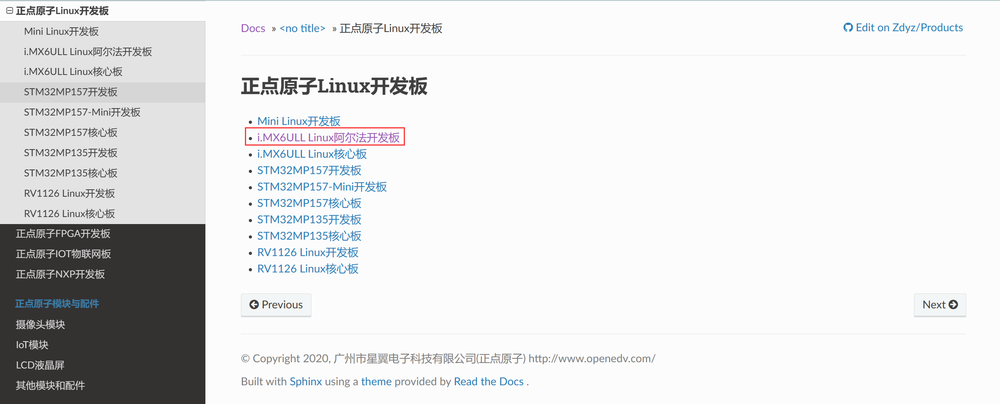
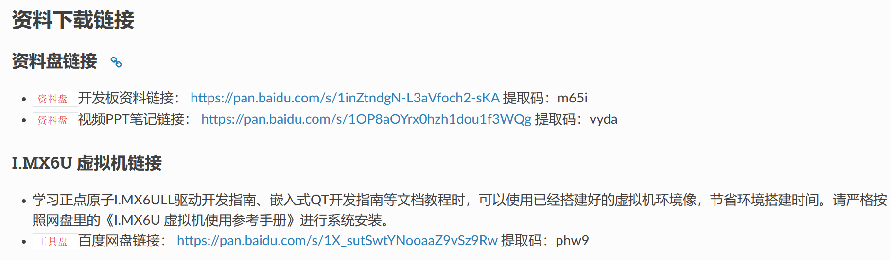
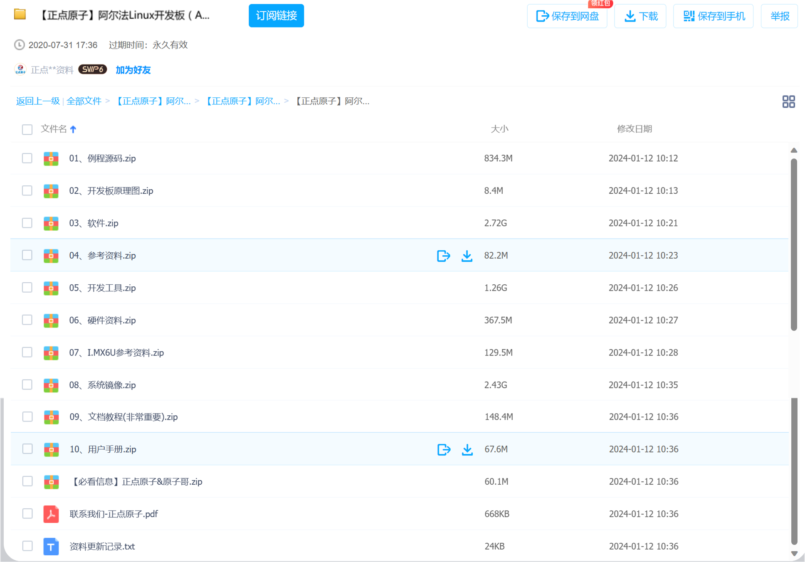
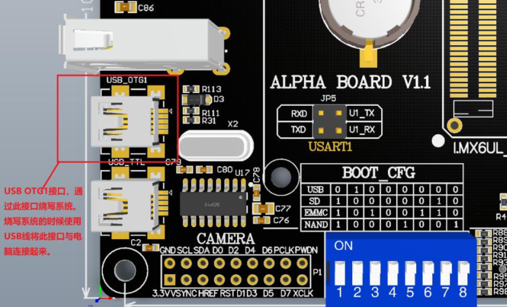
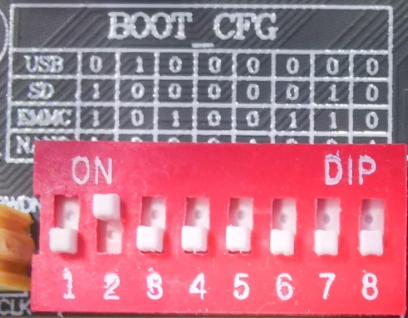

<!-- more -->

## 一、资料下载

### 1. 资料去哪找？

开发板购买的时候正点原子都会附赠开源的开发资料，我们可以在这里下载 [正点原子Linux开发板 — 正点原子资料下载中心 1.0.0 文档](http://47.111.11.73/docs/boards/arm-linux/index.html#linux)

点击进去之后就可以看到所有的资料链接啦，包括视频：

### 2. 下载哪一个？

我们就下载资料盘链接里边的相关资料就可以了，主要还是开发板资料，视频PPT就是视频教程中所用的PPT资料。开发资料都包含这一些：

## 二、使用前的准备

### 1. CH340驱动

开发板的串口与电脑通信，需要安装CH340驱动 ，这个后边LV02会有说明。

### 2. 串口终端

我们在PC电脑上与开发板通信，主要就是通过串口终端，常用的有SecureCRT和MobaXterm,在后边LV02都会有详细的安装和使用笔记。

### 3. VMware和ubuntu

我们还需要一个linux开发环境，由于我是windows11系统，所以就安装了VMware虚拟机，在虚拟机中运行ubuntu系统，我用的系统有两个，一个是ubuntu16.04，这是一个广为流传的版本，正点原子提供的虚拟机开发环境也是ubuntu16.04，自己也装了一个。另外由于ubuntu16.04好像已经停止支持了，并且在vscode中的ssh远程功能停止对16版本的支持，最低要到20版本，所以后来又装了一个20.04版本。

### 4. 开发板配置

#### 4.1 连接USB线

MfgTool 是通过 USB OTG 接口将系统烧写进 EMMC 中的，正点原子 I.MX6U-ALPHA 开发板上的 USB OTG 口 ：

在烧写之前，需要先用 USB 线将图中的 USB\_OTG1 接口与电脑连接起来。

#### 4.2 拨码开关状态

拨码开关需要拨到 USB 启动模式（前边学习单片机的时候应该有所了解，后边会再学习I.MX6U的启动方式），拨到USB模式的时候，我们就可以通过OTG接口，将u-boot、linux内核、设备树和根文件系统等内容下载到SD卡，或者EMMC或者NAND中去，如下图所示： 

**【注意】**如果插了 TF 卡，需要弹出 TF 卡，否则电脑可能不能识别 USB。可以等识别出来以后再插上 TF 卡。 

| sw1  | sw2  | sw3  | sw4  | sw5  | sw6  | sw7  | sw8  | boot device |
| ---- | ---- | ---- | ---- | ---- | ---- | ---- | ---- | ----------- |
| OFF  | ON   | OFF  | OFF  | OFF  | OFF  | OFF  | OFF  | USB         |
| ON   | OFF  | OFF  | OFF  | OFF  | OFF  | ON   | OFF  | Micro SD    |
| ON   | OFF  | ON   | OFF  | OFF  | ON   | ON   | OFF  | eMMC        |
| ON   | OFF  | OFF  | OFF  | ON   | OFF  | OFF  | ON   | NAND        |

> 说明： OFF 为 0， ON 为 1。
>
> （1） USB OTG 烧写设置： 0100 0000
>
> （2） SD 卡启动设置： 1000 0010
>
> （3） EMMC 启动设置： 1010 0110
>
> （4） NAND FLASH 启动设置： 1000 1001  
