<!-- more -->

前边我们已经了解过如何改造自己的mfgtool，以及如何通过mfgtool烧写系统，接下来就是用正点原子的开发板出厂系统来做烧写测试，后边也方便了解开发板功能。

## 一、mfgtool 烧写系统（OTG 方式）

### 1. 准备工作

#### 1.1 开发板配置

确保前边的CH340驱动和串口终端都已经安装好了，然后ALPHA开发板按如下方式连接：

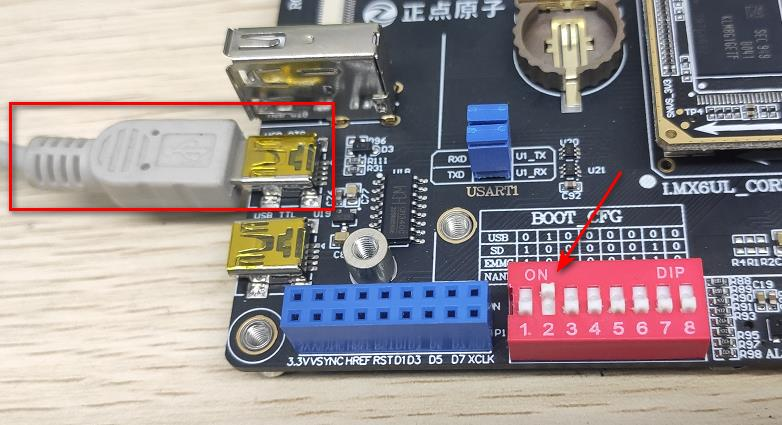

我们需要将底板拨码开关 BOOT_CFG 拨到对应的位置如上图，**设置为 USB 连接方式**，“1”代码 ON， “0”代表“OFF”。将拨码数字 2 处拨到 ON，其他的为 OFF。这样后面烧写才能正常识别到USB，最终将程序烧写到哪里，是在启动mfgtool工具的时候所选用的脚本来决定。

#### 1.2 资料准备

我们要烧写正点原子出厂系统，所以用的都是正点原子资料中的工具，我们主要使用 【开发板光盘 A-基础资料/05、开发工具/04、正点原子MFG_TOOL 出厂固件烧录工具/mfgtool 】  

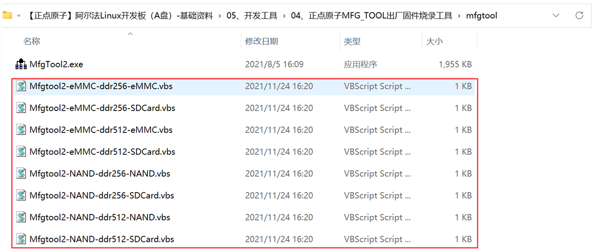

目前正点原子在售的核心板类型只有两种，一种是 eMMC（8GB）核心板类型， DDR 大小为 512MB。 另一种是 NandFlash（512MB）， DDR 大小为 256MB。 以 Mfgtool2-eMMC-ddr512-eMMC.vbs 为例，vbs 脚本命名解释如下：

>-eMMC：代表核心板上的存储介质为 eMMC
>
>-ddr512： 指核心板上的 DDR 大小为 512MB
>
>-eMMC： 选择此脚本是把固件烧写到 eMMC 上  

### 2. 烧写系统到 TF卡  

#### 2.1 vbs脚本选择

首先需要准备一张 TF 卡， 按前面的 vbs 脚本命名解释， 比如要烧写系统到 TF(SD Card)卡，那么需要确认我们手上的核心板类型是 eMMC 还是NandFlash。 比如现在我手上核心板类型为 eMMC 类型核心板（512MB）。所以我就需要选择 Mfgtool2-eMMC-ddr512-SDCard.vbs 这个脚本来烧写 ，如果手上核心板类型 NandFlash 核心板，则选择 Mfgtool2-NAND-ddr256-SDCard.vbs。

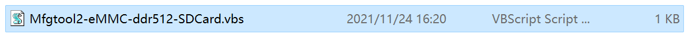

#### 2.2 运行烧写工具

开发板上电， 我们双击 Mfgtool2-eMMC-ddr512-SDCard.vbs。如果是第一次使用开发板 OTG 连接 PC机（电脑），需要等待 PC（电脑） 机自动安装驱动。 点击右下角正在安装驱动的小图标， 注意不要让 Winodws 去从 Windows update 里去找驱动，点击跳过， 驱动自然会装上。否则用了 Windows update 里的驱动，可能在烧写过程中会卡住。 等待安装驱动完成后， mfgtool 界面会提示【符合HID标准的供应商定义设备】， 注意不要打开虚拟机，如果虚拟机正在开启， OTG 会连接到虚拟机上去。

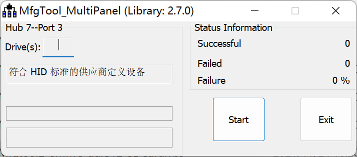

此时将 TF 卡插入卡槽（需开发板先上电后再将 TF 卡插进卡槽，否则上电时会检测 TF 卡，这样 mfgtool 会连接不到开发板设备）  

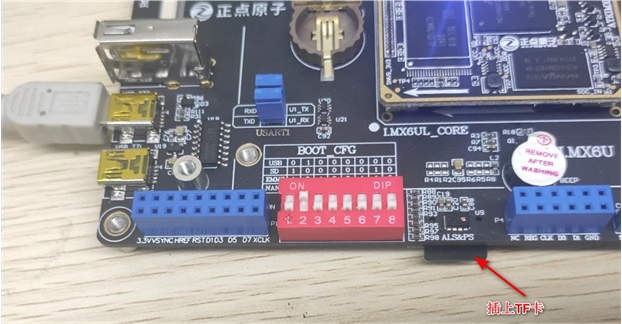

然后点击【start】即可开始烧写系统，烧写过程中如下图：

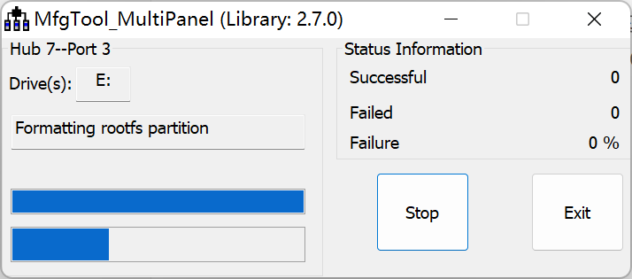

烧写是一个很漫长的过程，主要是后边根文件系统的拷贝过程（如果说连接了串口的话，是可以看到串口有大量的打印信息，那些就是正在烧写的过程信息）。烧写完成后如下所示：

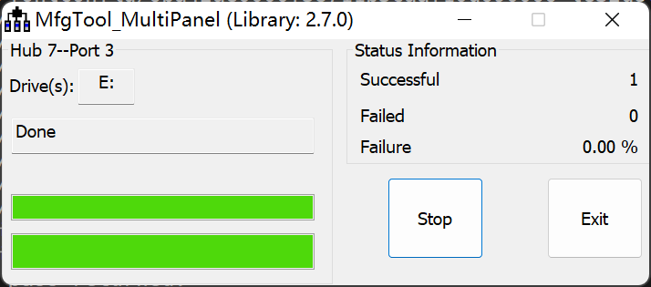

最后点击【Stop】&rarr;【Exit】退出即可。

#### 2.3 启动测试

测试从 SD 卡启动系统，拨码开关拨至 SD 卡启动方式 10000010，启动系统即可。启动成功我们可以看到正点原子的出厂系统，并且可以串口可以操作linux系统：

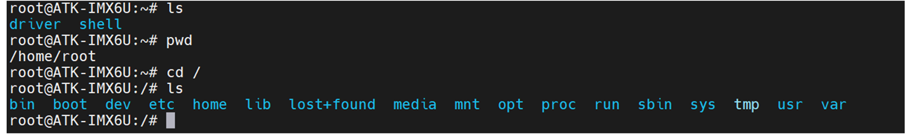

### 3. 烧写到eMMC

这个需要我们的核心板类型带 eMMC 存储介质。我使用的是eMMC核心板的ddr大小为512MB，所以双击 Mfgtool2-eMMC-ddr512-eMMC.vbs 这个 vbs 脚本文件进行烧写即可。和烧写到SD卡的步骤一模一样（这个时候就不要插入SD卡啦），当烧写完成后，将拨码开关拨至 eMMC 启动方式 10100110，启动系统即可。

### 4. 烧写到NAND

使用前提:核心板类型带 NAND FLASH 存储介质。 若是使用的 NAND FLASH 核心板是 ddr 大小是 256MB，可以双击 Mfgtool2-NAND-ddr256-NAND.vbs 这个 vbs 脚本文件进行烧写。和烧写到SD卡的步骤一模一样（这个时候就不要插入SD卡啦），当烧写完成后，将拨码开关拨至 NAND 启动方式 10001001，启动系统即可。  

## 二、shell脚本烧写系统

脚本烧写系统一般可用于批量烧写与升级系统， 不像 mfgtool 上位机那样还需要 PC 机和USB T 字口数据线，且每次只能打开一个 mfgtool 上位机，我们可以自行修改好烧写系统脚本，进行自动化烧写测试，那么可以无需专业人员参与，即可批量烧写系统。我们可以先对之前的SD卡进行格式化，然后我们通过脚本再将系统内核刷入SD卡。

格式化的时候建议使用SDFormatter去格式化吧，反正我用电脑格式化的话，好像只是格式化了一掉部分，并没有完全格式化。

### 1. 准备工作

#### 1.1 ubuntu

通过脚本烧写的话，就需要用到虚拟机啦，我这里用的是VMware下的ubuntu22.04版本（后来我换回ubuntu16.04了，问题少，但是后来发现vscode的ssh remote扩展后面的版本不支持16.04了，所以又换到了个20.04，但是操作和现象都是一模一样）。

#### 1.2 文件拷贝

我们要烧写正点原子出厂系统，需要将 OS Firmware/files 下的所有文件拷贝到ubuntu去，完整的路径如下：

```bash
开发板光盘 A-基础资料/05、开发工具/04、正点原子MFG_TOOL 出厂固件烧录具/mfgtool/Profiles/Linux/OS Firmware/files
```

 拷贝完成后如下所示：

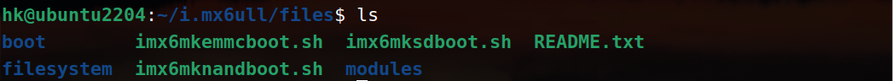

### 2. 烧写系统到TF卡

#### 2.1 挂载TF卡到ubuntu

我们插入TF卡，然后点击【虚拟机】&rarr;【可移动设备】&rarr;【设备名称】&rarr;【连接（断开与主机的连接）】

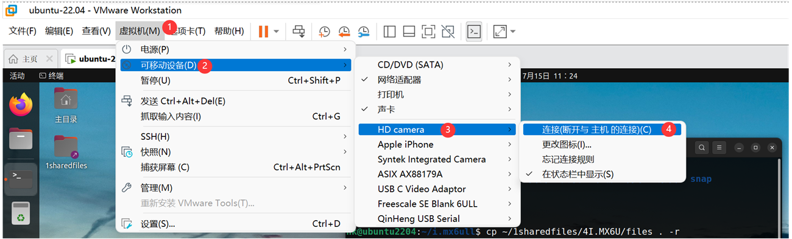

这里的设备名称一般我们可以拔掉TF卡，然后再插上，看一下多了哪一个，就就知道我们的TF卡对应哪一个名称啦。

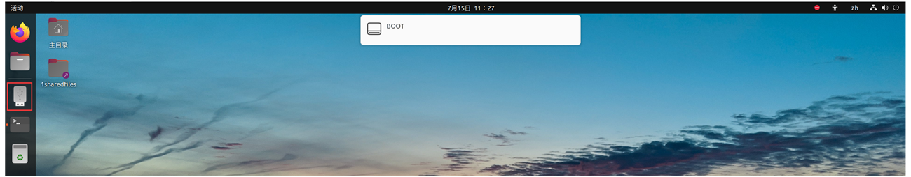

若是加载成功，一般会有这个图标出来，然后我们输入如下指令查看 SD 卡挂载节点，如下图， 写这篇笔记的时候用的 TF 卡容量是 32GB，但实际会比这小一些。

```bash
sudo fdisk -l
```

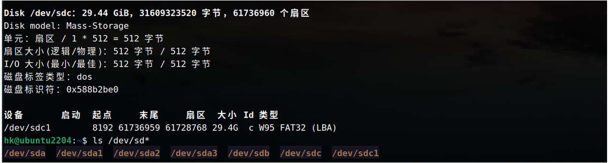

可以看到实际的容量大概就是29.44GB，挂载节点为 /dev/sdc 。

> - 节点命名规则？
>
> 节点的命名和Linux系统的磁盘命名有关系。Linux 使用一种更灵活的命名方案。它所传达的信息比其它操作系统采用的命名方案更多。该命名方案是基于文件的，文件名的格式为：
>
> ```bash
> /dev/xxyn
> ```
>
> （1）/dev/： 这是所有设备文件所在的目录名。因为分区在硬盘上，而硬盘是设备，所以这些文件代表了在/dev/上所有可能的分区。
>
> （2）xx：分区名的前两个字母标明分区所在设备的类型。通常是 hd （IDE 磁盘）或 sd（SCSI 磁盘）。
>
> （3）y：这个字母标明分区所在第几个设备。例如，/dev/hda（第一个 IDE 磁盘）或 /dev/sdb（第二个 SCSI 磁盘）
>
> （4）n：:最后的数字代表分区。前四个分区（主分区或扩展分区）是用数字从 1 排列到 4。逻辑分区从 5 开始。例如，/dev/hda3 是在第一个 IDE 硬盘上的第三个主分区或扩展分区；/dev/sdb6 是在第二个 SCSI 硬盘上的第二个逻辑分区。
>
> 因此，上边的sdc指的是系统中的第3块SCSI磁盘，sdc1指的是第3块SCSI磁盘上的第1个主分区或者扩展分区。


#### 2.2 imx6mksdboot.sh脚本

这个脚本是正点原子提供的，里边就是一些命令，这里就不详细分析脚本了，里边其实挺简单的，只是把需要敲的命令放到了脚本，方便使用。大概就是将TF卡进行格式化，然后进行分区，再把u-boot、linux内核、设备树和根文件系统等写入到TF卡中去。我们可以执行 ./imx6mksdboot.sh --help 查看脚本的使用方法：

```bash
# 这里有可能我们没有脚本执行权限，执行下面的命令即可
chmod +x imx6mksdboot.sh
./imx6mksdboot.sh --help
```

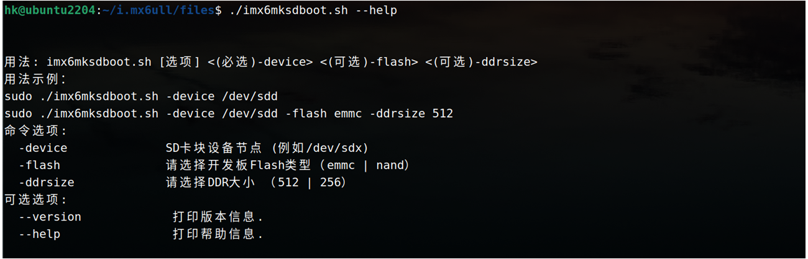

可以看到，基本的使用命令如下：

```bash
imx6mksdboot.sh [选项] <(必选)-device> <(可选)-flash> <(可选)-ddrsize>
```

（1） -device：指明设备节点（TF 卡挂载的节点如/dev/sdx）， 必需加这个参数

（2） -flash：指明核心板上的媒体存储介质，可选为（emmc或者nand）

（3） -ddrsize：指明核心板上的 ddr 容量大小，可选为（512或者256） MB

比如现在我现在用的是核心板的 ddr 容量大小是 512MB，媒体存储介质是 eMMC。 SD 卡挂载节点为/dev/sdc。那么烧写到 SD 卡的指令如下：

```bash
sudo ./imx6mksdboot.sh -device /dev/sdc -flash emmc -ddrsize 512
```

执行指令后脚本会有中文再次询问 SD 卡所挂载的节点是否对应，将会清空 SD 卡上的所有数据，这个时候需要注意备份重要的数据。然后按 Enter 键确认后继续，烧写 SD 卡需要大约需要几分钟时间，这里根据个人电脑不同和所用 SD 卡不同，可能花费的时间差异比较大。  

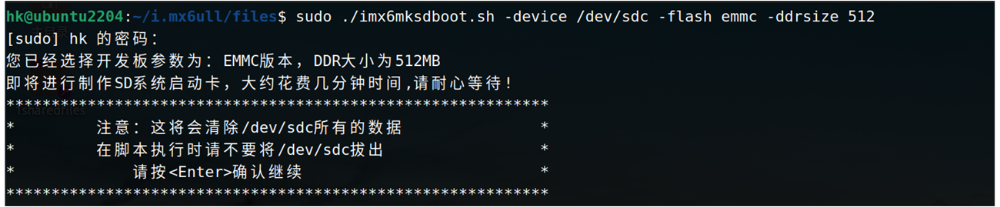

在烧写的过程中，会卸载 TF 卡，在脚本执行时，鼠标不要离开 Ubuntu 虚拟机，否则可能在脚本卸载 TF 卡时， TF 卡连接到 PC 主机上去了，这样脚本就无法找到 TF 卡执行，就会提示“mount: special device /dev/sdb1 does not exist”这样的错误。 烧写时有中英文结合提示烧写的过程，烧写完成如下图。  烧写完成后，会有如下提示信息：

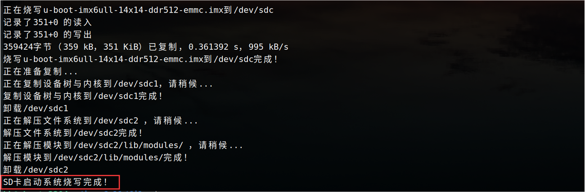

#### 2.3 TF卡中都烧写了什么？

烧写完成后，TF卡中都有什么文件？可以看吗？当然可以啦，我们搜索一下/dev/目录下sdc的相关节点：

```bash
ls /dev/sd*
```

可以看到有如下的节点：


发现有sdc、sdc1和sdc2这三个节点，从前边烧写过程中脚本的打印信息可以看出，sdc1中主要是放的设备树和内核，在sdc2中主要是文件系统，我们来挂载一下这两个分区，看一下里边的内容：

```bash
mkdir -p ~/i.mx6ull/sdc1_temp
mkdir -p ~/i.mx6ull/sdc2_temp

sudo mount /dev/sdc1 ~/i.mx6ull/sdc1_temp
sudo mount /dev/sdc2 ~/i.mx6ull/sdc2_temp
```

这样就可以看到sdc1和sdc2分区中文件如下所示：

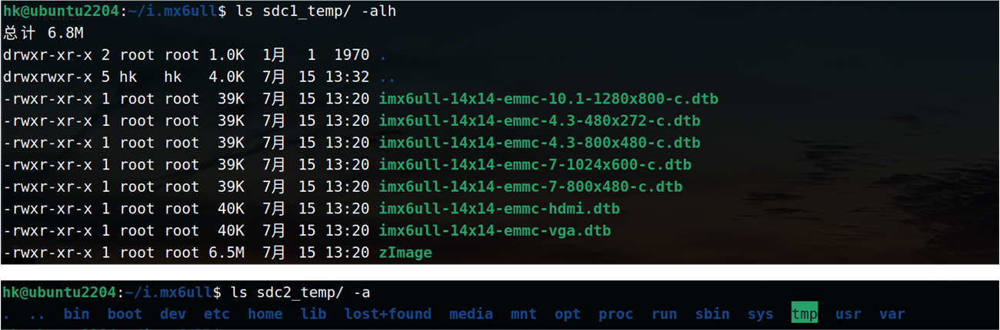

#### 2.4 断开TF卡

若是前边将tf卡的分区挂载到了ubuntu，可以用下边的命令卸载：

```bash
sudo umount ~/i.mx6ull/sdc1_temp
sudo umount ~/i.mx6ull/sdc2_temp
```

然后按连接 TF 卡到 Ubuntu 的方法，再点击断开即可退出 TF 卡。

#### 2.5 重启测试

烧写完成后，将拨码开关拨至 TF 启动方式 10000010，启动系统即可。若是成功则可以正常进入linux系统：

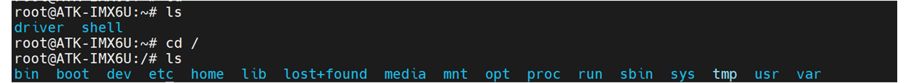

### 3. 烧写到eMMC

脚本怎么烧写到eMMC？这个**需要在开发板运行起来linux系统后**才能用，这也就意味着我们需要有一个TF卡启动系统。需要先在开发板上跑起来linux系统。换句话说，就是我们使用开发板上已经在运行的linux系统来操作eMMC，把相关的固件写到对应的地方去。这个方式其实就是和mfgtools类似了，只是mfgtools是直接通过usb把一个临时系统下载到内存中运行。

#### 3.1 准备TF启动系统

按照前边的 《一、mfgtool 烧写系统（OTG 方式）——2. 烧写系统到TF卡》或者《二、脚本烧写系统——2. 烧写系统到TF卡》先制作一个TF启动系统。

#### 3.2 在ubuntu下拷贝所需文件

我们需要将下边目录中的文件拷贝到开发板的根文件系统（注意这一步是在虚拟机的ubuntu中进行，并不是在开发板的linux系统进行）：

```bash
开发板光盘 A-基础资料/05、开发工具/04、正点原子MFG_TOOL 出厂固件烧录具/mfgtool/Profiles/Linux/OS Firmware/files
```

怎么拷贝？目前就只能用TF卡启动系统喽（也就是说我们需要先做一个TF卡启动盘），前边我们知道TF卡的分区2中是放的linux的根文件系统，所以我们可以在ubuntu中挂载TF卡，然后将files目录拷贝到根文件系统中。

- 挂载TF卡的根文件系统分区

```bash
mkdir -p ~/i.mx6ull/temp
sudo mount /dev/sdc2 ~/i.mx6ull/temp
```

挂载成功后，temp目录文件如下：

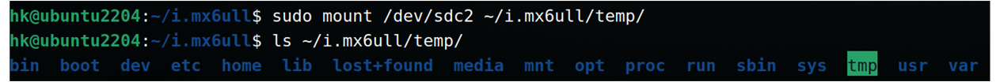


- 拷贝files目录下所有的文件到根文件系统

我们把files目录文件都拷贝到/home目录下，在ubuntu中就在 \~/i.mx6ull/temp/home 中了：

```bash
sudo cp -prf files ~/i.mx6ull/temp/home/
```

拷贝完后， \~/i.mx6ull/temp/home/files 目录下文件如下：

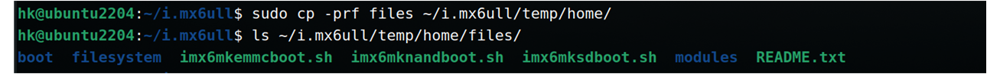

- 卸载tf卡

```bash
sudo umount ~/i.mx6ull/temp
```

#### 3.3 从TF卡启动开发板

接下来我们将拨码开关拨到 10000010 ，将刚才的TF卡插到开发板中，系统就会从TF卡启动了，启动完成后我们看一下files文件都在不在/home中：

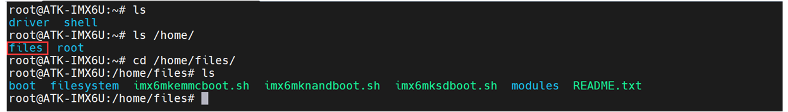

#### 3.4 imx6mkemmcboot.sh脚本

##### 3.4.1 脚本说明

我们在串口终端执行./imx6mkemmcboot.sh --help 查看脚本的使用说明 ：

```bash
chmod +x imx6mkemmcboot.sh
./imx6mkemmcboot.sh --help
```

可以看到如下提示信息：

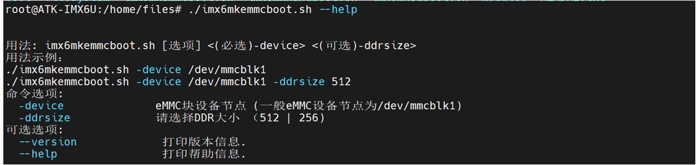

用法说明：

```bash
imx6mkemmcboot.sh [选项] <(必选)-device> <(可选)-ddrsize>
```

（1） -device：指明设备节点（eMMC 挂载的节点如/dev/mmcblk1）， 必需加这个参数

（2） -ddrsize：指明核心板上的 ddr 容量大小，可选为（512或者256） MB

比如现在我的核心板的 ddr 容量大小是 512MB ， eMMC 挂载节点为 /dev/mmcblk1 。那么烧写的指令如下：

```bash
./imx6mkemmcboot.sh -device /dev/mmcblk1 -ddrsize 512
```

执行指令后脚本会有中文再次询问 eMMC 所挂载的节点是否对应，将会清空 eMMC 上的所有数据，这个时候要注意备份重要的数据。按 Enter 键确认后继续，烧写系统到 eMMC 需要大约需要几分钟时间。  

##### 3.4.2 查看eMMC挂载节点

我们需要查看一下eMMC的挂载节点，我们在串口终端执行以下命令：

```bash
fdisk -l
```

可以看到有如下信息输出：

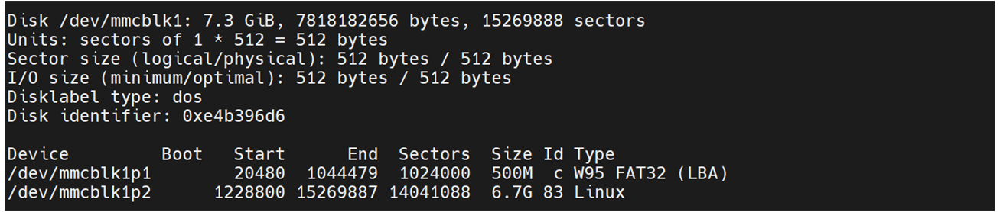

可以看到挂载的节点为 /dev/mmcblk1，后边的p1和p2就是分区，跟前边的sdc1和sdc2一样。

##### 3.4.3 烧写系统

前面我们知道核心板的 ddr 容量大小是 512MB ， eMMC 挂载节点为/dev/mmcblk1。那么烧写的指令如下，执行指令后脚本会有中文
再次询问 eMMC 所挂载的节点是否对应，将会清空 eMMC 上的所有数据，要注意备份重要的数据。

```bash
./imx6mkemmcboot.sh -device /dev/mmcblk1 -ddrsize 512
```

然后会有以下提示，需要我们按下Enter按键：

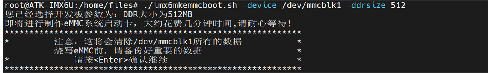

之后便会开始将files中相关的文件写入到eMMC中去，写入完成后有如下提示：

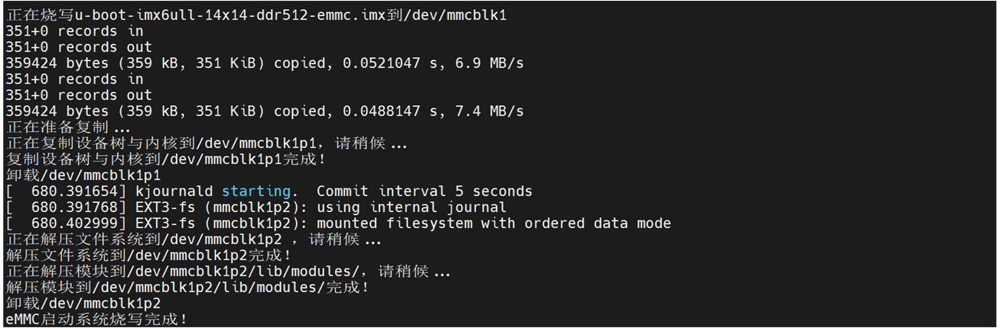

从这里大概可以知道，我们将内核和设备树都写入到了 /dev/mmcblk1p1 中，将根文件系统和模块都写入到了 /dev/mmcblk1p2 中。

#### 3.5 eMMC中都烧写了什么？

跟之前的方法一样，想要看eMMC分区中都有什么，我们需要挂载分区才行，我们先看一下eMMC的分区节点：，在串口终端执行以下命令：

```bash
ls /dev/mmc*
```

然后会看到有如下节点：

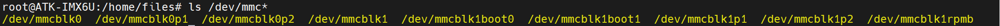

从刚才烧写完成的提示信息中可以看到我们实际用到的是mmcblk1的p1和p2分区，我们挂载这两个分区，看一下都有什么内容：

```bash
mkdir -p /home/emmc_p1 /home/emmc_p2
mount /dev/mmcblk1p1 /home/emmc_p1
mount /dev/mmcblk1p2 /home/emmc_p2
```

一般应该没啥大问题，都可以挂载成功，我们看一下都有那些文件：

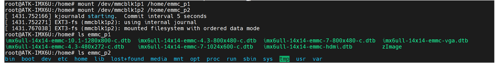

可以看到与上边的打印信息是吻合的。

#### 3.6 重启测试

烧写完成后，我们可以将拨码开关拨至 eMMC 启动方式 10100110，启动系统即可。 若是烧写成功，则可以正常进入linux系统：

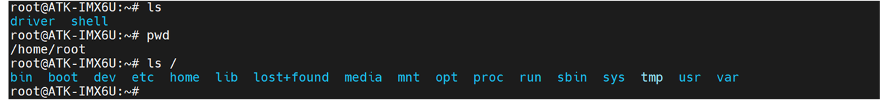

### 6. 烧写到NAND

#### 6.1 准备TF启动系统

按照前边的 《一、mfgtool 烧写系统（OTG 方式）——2. 烧写系统到TF卡》或者《二、脚本烧写系统——2. 烧写系统到TF卡》先制作一个TF启动系统。

#### 6.2 MTD 分区表  

在开发板linux系统中使用 cat 指令查看 MTD 分区表，打印结果如下图表示存在 Nand Flash。  

```bash
cat /proc/mtd
```

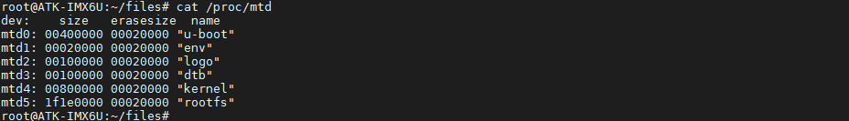

#### 6.3 imx6mknandboot.sh 脚本

- 赋予 NandFlash 烧写脚本的可执行权限  

```bash
chmod +x imx6mknandboot.sh
```

- 查看脚本的使用说明  

```bash
./imx6mknandboot.sh --help
```

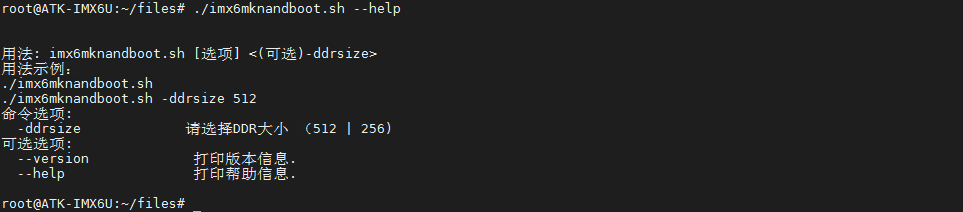

- 用法说明

```bash
imx6mknandboot.sh [选项] <(可选)-ddrsize>
```

-ddrsize：指明核心板上的 ddr 容量大小，可选为（512|256） MB  

- 烧写指令

若我们使用核心板的 ddr 容量大小是 256MB，那么烧写的指令如下。这将会清空 NandFlash 上的所有数据，请注意备份重要的数据。按 Enter 键确认后继续，烧写系统到 NandFlash 需要大约需要几分钟时间。  

```bash
./imx6mknandboot.sh -ddrsize 256
```

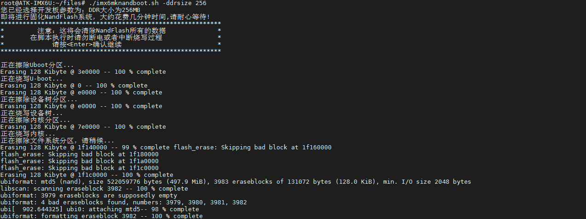

烧写完成如下图所示：

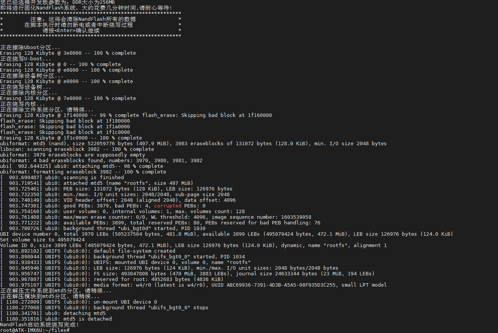

#### 6.4 重启测试

烧写完成后，将拨码开关拨至 Nand Flash 启动方式 10001001，启动系统即可。  

### 三、shell脚本分析

### 1. imx6mksdboot.sh

```shell
#! /bin/sh
#I.MX6 SD卡启动系统烧写脚本
#version v1.1
#Author QQ1252699831
#company 广州星翼电子科技有限公司

#version v1.0 2019.10.26
#version v1.1 2020.11.7 1.添加判断文件系统是否存在/lib/modules目录的功能，再解压模块
VERSION="1.1"
#打印用法
usage ()
{
  echo "

用法: `basename $1` [选项] <(必选)-device> <(可选)-flash> <(可选)-ddrsize>
用法示例：
sudo ./imx6mksdboot.sh -device /dev/sdd
sudo ./imx6mksdboot.sh -device /dev/sdd -flash emmc -ddrsize 512 
命令选项:
  -device              SD卡块设备节点 (例如/dev/sdx)
  -flash	       请选择开发板Flash类型（emmc | nand）
  -ddrsize	       请选择DDR大小 （512 | 256） 
可选选项:
  --version             打印版本信息.
  --help                打印帮助信息.
"
  exit 1
}
#Uboot默认值
Uboot='u-boot-imx6ull-14x14-ddr512-emmc.imx'

#execute执行语句成功与否打印
execute ()
{
    $* >/dev/null
    if [ $? -ne 0 ]; then
        echo
        echo "错误: 执行 $*"
        echo
        exit 1
    fi
}

#打印版本信息
version ()
{
  echo
  echo "`basename $1` version $VERSION"
  echo "I.MX6 SD卡制卡脚本"
  echo

  exit 0
}

#判断参数个数
arg=$#
if [ $arg -ne 6 ];then
number=1

while [ $# -gt 0 ]; do
  case $1 in
    --help | -h)
      usage $0
      ;;
    -device) shift; device=$1; shift; ;;
    --version) version $0;;
    *) copy="$copy $1"; shift; ;;
  esac
done
#判断字符串是否为零
test -z $device && usage $0
echo ""
echo "根据下面的提示，补全缺省的参数-flash -ddrsize"
read -p "请选择开发板参数，输入数字1~4，按Enter键确认
1.-flash emmc，-ddrsize 512
2.-flash emmc，-ddrsize 256
3.-flash nand，-ddrsize 512
4.-flash nand，-ddrsize 256 
输入数字1~4(default 1): " number
if [ -z $number ];then
  echo "使用默认参数:EMMC版本，DDR大小为512MB"
else
  case $number in
    1)  echo '您已经选择开发板参数为：EMMC版本，DDR大小为512MB'
	Uboot='u-boot-imx6ull-14x14-ddr512-emmc.imx'
    ;;
    2)  echo '您已经选择开发板参数为：EMMC版本，DDR大小为256MB'
	Uboot='u-boot-imx6ull-14x14-ddr256-emmc.imx'
    ;;
    3)  echo '您已经选择开发板参数为：NAND FLASH版本，DDR大小为512MB'
	Uboot='u-boot-imx6ull-14x14-ddr512-nand-sd.imx'
    ;;
    4)  echo '您已经选择开发板参数为：NAND FLASH版本，DDR大小为256MB'
	Uboot='u-boot-imx6ull-14x14-ddr256-nand-sd.imx'
    ;;
    *)  echo '输入的参数有误，退出制卡';exit;
    ;;
esac
fi
else
#命令行处理，根据选项获得参数
while [ $# -gt 0 ]; do
  case $1 in
    --help | -h)
      usage $0
      ;;
    -device) shift; device=$1; shift; ;;
    -flash) shift; flash=$1; shift; ;;
    -ddrsize) shift; ddrsize=$1; shift; ;;
    --version) version $0;;
    *) copy="$copy $1"; shift; ;;
  esac
done
  if [ $flash = "emmc" -a $ddrsize = "512" ];then
    Uboot='u-boot-imx6ull-14x14-ddr512-emmc.imx'
    echo '您已经选择开发板参数为：EMMC版本，DDR大小为512MB'

  elif [ $flash = "emmc" -a $ddrsize = "256" ];then
    Uboot='u-boot-imx6ull-14x14-ddr256-emmc.imx'
    echo '您已经选择开发板参数为：EMMC版本，DDR大小为256MB'

  elif [ $flash = "nand" -a $ddrsize = "512" ];then
    Uboot='u-boot-imx6ull-14x14-ddr512-nand-sd.imx'
    echo '您已经选择开发板参数为：NAND FLASH版本，DDR大小为512MB'

  elif [ $flash = "nand" -a $ddrsize = "256" ];then
    Uboot='u-boot-imx6ull-14x14-ddr256-nand-sd.imx'
    echo '您的开发板参数为：NAND FLASH版本，DDR大小为256MB'
  else
    echo '参数有误!'
    usage $0
  fi 
fi

#测试制卡包当前目录下是否缺失制卡所需要的文件
sdkdir=$PWD

if [ ! -d $sdkdir ]; then
   echo "错误: $sdkdir目录不存在"
   exit 1
fi

if [ ! -f $sdkdir/filesystem/*.tar.* ]; then
  echo "错误: $sdkdir/filesystem/下找不到文件系统压缩包"
  exit 1
fi

if [ ! -f $sdkdir/boot/zImage ]; then
  echo "错误: $sdkdir/boot/下找不到zImage"
  exit 1
fi
#判断选择的块设备是否存在及是否是一个块设备
if [ ! -b $device ]; then
  echo "错误: $device 不是一个块设备文件"
  exit 1
fi
#这里防止选错设备，否则会影响Ubuntu系统的启动
if [ $device = '/dev/sda' ];then
  echo "请不要选择sda设备，/dev/sda通常是您的Ubuntu硬盘!
继续操作你的系统将会受到影响！脚本已自动退出"
  exit 1 
fi
echo "即将进行制作SD系统启动卡，大约花费几分钟时间,请耐心等待!"
echo "************************************************************"
echo "*         注意：这将会清除$device所有的数据               *"
echo "*         在脚本执行时请不要将$device拔出                 *"
echo "*             请按<Enter>确认继续                          *"
echo "************************************************************"
read enter

#格式化前要卸载
for i in `ls -1 $device?`; do
 echo "卸载 device '$i'"
 umount $i 2>/dev/null
done

#执行格式化$device
execute "dd if=/dev/zero of=$device bs=1024 count=1024"

#第一个分区为64M用来存放设备树与内核镜像文件，因为设备树与内核都比较小，不需要太大的空间
#第二个分区为SD卡的总大小-64M，用来存放文件系统
cat << END | fdisk -H 255 -S 63 $device
n
p
1

+64M
n
p
2


t
1
c
a
1
w
END

#两个分区处理
PARTITION1=${device}1
if [ ! -b ${PARTITION1} ]; then
        PARTITION1=${device}1
fi

PARTITION2=${device}2
if [ ! -b ${PARTITION2} ]; then
        PARTITION2=${device}2
fi

#第一个分区创建为Fat32格式
echo "格式化 ${device}1 ..."
if [ -b ${PARTITION1} ]; then
	mkfs.vfat -F 32 -n "boot" ${PARTITION1}
else
	echo "错误: /dev下找不到 SD卡 boot分区"
fi
#第二个分区创建为ext3格式
echo "格式化${device}2 ..."
if [ -b ${PARITION2} ]; then
	mkfs.ext3 -F -L "rootfs" ${PARTITION2}
else
	echo "错误: /dev下找不到 SD卡 rootfs分区"
fi

while [ ! -e $device ]
do
sleep 1
echo "wait for $device appear"
done

echo "正在烧写${Uboot}到${device}"
execute "dd if=$sdkdir/boot/$Uboot of=$device bs=1024 seek=1 conv=fsync"
sync
echo "烧写${Uboot}到${device}完成！"

echo "正在准备复制..."
echo "正在复制设备树与内核到${device}1，请稍候..."
execute "mkdir -p /tmp/sdk/$$"

while [ ! -e ${device}1 ]
do
sleep 1
echo "wait for ${device}1 appear"
done

execute "mount ${device}1 /tmp/sdk/$$"
execute "cp -r $sdkdir/boot/*${flash}*.dtb /tmp/sdk/$$/"
execute "cp -r $sdkdir/boot/zImage /tmp/sdk/$$/"
#execute "cp $sdkdir/boot/alientek.bmp /tmp/sdk/$$/"
sync
echo "复制设备树与内核到${device}1完成！"

if [ "$copy" != "" ]; then
  echo "Copying additional file(s) on ${device}p1"
  execute "cp -r $copy /tmp/sdk/$$"
fi

echo "卸载${device}1"
execute "umount /tmp/sdk/$$"
sleep 1
#解压文件系统到文件系统分区
#挂载文件系统分区
execute "mkdir -p /tmp/sdk/$$"
execute "mount ${device}2 /tmp/sdk/$$"

echo "正在解压文件系统到${device}2 ，请稍候..."
rootfs=`ls -1 filesystem/*.tar.*`
execute "tar jxfm $rootfs -C /tmp/sdk/$$"
sync
echo "解压文件系统到${device}2完成！"

#判断是否存在这个目录，如果不存在就为文件系统创建一个modules目录
if [ ! -e "/tmp/sdk//lib/modules/" ];then
mkdir -p /tmp/sdk/lib/modules/
fi

echo "正在解压模块到${device}2/lib/modules/ ，请稍候..."
modules=`ls -1 modules/*.tar.*`
execute "tar jxfm $modules -C /tmp/sdk/$$/lib/modules/"
sync
echo "解压模块到${device}2/lib/modules/完成！"

echo "卸载${device}2"
execute "umount /tmp/sdk/$$"

execute "rm -rf /tmp/sdk/$$"
sync
echo "SD卡启动系统烧写完成！"
```

### 2. imx6mkemmcboot.sh

```shell
#!/bin/sh
#I.MX6 eMMC启动系统烧写脚本
#version v1.1
#Author QQ1252699831
#company 广州星翼电子科技有限公司
VERSION="1.1"

#version v1.0 2019.10.26
#version v1.1 2020.11.7 1.添加判断文件系统是否存在/lib/modules目录的功能，再解压模块

#打印用法
usage ()
{
  echo "

用法: `basename $1` [选项] <(必选)-device> <(可选)-ddrsize>
用法示例：
./imx6mkemmcboot.sh -device /dev/mmcblk1
./imx6mkemmcboot.sh -device /dev/mmcblk1 -ddrsize 512
命令选项:
  -device              eMMC块设备节点 (一般eMMC设备节点为/dev/mmcblk1)
  -ddrsize             请选择DDR大小 （512 | 256)
可选选项:
  --version             打印版本信息.
  --help                打印帮助信息.
"
  exit 1
}
#Uboot默认值
Uboot='u-boot-imx6ull-14x14-ddr512-emmc.imx'

#execute执行语句成功与否打印
execute ()
{
    $* >/dev/null
    if [ $? -ne 0 ]; then
        echo
        echo "错误: 执行 $*"
        echo
        exit 1
    fi
}

#打印版本信息
version ()
{
  echo
  echo "`basename $1` version $VERSION"
  echo "I.MX6 系统烧写脚本"
  echo

  exit 0
}

#等待mmc
while [ ! -e /dev/mmcblk1 ];do 
sleep 1
echo \"等待mmcblk1...\"
done

#判断参数个数
arg=$#
if [ $arg -ne 4 ];then
number=1
while [ $# -gt 0 ]; do
  case $1 in
    --help | -h)
      usage $0
      ;;
    -device) shift; device=$1; shift; ;;
    --version) version $0;;
    *) copy="$copy $1"; shift; ;;
  esac
done
#判断字符串是否为零
test -z $device && usage $0
echo ""
echo "根据下面的提示，补全缺省的参数-ddrsize"
read -p "请选择开发板参数，输入数字1|2，按Enter键确认
1.-ddrsize 512
2.-ddrsize 256
输入数字1~4(default 1): " number
if [ -z $number ];then
  echo "使用默开发板参数DDR大小为512MB"
else
  case $number in
    1)  echo '您已经选择开发板参数为：DDR大小为512MB'
        Uboot='u-boot-imx6ull-14x14-ddr512-emmc.imx'
    ;;
    2)  echo '您已经选择开发板参数为：DDR大小为256MB'
        Uboot='u-boot-imx6ull-14x14-ddr256-emmc.imx'
    ;;
    *)  echo '输入的参数有误，退出烧写eMMC';exit;
    ;;
esac
fi
else
#命令行处理，根据选项获得参数
while [ $# -gt 0 ]; do
  case $1 in
    --help | -h)
      usage $0
      ;;
    -device) shift; device=$1; shift; ;;
    -ddrsize) shift; ddrsize=$1; shift; ;;
    --version) version $0;;
    *) copy="$copy $1"; shift; ;;
  esac
done
  if [ $ddrsize = "512" ];then
    Uboot='u-boot-imx6ull-14x14-ddr512-emmc.imx'
    echo '您已经选择开发板参数为：DDR大小为512MB'
  elif [ $ddrsize = "256" ];then
    Uboot='u-boot-imx6ull-14x14-ddr256-emmc.imx'
    echo '您已经选择开发板参数为：DDR大小为256MB'
  else
    echo '参数有误!'
    usage $0
  fi
fi

#测试制卡包当前目录下是否缺失制卡所需要的文件
sdkdir=$PWD

if [ ! -d $sdkdir ]; then
   echo "错误: $sdkdir目录不存在"
   exit 1
fi

if [ ! -f $sdkdir/filesystem/*.tar.* ]; then
  echo "错误: $sdkdir/filesystem/下找不到文件系统压缩包"
  exit 1
fi

if [ ! -f $sdkdir/boot/zImage ]; then
  echo "错误: $sdkdir/boot/下找不到zImage"
  exit 1
fi

if [ ! -b $device ]; then
   echo "错误: $device 不是一个块设备文件"
   exit 1
fi
echo "即将进行制作eMMC系统启动卡，大约花费几分钟时间,请耐心等待!"
echo "************************************************************"
echo "*         注意：这将会清除$device所有的数据           *"
echo "          烧写eMMC前，请备份好重要的数据                   *"
echo "*             请按<Enter>确认继续                          *"
echo "************************************************************"
read enter

#分区前要卸载
for i in `ls -1 ${device}p?`; do
 echo "卸载 device '$i'"
 umount $i 2>/dev/null
done

#清空$device
execute "dd if=/dev/zero of=$device bs=1024 count=1024"

#第一个分区为32M用来存放设备树与内核镜像文件，因为设备树与内核都比较小，不需要太大的空间
#第二个分区为eMMC的总大小-32M，用来存放文件系统
cat << END | fdisk -H 255 -S 63 $device
n
p
1

+32M
n
p
2


t
1
c
a
1
w
END
sleep 3
#上面分区后系统会自动挂载，所以这里再一次卸载
for i in `ls -1 ${device}p?`; do
 echo "卸载 device '$i'"
 umount $i 2>/dev/null
done

#两个分区处理
PARTITION1=${device}1
if [ ! -b ${PARTITION1} ]; then
        PARTITION1=${device}p1
fi

PARTITION2=${device}2
if [ ! -b ${PARTITION2} ]; then
        PARTITION2=${device}p2
fi

#第一个分区创建为Fat32格式
echo "Formating ${device}p1 ..."
if [ -b ${PARTITION1} ]; then
	mkfs.vfat -F 32 -n "boot" ${PARTITION1}
else
	echo "错误: /dev下找不到 eMMC boot分区"
fi
#第二个分区创建为ext3格式
echo "格式化${device}p2 ..."
if [ -b ${PARITION2} ]; then
	mkfs.ext3 -F -L "rootfs" ${PARTITION2}
else
	echo "错误: /dev下找不到 eMMC rootfs分区"
fi

#烧写u-boot.imx到emmc boot0分区
echo "正在烧写${Uboot}到$device"
#烧写前，先使能mmcblk1boot0
echo 0 > /sys/block/mmcblk1boot0/force_ro
execute "dd if=$sdkdir/boot/$Uboot of=${device}boot0 bs=1024 seek=1 conv=fsync"
execute "dd if=$sdkdir/boot/$Uboot of=${device}boot0 bs=1024 seek=500 conv=fsync"
echo 1 >/sys/block/mmcblk1boot0/force_ro

#烧写内核与设备树到 emmc mmcblk1p1
echo "正在准备复制..."
echo "正在复制设备树与内核到${device}p1，请稍候..."
execute "mkdir -p /tmp/sdk/$$"
execute "mount ${device}p1 /tmp/sdk/$$"
execute "cp -r $sdkdir/boot/*emmc*.dtb /tmp/sdk/$$/"
execute "cp -r $sdkdir/boot/zImage /tmp/sdk/$$/"
sync
echo "复制设备树与内核到${device}p1完成！"

if [ "$copy" != "" ]; then
  echo "Copying additional file(s) on ${device}p1"
  execute "cp -r $copy /tmp/sdk/$$"
fi

echo "卸载${device}p1"
execute "umount /tmp/sdk/$$"

#挂载文件系统分区
execute "mkdir -p /tmp/sdk/$$"
execute "mount ${device}p2 /tmp/sdk/$$"

#解压文件系统到 emmc mmcblk1p2
echo "正在解压文件系统到${device}p2 ，请稍候..."
rootfs=`ls -1 filesystem/*.tar.*`
execute "tar jxfm $rootfs -C /tmp/sdk/$$"
sync
echo "解压文件系统到${device}p2完成！"

#判断是否存在这个目录，如果不存在就为文件系统创建一个modules目录
if [ ! -e "/tmp/sdk/$$/lib/modules/" ];then
mkdir -p /tmp/sdk/$$/lib/modules
fi

echo "正在解压模块到${device}p2/lib/modules/，请稍候..."
modules=`ls -1 modules/*.tar.*`
execute "tar jxfm $modules -C /tmp/sdk/$$/lib/modules/"
sync
echo "解压模块到${device}p2/lib/modules/完成！"

echo "卸载${device}p2"
execute "umount /tmp/sdk/$$"

execute "rm -rf /tmp/sdk/$$"
#使能启动分区
execute "mmc bootpart enable 1 1 /dev/mmcblk1"
sync
echo "eMMC启动系统烧写完成！"

```

### 3. imx6mknandboot.sh

```shell
#! /bin/sh
#I.MX6 NandFlash启动系统烧写脚本
#version v1.1
#Author QQ1252699831
#company 广州星翼电子科技有限公司

#version v1.0 2019.10.26
#version v1.1 2020.11.7 1.添加判断文件系统是否存在/lib/modules目录的功能，再解压模块

VERSION="1.0"
#打印用法
usage ()
{
  echo "

用法: `basename $1` [选项] <(可选)-ddrsize>
用法示例：
./imx6mknandboot.sh
./imx6mknandboot.sh -ddrsize 512
命令选项:
  -ddrsize             请选择DDR大小 （512 | 256)
可选选项:
  --version             打印版本信息.
  --help                打印帮助信息.
"
  exit 1
}
#Uboot默认值
Uboot='u-boot-imx6ull-14x14-ddr512-nand.imx'
#execute执行语句成功与否打印
execute ()
{
    $* >/dev/null
    if [ $? -ne 0 ]; then
        echo
        echo "错误: 执行 $*"
        echo
        exit 1
    fi
}

version ()
{
  echo
  echo "`basename $1` version $VERSION"
  echo "I.MX6 NandFlash启动系统烧写脚本"
  echo

  exit 0
}

#判断参数个数
arg=$#
#命令行处理，根据选项获得参数
while [ $# -gt 0 ]; do
  case $1 in
    --help | -h)
      usage $0
      ;;
    -ddrsize) shift; ddrsize=$1;shift; ;;
    --version) version $0;;
    *) copy="$copy $1"; shift; ;;
  esac
done

if [ $arg -ne 2 ];then
number=1
echo ""
echo "根据下面的提示，补全缺省的参数-ddrsize"
read -p "请选择开发板参数，输入数字1|2，按Enter键确认
1.-ddrsize 512
2.-ddrsize 256
输入数字1~4(default 1): " number
if [ -z $number ];then
  echo "使用默开发板参数DDR大小为512MB"
else
  case $number in
    1)  echo '您已经选择开发板参数为：DDR大小为512MB'
        Uboot='u-boot-imx6ull-14x14-ddr512-nand.imx'
    ;;
    2)  echo '您已经选择开发板参数为：DDR大小为256MB'
        Uboot='u-boot-imx6ull-14x14-ddr256-nand.imx'
    ;;
    *)  echo '输入的参数有误，退出烧写Nand Flash';exit;
    ;;
esac
fi
else
  if [ $ddrsize = "512" ];then
    Uboot='u-boot-imx6ull-14x14-ddr512-nand.imx'
    echo '您已经选择开发板参数为：DDR大小为512MB'
  elif [ $ddrsize = "256" ];then
    Uboot='u-boot-imx6ull-14x14-ddr256-nand.imx'
    echo '您已经选择开发板参数为：DDR大小为256MB'
  else
    echo '参数有误!'
    usage $0
  fi
fi

#测试制卡包当前目录下是否缺失制卡所需要的文件
#test -z $device && usage $0
sdkdir=$PWD

if [ ! -b /dev/mtdblock0 ]; then
   echo "错误: 你的设备不存在NandFlash"
   exit 1
fi

if [ ! -d $sdkdir ]; then
   echo "错误: $sdkdir目录不存在"
   exit 1
fi

if [ ! -f $sdkdir/filesystem/*.tar.* ]; then
  echo "错误: $sdkdir/filesystem/下找不到文件系统压缩包"
  exit 1
fi

if [ ! -f $sdkdir/boot/zImage ]; then
  echo "错误: $sdkdir/boot/下找不到zImage"
  exit 1
fi

echo "即将进行固化NandFlash系统，大约花费几分钟时间,请耐心等待!"
echo "************************************************************"
echo "*         注意：这将会清除NandFlash所有的数据              *"
echo "*       在脚本执行时请勿断电或者中断烧写过程               *"
echo "*             请按<Enter>确认继续                          *"
echo "************************************************************"
read enter
#挂载debug，默认系统已经挂载
#execute "mount -t debugfs debugfs /sys/kernel/debug"
#烧写前，先使用指令flash_erase擦除各个分区
#NandFlash擦除是往设备里写'1'，写数据是写'0'

echo "正在擦除Uboot分区..."
flash_erase /dev/mtd0 0 0
echo "正在烧写U-boot..."
kobs-ng init -x -v --chip_0_device_path=/dev/mtd0 $sdkdir/boot/$Uboot >/dev/null 2>&1

flash_erase /dev/mtd1 0 0
flash_erase /dev/mtd2 0 0

echo "正在擦除设备树分区..."
flash_erase /dev/mtd3 0 0
echo "正在烧写设备树..."
nandwrite -p /dev/mtd3 $sdkdir/boot/imx6ull-14x14-nand-4.3-480x272-c.dtb >/dev/null 2>&1
nandwrite -s 0x20000 -p /dev/mtd3 $sdkdir/boot/imx6ull-14x14-nand-4.3-800x480-c.dtb >/dev/null 2>&1
nandwrite -s 0x40000 -p /dev/mtd3 $sdkdir/boot/imx6ull-14x14-nand-7-800x480-c.dtb >/dev/null 2>&1
nandwrite -s 0x60000 -p /dev/mtd3 $sdkdir/boot/imx6ull-14x14-nand-7-1024x600-c.dtb >/dev/null 2>&1
nandwrite -s 0x80000 -p /dev/mtd3 $sdkdir/boot/imx6ull-14x14-nand-10.1-1280x800-c.dtb >/dev/null 2>&1
nandwrite -s 0xa0000 -p /dev/mtd3 $sdkdir/boot/imx6ull-14x14-nand-hdmi.dtb >/dev/null 2>&1
nandwrite -s 0xc0000 -p /dev/mtd3 $sdkdir/boot/imx6ull-14x14-nand-vga.dtb >/dev/null 2>&1

echo "正在擦除内核分区..."
flash_erase /dev/mtd4 0 0
echo "正在烧写内核..."
nandwrite -p /dev/mtd4 $sdkdir/boot/zImage >/dev/null 2>&1

echo "正在擦除文件系统分区，请稍候..."
flash_erase /dev/mtd5 0 0
ubiformat /dev/mtd5
ubiattach /dev/ubi_ctrl -m 5
ubimkvol /dev/ubi0 -Nrootfs -m
mkdir -p /mnt/mtd5
mount -t ubifs ubi0:rootfs /mnt/mtd5
echo "正在解压文件系统到mtd5分区，请稍候..."
tar jxfm $sdkdir/filesystem/*.tar.* -C /mnt/mtd5

#判断是否存在这个目录，如果不存在就为文件系统创建一个modules目录
if [ ! -e "/mnt/mtd5/lib/modules" ];then
mkdir -p /mnt/mtd5/lib/modules
fi

echo "正在解压模块到mtd5分区，请稍候..."
tar jxfm $sdkdir/modules/*.tar.* -C /mnt/mtd5/lib/modules

sleep 1
sync
umount /mnt/mtd5
rm -rf /mnt/mtd5
ubidetach -p /dev/mtd5
sync

echo "NandFlash启动系统烧写完成！"

```
