<!-- more -->

注意：本节的测试操作都是基于正点原子alpha开发板的出厂操作系统进行。

## 一、GPIO测试

### 1. LED灯

开发板启动时， DS0 作为心跳灯，用于指示系统的运行，开发板与 LED 对应的管脚关系如下：

| 开发板 | GPIO03 |
| :----: | :----: |
| ALPHA  |  DS0   |

进入开发板系统，在串口终端执行指令控制对应的 IO 来控制对应的器件：开发板上启动后 DS0 默认是\[heartbeat\]模式，执行如下指令改变当前触发模式，改成\[none\]模式就可以通过指令来控制 LED 的亮灭了。  

```bash
echo none > /sys/class/leds/sys-led/trigger # 改变 LED 的触发模式
echo 1 > /sys/class/leds/sys-led/brightness # 点亮 LED
echo 0 > /sys/class/leds/sys-led/brightness # 熄灭 LED
```

### 2. 蜂鸣器

开发板底板上有一个蜂鸣器，它对应的管脚为：

| 开发板 | SNVS_TAMPER1 |
| :----: | :----------: |
| ALPHA  |     BEEP     |

板的蜂鸣器用配置成了 gpio-leds 模式， 同理蜂鸣器也可以用这样的指令来控制，默认 BEEP 的触发模式为\[none\]，相关的命令如下：

```bash
echo 1 > /sys/class/leds/beep/brightness # 鸣叫
echo 0 > /sys/class/leds/beep/brightness # 关闭
```

### 3. 按键测试

底板上按键对应的管脚关系如下：  

| 开发板 | GPIO18 |
| :----: | :----: |
| ALPHA  |  KEY0  |

进入开发板系统，在串口终端执行如下指令查看按键所对应的输入事件 ：

```bash
lsinput
```

然后便可以看到有以下信息输出：

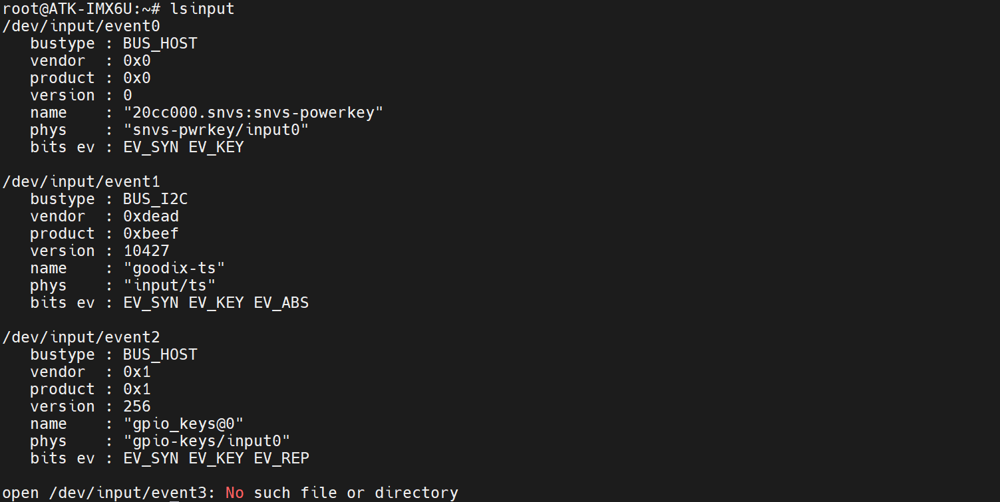

可以从上图看出按键事件号为 event2，触摸屏占用了 event1，所以当触摸屏没有插上时按键事件号为不一定为 event2！执行下面的指令，进行按键测试

>hexdump 或者 od -x 指令都是以十六进制的形式打印出输入事件信息。 由于文件系统没提供 hexpdump 指令，所以只测试 od 指令。  

```bash
od -x /dev/input/event2
```

按下底板上的 KEY0，打印出按键输入事件的信息如下:

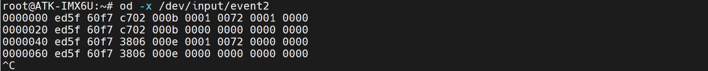

按“Ctrl + c”可以终止上边的指令。  

## 二、LCD屏幕测试

### 1. 测试准备

ALPHA/Mini 开发板已经兼容所有正点原子公司的 RGB LCD 屏幕， 由于屏幕存在 id 的关系， 开发板上电自动识别屏幕， 进行 LCD 触摸屏实验时需要先断电插上 RGB 屏幕，再启动系统。  

| 屏幕尺寸              | 触摸芯片                                | 屏幕 ID |
| --------------------- | --------------------------------------- | ------- |
| 4.3 寸屏（480x272）   | gt9xx                                   | 0x00    |
| 4.3 寸屏（800x480）   | gt9xx/gt1151                            | 0x04    |
| 7 寸屏（800x480）     | ft5x06                                  | 0x01    |
| 7 寸屏（1024x600）    | ft5x06/cst340(cst340 兼容 ft5x0 6 驱动) | 0x02    |
| 10.1 寸屏（1280x800） | gt9xx                                   | 0x03    |

### 2. 背光调节

LCD 屏幕的背光支持 8 级变化，亮度级数为 0～7，默认为 7。

- 查看 LCD 屏幕最大亮度等级 ：

```bash
cat /sys/devices/platform/backlight/backlight/backlight/max_brightness
```

查询结果如下图所示：

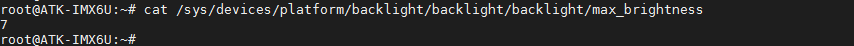

- 查看当前 LCD 屏幕背光亮度等级  

```bash
cat /sys/devices/platform/backlight/backlight/backlight/actual_brightness
```

查询结果如下图所示：

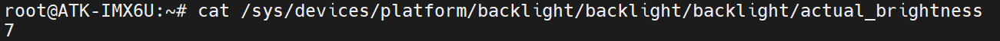

- 修改当前 LCD 屏幕背光亮度等级  

```bash
echo 5 > /sys/class/backlight/backlight/brightness  #修改亮度等级为 5
cat /sys/devices/platform/backlight/backlight/backlight/actual_brightness
```

修改后查询结果如下：

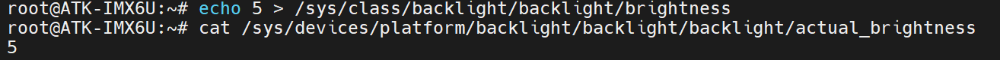

### 3. 触摸测试  

先退出 Qt 桌面， 直接点击桌面的“设置” ，点击设置项里的退出桌面即可！ 如果没有这项，说明我们的出厂系统还不是最新的，可以去官网下正点原子 ALPHA 最新的资料。我们退出桌面后，敲下面的命令：

```bash
ts_test
```

然后就会进入触摸屏测试的应用程序，lcd屏幕上会显示对应的菜单。我们点击不同的位置会有对应的打印信息：

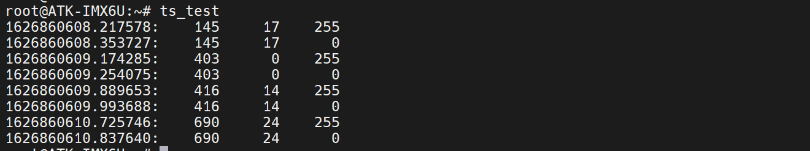

点击 Draw，就可以开始画图：

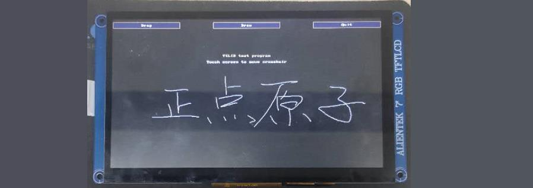

关闭桌面程序后，可执行下面的指令进行重启桌面程序 ：

```bash
/opt/QDesktop > /dev/null 2>&1 &
```

注意：这里不需要使用 ts\_calibrate 校准。 ts\_calibrate 一般是针对电阻屏校准的。 使用ts\_calibrate 后会在/etc 目录下生成一个坐标参考文件 pointercal。如果我们的开发板/etc 目录下有 pointercal这个坐标参考文件，需要把它删除。 否则可能影响触摸坐标上报的数据值。  

### 4. 显示控制  

进入/退出睡眠模式，注：这里指控制 LCD 进入睡眠模式（实质是操控 fb0） ，并不是整机进入睡眠模式。  

- 进入睡眠/熄屏模式  

```bash
echo "4" > /sys/class/graphics/fb0/blank
```

- 退出睡眠/亮屏模式  

```bash
echo "0" > /sys/class/graphics/fb0/blank
```

## 三、系统相关测试

### 1. 系统主频

#### 1.1 查看系统主频

查看可用主频，使用如下指令：

```bash
cat /sys/devices/system/cpu/cpu0/cpufreq/scaling_available_frequencies
```

可以看到有 198MHz、 396MHz、 528MHz 和 792MHz 的主频可用:


然后我们输入 cpufreq-info 查看 cpu 运行的频率：

```bash
cpufreq-info
```

可以看到有如下信息：

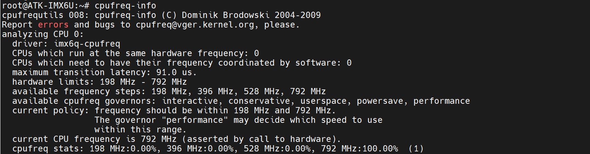

由于出厂内核配置了 CPU 主频为“Performance”（此模式不考虑耗电，最高性能） ，直接运行在最高主频上。所以看到 792MHz 处是 100%。  

#### 1.2 修改系统主频

是否可以无需重新编译 Linux 源码来修改 CPU 的主频呢，答案是可以的。输入下面的指令，申请用户空间控制 CPU 主频：

```bash
echo userspace > /sys/devices/system/cpu/cpu0/cpufreq/scaling_governor
```

输入下面指令将 CPU 主频修改为 198MHz，注意不是任意主频都支持，必须是上面支持的那几种频率：

```bash
echo 198000 > /sys/devices/system/cpu/cpu0/cpufreq/scaling_setspeed
```

再查看当前的 CPU 主频，修改成了低主频，明显的是 Qt 桌面滑动变卡了，说明此主频生效，相关命令如下：

```bash
cat /sys/devices/system/cpu/cpu0/cpufreq/cpuinfo_cur_freq
```

可以看到有如下信息：

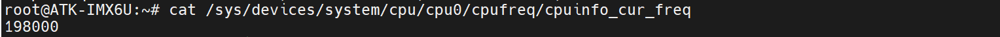

### 2. 查看系统信息

#### 2.1 查看内核版本号

我们可以使用下边的命令查看内核版本号：

```bash
uname -a
```


#### 2.2 查看系统主机名

```bash
cat /etc/hostname
```


#### 2.3 查看系统登录开机信息  

```bash
cat /etc/issue
```


#### 2.4 查看 CPU 相关信息  

```bash
cat /proc/cpuinfo
```

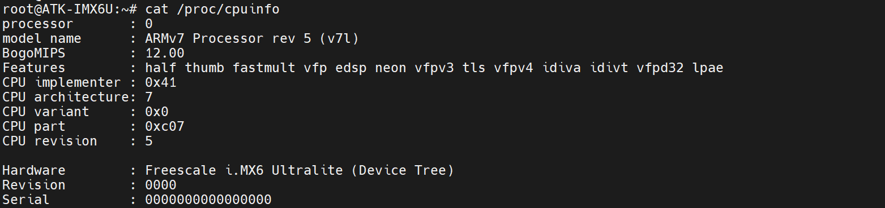

#### 2.5 查看内存相关信息  

```bash
cat /proc/meminfo
```


### 3. 系统时钟与RTC时钟

注意：测试 RTC 时钟要安装上钮扣电池。  

#### 3.1 两个时钟？

Linux 系统分两个时钟， 一个是 system time（软件时钟） ， 一个是 hardware clock（硬件时钟， 6ULL 芯片内部有 RTC 硬件时钟（可能不太精准） ）。使用 date 和 hwclock 命令可分别查看和设定系统时间和硬件时间。系统时钟掉电即会消失， RTC 时钟在有电池的情况下会长期运行。系统时钟会在系统重启时与 RTC 时钟同步。  

#### 3.2 查看系统时钟  

```bash
date
```


#### 3.3 设置系统时钟

我们也可以通过date命令修改系统时钟，若要修改始终为 2020 年 11 月15 日 下午 20:00:00。 指令如下：  

```bash
date -s "2020-11-15 20:00:00"  # 设置当前系统时钟
```

#### 3.4 查看硬件（RTC）时钟  

```bash
hwclock
```


#### 3.5 系统时钟写入硬件时钟  

```bash
hwclock -w  #将系统时钟同步至硬件时钟
```

### 4. 系统温度传感器

I.MX6U 芯片内部内置有温度传感器，可以实时反映 I.MX6U CPU 的内部温度 ：

```bash
cat /sys/class/thermal/thermal_zone0/temp
```

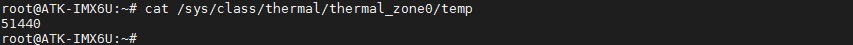

温度值即为 51.440℃（51440/1000）。  


## 四、DDR与SD卡测试

### 1. DDR 测试  

Memtester 主要是捕获内存错误和一直处于很高或者很低的坏位， 其测试的主要项目有随机值， 异或比较，减法，乘法，除法，与或运算等等。通过给定测试内存的大小和次数， 可以对系统现有的内存进行上面项目的测试。  

```bash
memtester [-p PHYSADDR] <MEMORY> [ITERATIONS]
```

参数说明：

- MEMORY 申请测试内存的数量，单位默认是 megabytes(兆)，也可以是 B K M G。
- ITERATIONS 测试的次数，默认是无限  

使用文件系统自带的 Memtester 测试工具申请 8MB 内存数量测试做 1 次 DDR 测试。执行如下指令。  

```bash
memtester 8M 1
```

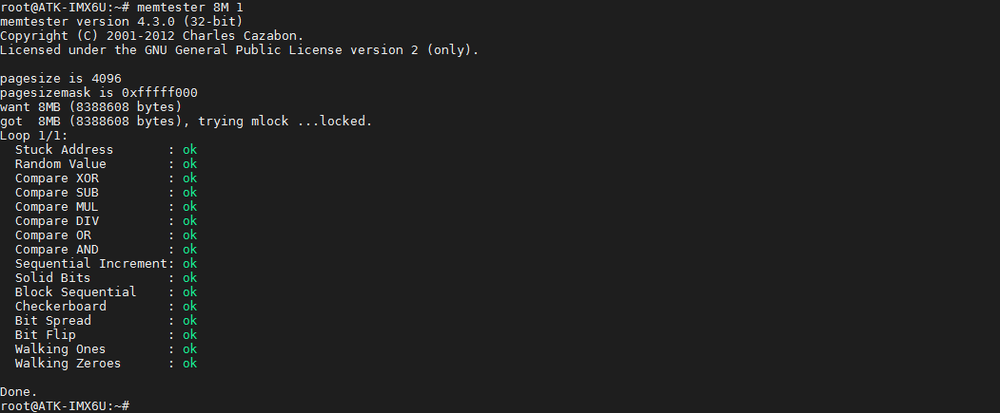

### 2. TF(SD)卡读写测试  

测试 SD 卡读写速度时建议使用 SD 卡作为系统启动卡。  

#### 2.1 命令说明

time 命令常用于测量一个命令的运行时间， dd 用于复制，从 if(input file)文件读出，写到of(output file)指定的文件， bs 是每次写块的大小， count 是读写块的数量。 "if=/dev/zero"不产生IO，即可以不断输出数据，因此可以用来测试纯写速度。

#### 2.2 TF(SD)卡写速度测试  

本次对 TF 系统卡的第一个分区写 50MiB 数据（注意这里读写数据越大测试出来计算出来的结果越平均与接近实际值，但要注意 TF 卡第一个分区的实际大小）。执行下面的指令测试TF 卡的写速度。  

```bash
time dd if=/dev/zero of=/run/media/mmcblk0p1/test bs=1024k count=50 conv=fdatasync
```

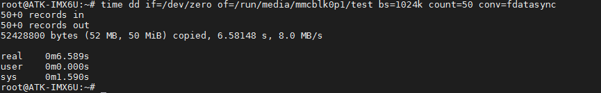

这里一共写入 50 MiB test 文件，速度为 8.0 MB/s。  

#### 2.3 TF(SD)卡读速度测试  

因为 LINUX 的内核机制，一般情况下不需要特意去释放已经使用的 cache。这些 cache 内容可以增加文件以及的读写速度。执行下面指令清除缓存  ：

```bash
echo 3 > /proc/sys/vm/drop_caches
```

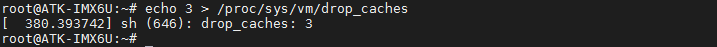

执行下面的指令读取前面用 dd 指令写入的 test 文件  :

```bash
time dd if=/run/media/mmcblk0p1/test of=/dev/null bs=1024k
```

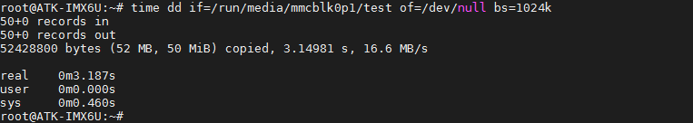

这里一共读出了 50 MiB test 文件，速度为 16.6MB/s， 测试完成后，可以把 test 文件使用 rm指令删除。  

### 3. NAND FLASH 读写速度测试  

本测试要求用 SD 卡启动卡启动，使用 NAND FLASH 版本的核心板进行测试。实际上读写数据量越大，数据越平均，越接近实际值。  

```bash
cat /proc/mtd
```

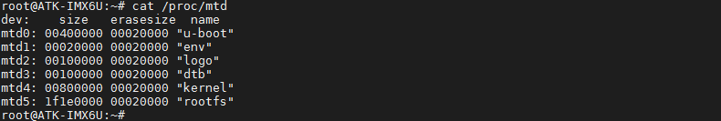

写数据前需要对操作的分区进行擦除，注意该操作会清除该操作分区的数据，请提前做好数据备份。  

```bash
flash_erase /dev/mtd5 0 0
```

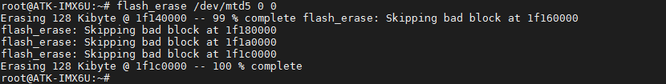

执行如下指令往 NAND FLASH 的 mtd5 文件系统分区写入 50MiB 数据， bs 大小为1024KB ：

```bash
time dd if=/dev/zero of=/dev/mtd5 bs=1024k count=50
```

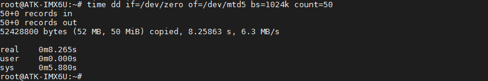

执行如下指令从 NAND FLASH 的 mtd4 内核分区（8MiB） 读取 8MiB 数据。  

```bash
time dd if=/dev/mtd4 of=/dev/null bs=1024k
```

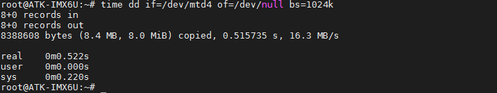

### 4. 出厂系统 DDR 剩余容量  

正点原子 IMX6U 核心板有 EMMC 和 NAND 版本，其中 EMMC 版本的 DDR 是 512M，NAND 版本的 DDR 是 256M。  启动系统后，在串口终端执行以下指令可以查看到剩余 DDR 容量：  

```bash
cat /proc/meminfo
```


我这里是eMMC版本，可以看到总内存为506864KB，剩余内存299916KB。

#### 5. 出厂系统 Flash 剩余容量  

正点原子 IMX6U 核心板有 EMMC 和 NAND 版本，其中 EMMC 版本的 Flash 是 8G， NAND版本的 Flash 是 512M。启动系统后，在串口终端执行以下指令可以查看到剩余 Flash 容量：  

```bash  
df -h
```

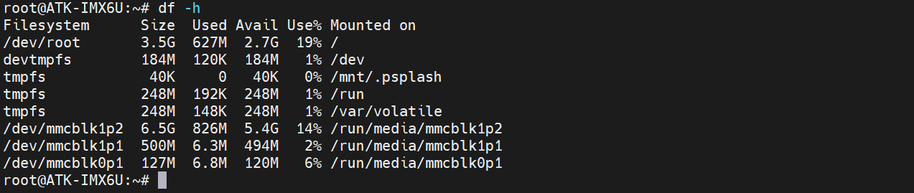

我这里使用的是 eMMC Flash 版本的核心板，应该是下面的几个吧，搞得有点迷，后面有问题再补充。  

## 五、USB WiFi测试

### 1. USB WiFi说明

正点原子 ALPHA 开发板购买时赠送了一个 USB WIFI 模块，型号是USB WIFI RTL8188EUS/RTL8188CUS，该模块可直接插到电脑上联网测试好坏。插到电脑上的话，是这样的：

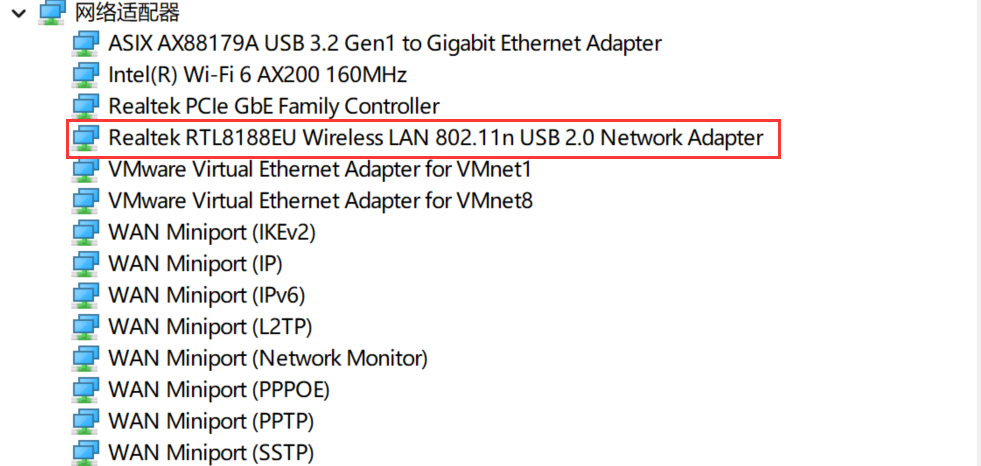


在开发板上使用的话是使用 USB 2.0 HOST 接口， ALPHA 底板 4 个 USB 接口都可以。正点原子提供了一个 USB WIFI 测试脚本 alientek_usb_wifi_setup.sh用于参考。它默认放在开发板根文件系统的 /home/root/shell/wifi   目录下：


一般 USB 设备都是可带电插拔的，RTL8188EUS/RTL8188CUS 模块也是支持热插拔的，可在系统起来后再插上USB WIFI 模块。 使用前可以插上12V电源，防止串口供电的电压不足。

### 2. 连接USB WiFi模块

我们按下图，将USB WiFi模块接入开发板：

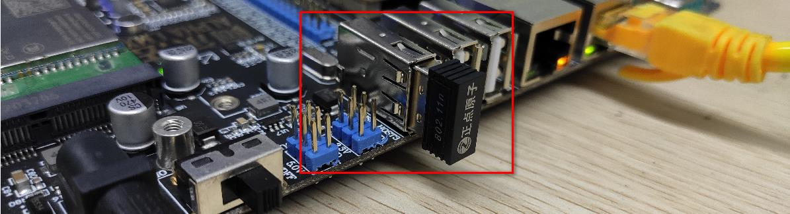

插上模块后，串口会有如下打印信息：

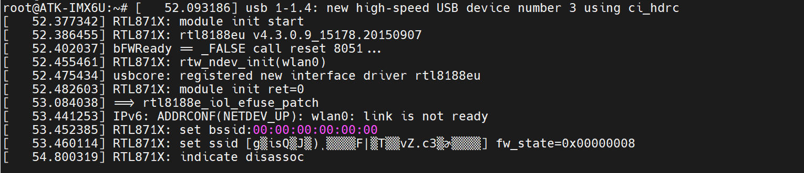

然后我们查看一下 USB WIFI 的网卡信息，使用 ifconfig 指令即可查看相关信息，如下图示：

```bash
ifconfig wlan0 up # 若默认没打开 wlan0 则需要执行此项。
ifconfig
```

然后便会看到如下信息显示：

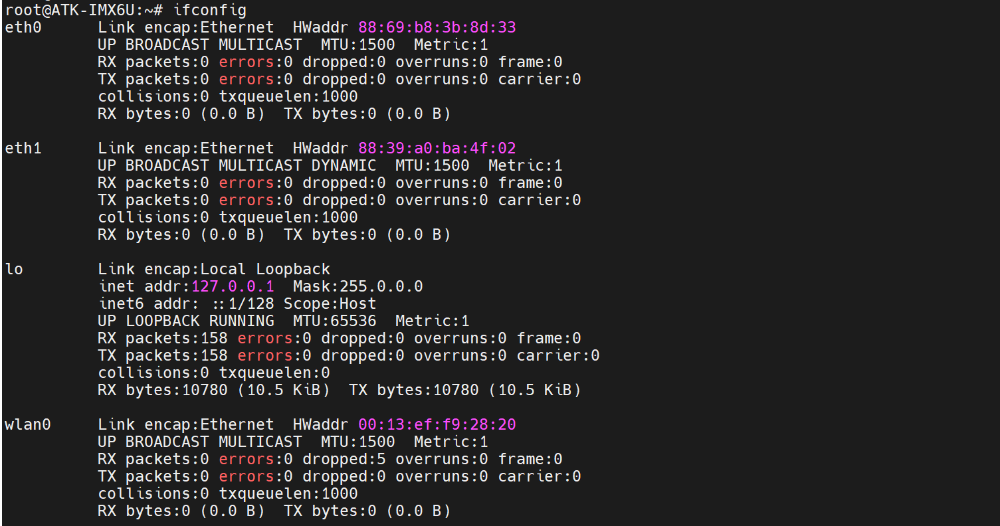

其中wlan0 是 USB WIFI 的节点。  

### 3. Station（上网）模式  

这一部分测试是使用 USB WIFI 连接无线网络并测试网络是否能上网。

#### 3.1 WiFi扫描

我们使用下边的命令扫描附近无线网络信息并打印相关信息：

```bash
wpa_cli -i wlan0 scan_result # 此指令需要启动进入后再插 WIFI 才生效，需要 wpa_supplicant 在运行。
```

然后可以看到如下信息打印：

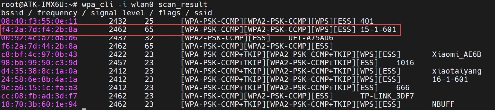

还可以用其他指令来扫描无线网络信息，例如：

```bash
iwlist wlan0 scan
```

该命令会显示更为详细的信息：

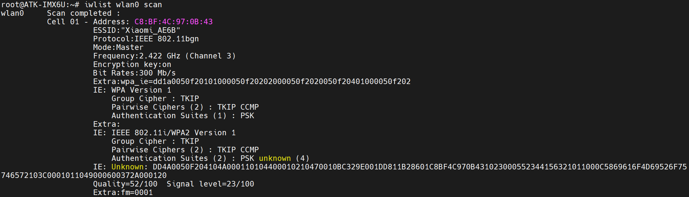

#### 3.2 连接WiFi

我们需要通过脚本来连接WiFi，可以执行如下命令：

```bash
cd /home/root/shell/wifi
source ./alientek_usb_wifi_setup.sh -m station -i 15-1-601 -p ****** -d wlan0
```

> （1）-m station ：设置成 station 模式
>
> （2）-i 15-1-601 ：无线网络名称(ssid)
>
> （3）-p \*\*\*\*\*\* ：无线网络密码(psk)
>
> （4）-d wlan0 ： USB WIFI 节点  

执行该脚本连接WiFi后会有如下打印提示：

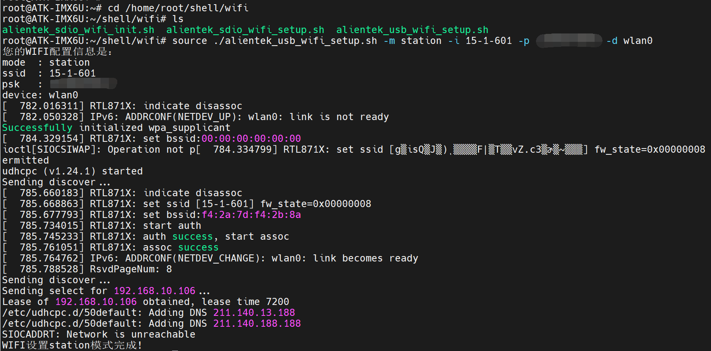

看到其中有这一行，就表示开发板已经成功获取到了ip地址：


内核日志会有这些打印信息，这段日志里面的肯呢个肯上图中有一些不对应，这是因为我后来重新连接了，这个影响不大：

```bash
[   88.348485] RTL871X: module init start
[   88.352270] RTL871X: rtl8188eu v4.3.0.9_15178.20150907
[   88.367606] bFWReady == _FALSE call reset 8051...
[   88.416165] RTL871X: rtw_ndev_init(wlan0)
[   88.433681] usbcore: registered new interface driver rtl8188eu
[   88.440743] RTL871X: module init ret=0
[   88.984257] ==> rtl8188e_iol_efuse_patch
[   89.319997] IPv6: ADDRCONF(NETDEV_UP): wlan0: link is not ready
[   89.327455] RTL871X: set bssid:00:00:00:00:00:00
[   89.335330] RTL871X: set ssid [g\xffffffc6isQ\xffffffffJ\xffffffec)ͺ\xffffffab\xfffffff2\xfffffffb\xffffffe3F|\xffffffc2T\xfffffff8xffffffe8\xffffffe7\xffffff8dvZ.c3\xfffff    f9fɚ\xfffffff0\xffffffbe\xfffffff7\xffffff94\xfffffff4\xffffff90\xffffff8d\xffffff80\xffffff8b] fw_state=0x00000008
[   90.670394] RTL871X: indicate disassoc
[   90.681089] RTL871X: set ssid [TP-LINK_83A3] fw_state=0x00000008
[   90.693833] RTL871X: set bssid:3c:6a:48:7b:83:a3
[   90.815836] RTL871X: start auth
[   90.854068] RTL871X: auth success, start assoc
[   90.876247] RTL871X: assoc success
[   90.879923] IPv6: ADDRCONF(NETDEV_CHANGE): wlan0: link becomes ready
[   90.906365] RsvdPageNum: 8
[  314.781281] RTL871X: indicate disassoc
[  314.816614] IPv6: ADDRCONF(NETDEV_UP): wlan0: link is not ready
[  314.826813] IPv6: ADDRCONF(NETDEV_UP): eth1: link is not ready
[  317.141829] RTL871X: set bssid:00:00:00:00:00:00
[  317.147432] RTL871X: set ssid [g\xffffffc6isQ\xffffffffJ\xffffffec)ͺ\xffffffab\xfffffff2\xfffffffb\xffffffe3F|\xffffffc2T\xfffffff8xffffffe8\xffffffe7\xffffff8dvZ.c3\xfffff    f9fɚ\xfffffff0\xffffff9e\xffffff95\xfffffff4\xffffff90\xffffff8d\xffffff80\xffffff8b] fw_state=0x00000008
[  318.470142] RTL871X: indicate disassoc
[  318.479903] RTL871X: set ssid [15-1-601] fw_state=0x00000008
[  318.489635] RTL871X: set bssid:f4:2a:7d:f4:2b:8a
[  319.435595] RTL871X: start auth
[  319.451807] RTL871X: auth success, start assoc
[  319.474025] RTL871X: assoc success
[  319.477719] IPv6: ADDRCONF(NETDEV_CHANGE): wlan0: link becomes ready
[  319.501864] RsvdPageNum: 8
[  329.497966] RTL871X: indicate disassoc
[  329.507277] RTL871X: set bssid:00:00:00:00:00:00
\xffffffb71X\xffffffa3Z%]X\xffffffe9^ԫ\xffffffb2\xffffffcdƛ\xffffffb4T\xffffff82tA!=܇\xfffffff0\xfffffffe\xfffffff7\xffffff94\xfffffff4\xffffff90\xffffff8d\xffffff80\xffffff8b    ] fw_state=0x00000008
[  330.840655] RTL871X: indicate disassoc
[  330.850329] RTL871X: set ssid [15-1-601] fw_state=0x00000008
[  330.858310] RTL871X: set bssid:f4:2a:7d:f4:2b:8a
[  330.903584] RTL871X: start auth
[  330.911687] RTL871X: auth success, start assoc
[  330.936512] RTL871X: assoc success
[  330.955240] RsvdPageNum: 8
[  340.941505] RTL871X: indicate disassoc
[  340.949122] RTL871X: set bssid:00:00:00:00:00:00
[  340.956429] RTL871X: set ssid [p\xffffffe9>\xffffffa1A\xffffffe1\xfffffffcg>~\xffffff97\xffffffea\xffffffdck\xffffff96\xffffff8f8\*\xffffffec\xffffffb0;\xfffffffb2\xffffffa    f<T\xffffffec\xffffffdb\\xfffffff0\xfffffffe\xfffffff7\xffffff94\xfffffff4\xffffff90\xffffff8d\xffffff80\xffffff8b] fw_state=0x00000008
[  342.290409] RTL871X: indicate disassoc
[  351.703529] RTL871X: set ssid [15-1-601] fw_state=0x00000008
[  351.710057] RTL871X: set bssid:f4:2a:7d:f4:2b:8a
[  351.895340] RTL871X: start auth
[  351.917049] RTL871X: auth success, start assoc
[  351.940869] RTL871X: assoc success
[  351.959865] RsvdPageNum: 8
[  352.042949] RTL871X: recv eapol packet
[  352.049942] RTL871X: send eapol packet
[  352.060956] RTL871X: recv eapol packet
[  352.067477] RTL871X: send eapol packet
[  352.071558] RTL871X: set pairwise key camid:4, addr:f4:2a:7d:f4:2b:8a, kid:0, type:AES
[  352.091248] RTL871X: set group key camid:5, addr:f4:2a:7d:f4:2b:8a, kid:2, type:AES

```

若未能正常获取 ip，等待 RTL871X: set group key camid:5 这句话出现后输入 `udhcpc -iwlan0` 指令重新获取 ip。若没有这句话，需要检查无线网络信息是否正确。我们可以看一下现在的ifconfig信息：

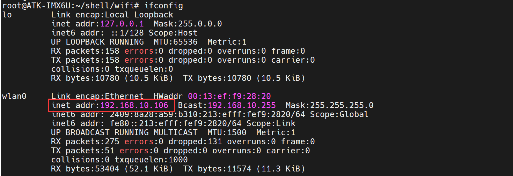

#### 3.3 是否可以上网？

我们来ping一下百度，测试一下是不是可以上网了：

```bash
ping www.baidu.com -I wlan0
```

然后若是可以上网，则可以看到有以下信息打印：

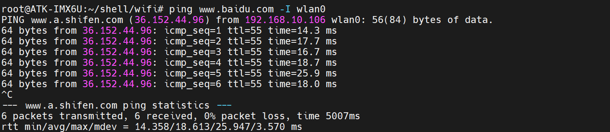

#### 3.4 与PC端ping一下？

由于我的笔记本也是连接在同一个局域网下，所以他们应该是可以互相ping通的，先来看一下笔记本的ip：

```shell
PS C:\Users\20380> ipconfig

Windows IP 配置


# 中间部分省略 ... ...
无线局域网适配器 WLAN:

   连接特定的 DNS 后缀 . . . . . . . :
   本地链接 IPv6 地址. . . . . . . . : fe80::82b4:b2c2:18a2:65d1%2
   IPv4 地址 . . . . . . . . . . . . : 192.168.10.112
   子网掩码  . . . . . . . . . . . . : 255.255.255.0
   默认网关. . . . . . . . . . . . . : 192.168.10.1

以太网适配器 蓝牙网络连接:

   媒体状态  . . . . . . . . . . . . : 媒体已断开连接
   连接特定的 DNS 后缀 . . . . . . . :
```

然后互相ping一下

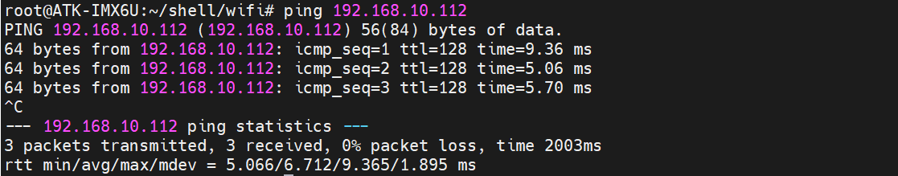

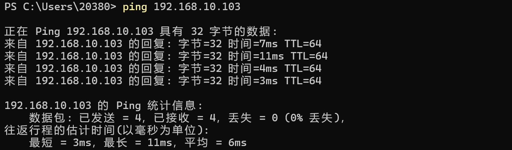

可以看到是可以ping通的。

### 4. SoftAP（热点）模式  

这一部分是测试 USB WIFI 开启热点，与手机连接 。

#### 4.1 开启AP热点

我们执行以下命令：

```bash
source ./alientek_usb_wifi_setup.sh -m softap -d wlan0
```

然后便会看到如下打印信息：

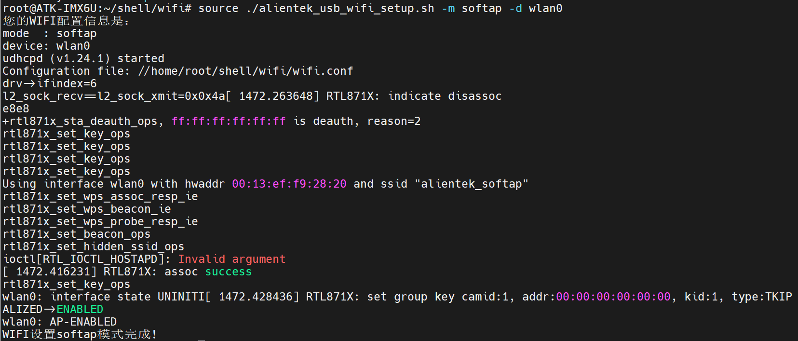

#### 4.2 手机连接AP热点

打开手机设置，可以看到 USB WIFI 发出的热点，名称为“alientek\_softap”，密码默认为12345678。输入密码后点击连接，即可连接到无线热点。  

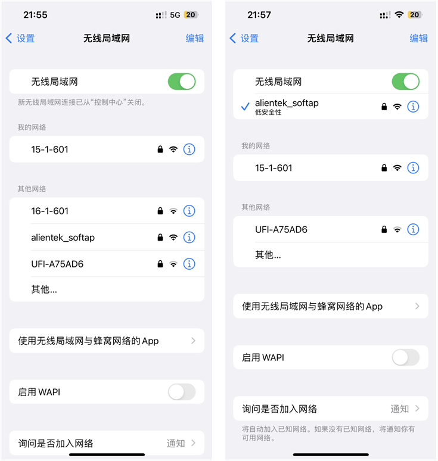

可以看到手机已经连接了热点，这样手机与开发板的 WIFI 构成了一个无线局域网。  我们也可以按照正点原子的文档配置一下静态ip：

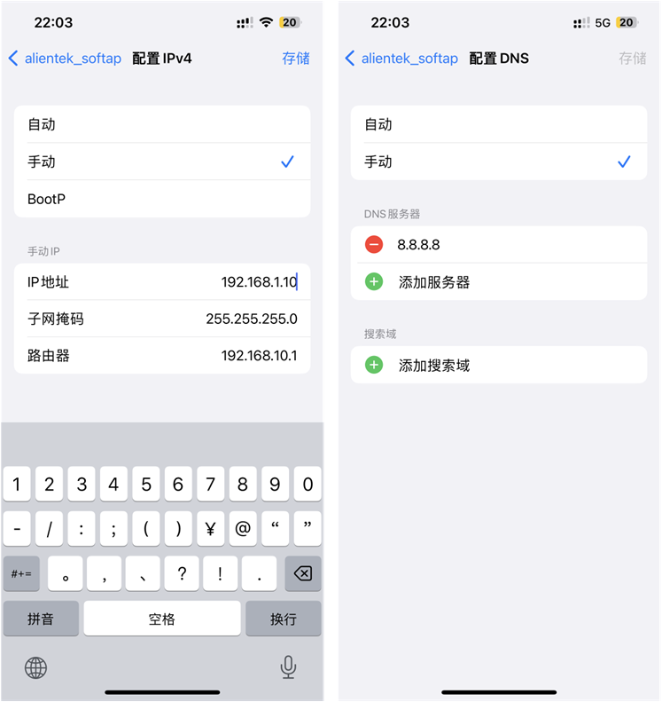

#### 4.3 修改AP热点信息

如需要修改热点名称与热点密码，用户可以编辑  alientek\_usb\_wifi\_setup.sh 脚本内容设置个人的热点信息。 

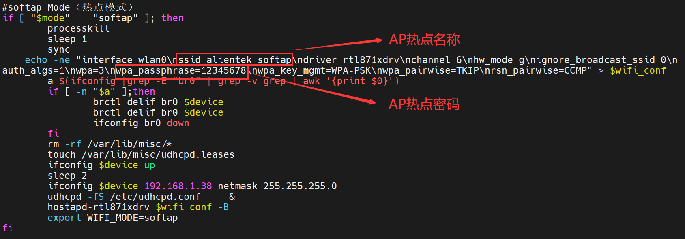

### 5. Bridge（桥接）模式  

测试 USB WIFI 开启热点，并桥接到有线网络，让手机连接到热点并上网，这个我就没做了，离路由器太远了。

#### 5.1 有线网络连接

将网线插上ALPHA 开发板的网口其中一个或者两个，并且确保有线网络能上网。用 ifconfig 查看有线网络 eth0 或者 eth1 能否获取 ip，并测试 eth0 是否能上网。下图是将网线插到开发板底板 ENET2 接口处，节点是 eth0，如果插到 ENET1 接口，节点是 eth1。 MINI 底板只有一个网口，节点是 eth0。  

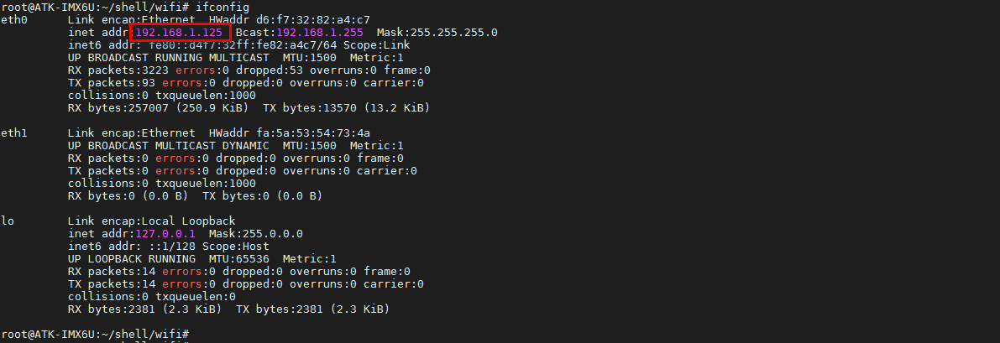

#### 5.2 开启桥接模式

我们执行以下命令开启USB WiFi的桥接模式：

```bash
source ./alientek_usb_wifi_setup.sh -m bridge -d wlan0 -e eth0
```

其中 -e eth0 ：桥接的有线网络节点，根据实际情况桥接到对应的网络节点 eth0/eth1。  执行完毕后我们可能会看到如下信息：

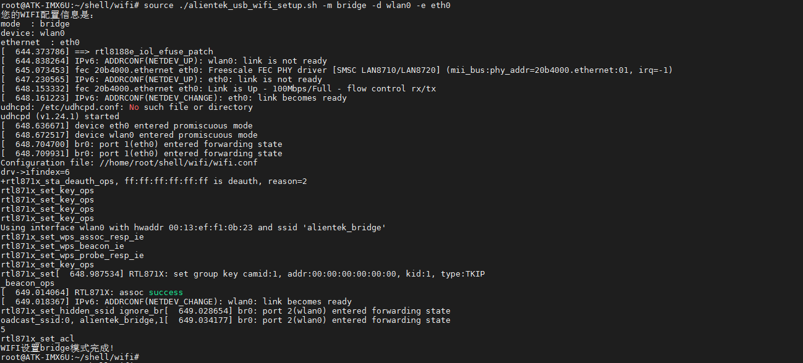

#### 5.3 连接桥接模式下的热点

打开手机设置，可以看到 USB WIFI 发出的热点，名称为“alientek\_bridge”，密码默认为12345678。输入密码后点击连接，即可连接到无线热点。并测试能否上网，打开手机的浏览器测试即可。  

#### 5.4 修改桥接模式下的热点信息

如需要修改热点名称与热点密码 ，可以修改 alientek\_usb\_wifi\_setup.sh 脚本：

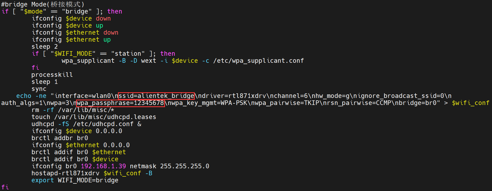

## 六、网口测试

### 1. 网口说明

ALPHA 开发板有 eth0 和 eth1 两路百兆网卡。 eth0 对应底板上 ENET2， eth1 对应底板上的 ENET1如下图所示：

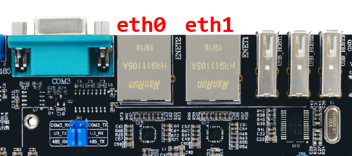

### 2. 网口的使用

下边的测试我自己没做，直接照搬正点原子教程的，应该是开发板直连路由器进行上网测试。

#### 2.1 查看网络信息

```bash
ifconfig
```

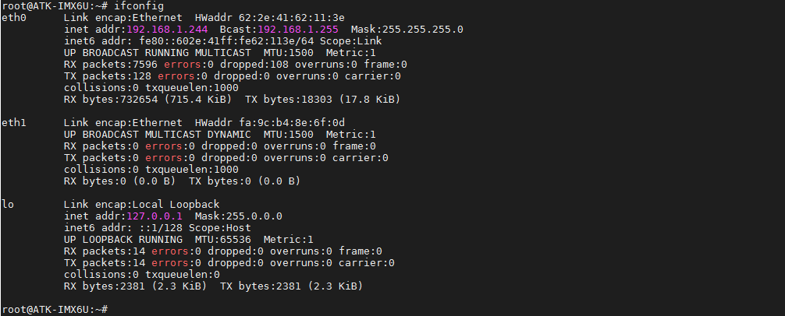

插上网线到 ENET2 （对应eth0）处可以看到如下信息，系统自动获取了 ip， eth1 同理。  

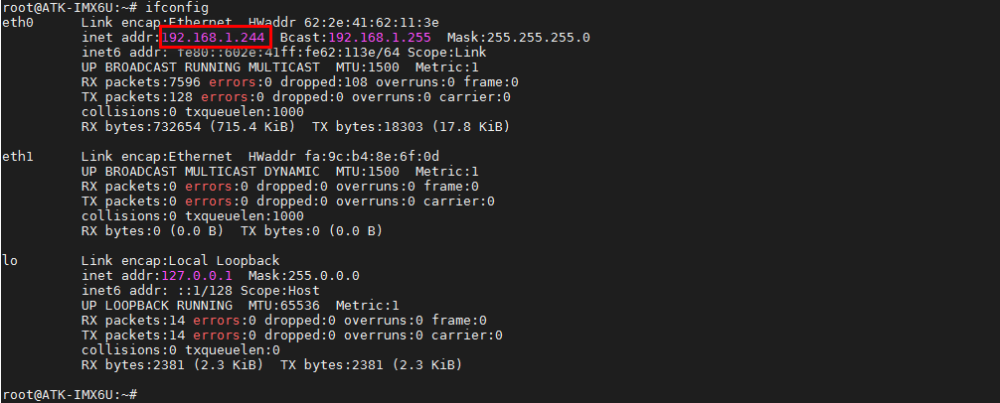

#### 2.2 获取ip

如果对应网卡没有自动获取到 IP，请使用下面的指令获取。“-i”是指定网卡名称，如不指定，会使用默认会使用 eth0。  

```bash
udhcpc -i eth0
```

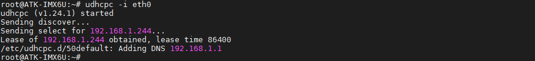

#### 2.3 网口的打开与关闭

```bash
ifconfig eth0 down # 关闭网口，网卡名字请根据实际情况修改， down 表示关闭
ifconfig eth0 up   # 打开网口，网卡名字请根据实际情况修改， up 表示打开
```

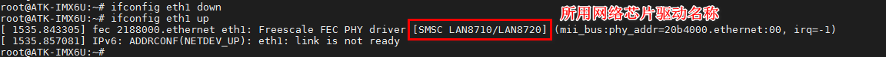

#### 2.4 测试联网效果

测试网口是否能上网，以访问 www.baidu.com 为例，执行如下命令，“-I”（大写的 i ）代表指定网口。不加“-I”则使用默认网卡（默认网卡指的是有网络接入的一端，如果两个网口都有网络接入，则使用 eth0 作为默认网卡）。按“Ctrl+c”终止 ping 指令。百度的实际地址根据网络运营商不同，访问的地址会不同。

- eth0 联网测试

```bash
ping www.baidu.com -I eth0
```

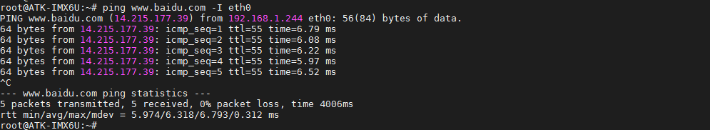

- eth1 联网测试

```bash
ping www.baidu.com -I eth1
```

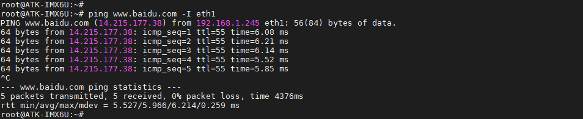

- 与网关的联通测试

可以使用如下命令查看网关：

```bash
route
```

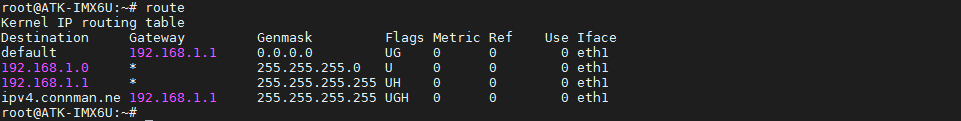

由上可知网关为 192.168.1.1，根据路由器不同，网关可能不同。 **ping 网关可测试内网与开发板连接是否正常**。下面指令不加“-I”参数，使用默认网卡。  

```bash
ping 192.168.1.1
```

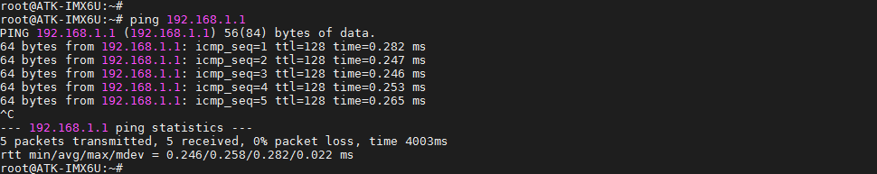

### 3. 网络通信速度测试  

iperf3 是一个网络性能测试工具。 iperf 可以测试最大 TCP 和 UDP 带宽性能，具有多种参数和 UDP 特性，可以根据需要调整，可以报告带宽、延迟抖动和数据包丢失。测试 Ubuntu 与开发板通信速度。如果ubuntu 未安装 iperf3，可以在 ubuntu 终端中执行以下命令安装：

```bash
sudo apt-get install iperf3
```

查看 ubuntu 的 ip 地址，备用。 （这里要确保开发板的 ip 地址要与 ubuntu 的 ip 地址是同一局域网内）。本次测试 ubuntu 作服务端，开发板作客户端，执行下面指令：

```bash
ifconfig
```

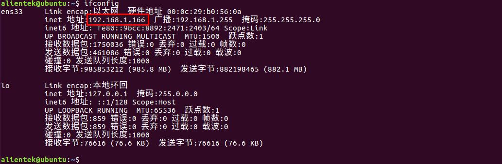

然后在ubuntu执行下边的命令启动iperf3：

```bash
iperf3 -s # ubuntu 作为服务端
```


然后开发板作为客户端连接 ubuntu 服务端，在开发板中执行以下命令：

```bash
iperf3 -c 192.168.1.166 -i 1 # -i 1 指通信周期，单位秒。
```

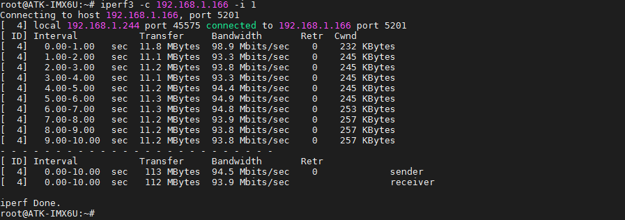

ubuntu 服务端将会打印如下信息：

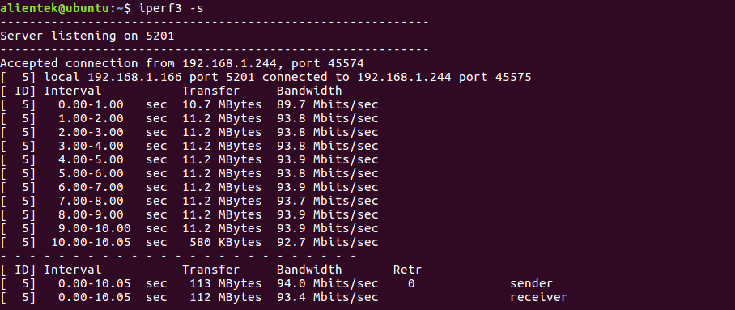

反过来 ubuntu 作客户端，开发板作服务端是一样的步骤。  
